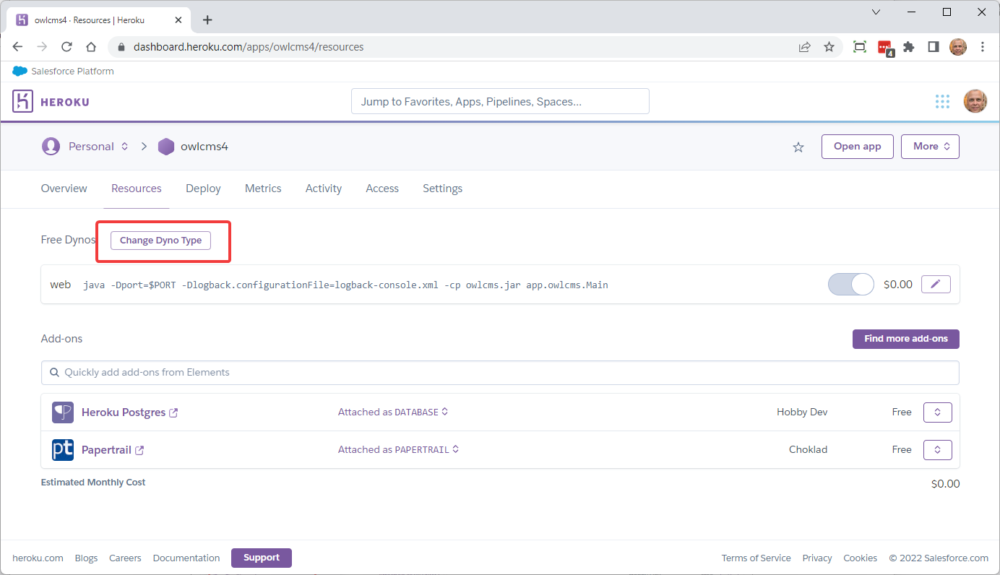
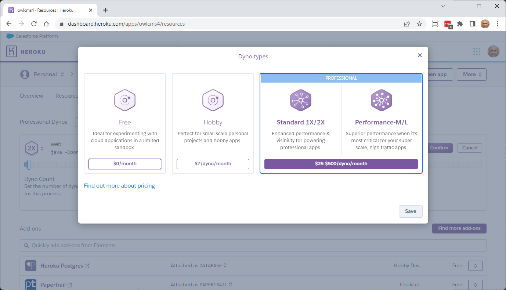

# Large Competition Setup on Heroku

Heroku is a cloud service that makes it easy to start from a free service for small competitions, but also support an affordable paid tier for larger meets.  In order to host a large competition, we need to update so the application gets dedicated and faster computing resources as well as more memory. 

As an order of magnitude, running a large 2-day national competition would cost something like 20 US$  You can create your application as a free setup, and scale it up to high-capacity, then scale it down back to the free tier when you are done (or delete it).  Pricing is by second, based on the actual elapsed time the application is running.

> The key thing when using paid tiers is to *scale down* when done, otherwise billing continues. See the [Scale Down](#scale-down) section below

## Initial Setup

1. Install owlcms, as described on [this page](Heroku).
2. Install publicresults, and connect the two applications together, as explained on [this page](Remote)
3. Associate a credit card with your account.  This is done by clicking on your profile icon at the top right and changing the account settings.

## Scale-up

These steps are needed a few hours before the competition.  They will cause the applications to be moved and restarted on a different (larger) container, which takes less than a minute.

1. Update publicresults to the 2x dyno type. A "dyno" is the Heroku word for a Linux container.

   1. Select the "Resources" section
   
   2. If you are on the free tier, click on Change Dyno Type and then the "Professional" option
      
   
      
   
   3. Select "Standard-2X" as the performance level by clicking on the hexagon and dropping in the menu.  This will give us the memory we need.
     
   
   4. **IMPORTANT**: **DO NOT CHANGE THE DYNO COUNT**.  **The value should be 1** (actually the only other value you can use is 0 to turn off the application).  
     Values larger than 1 are not needed, do not help in any way, and actually cause problems.
     
   

## Scale-down

After the competition you should go back to cheaper or no billing.

Deleting the applications will stop billing.  But in most instances you will want to keep the applications for at least a few days to fetch results, print the final competition package, etc.

There are 3 main ways to scale down without deleting the application

1. To turn off the application and stop paying, but keeping the application around, change the dyno count to **0** using the pencil.
2. Use the change Dyno type button to go to the Hobby tier (7$ per month, but the application keeps running with minimal memory)
3. Use the change Dyno Type button to go back to the free tier.  (0$ per month but the application goes to sleep after 1 hour.)
