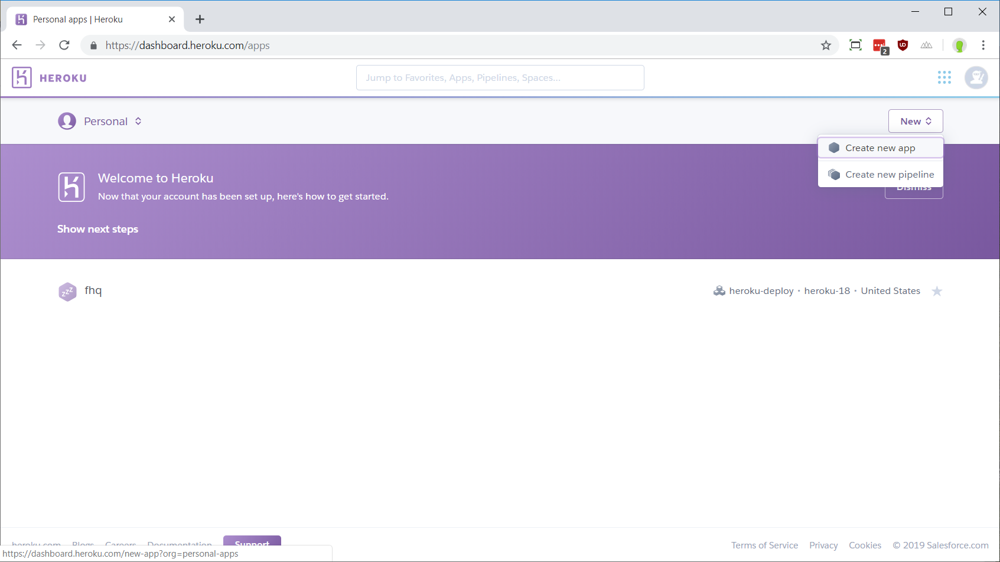
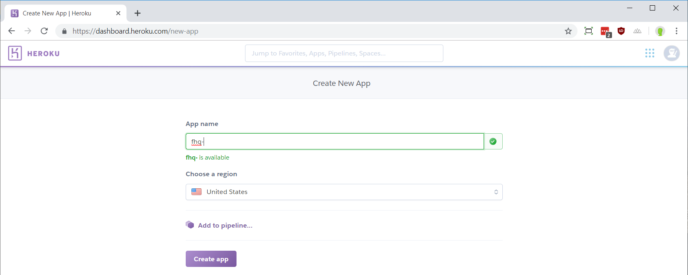
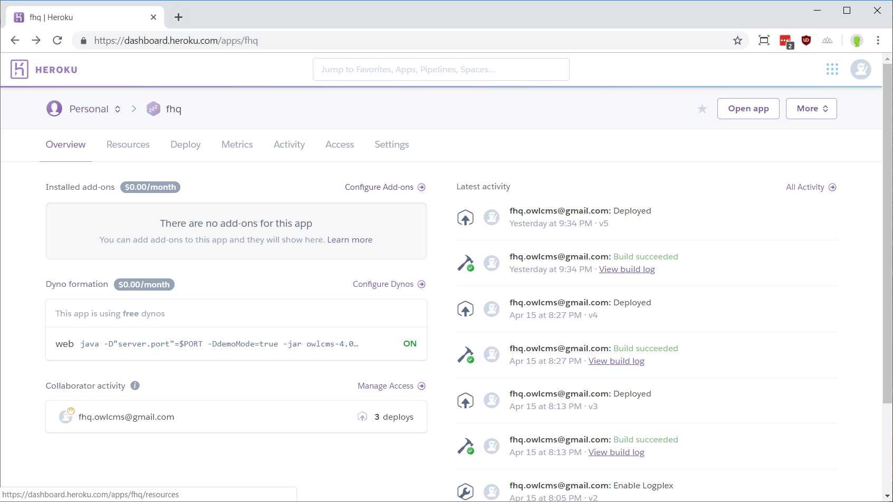
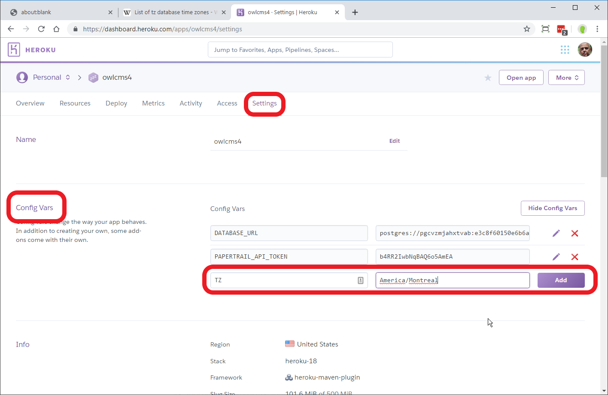
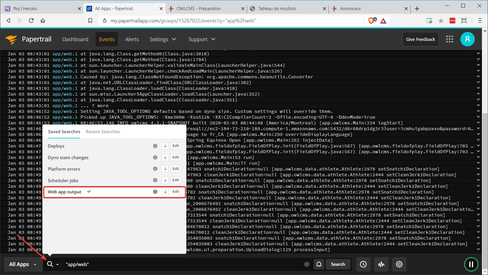
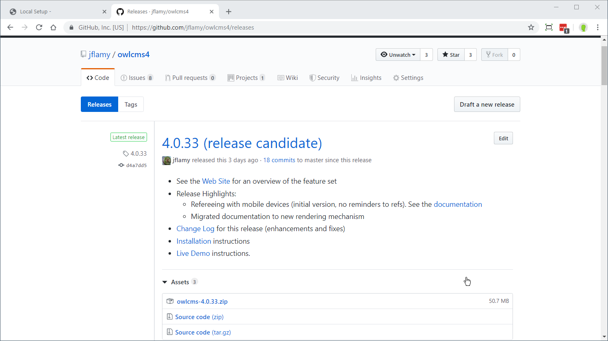
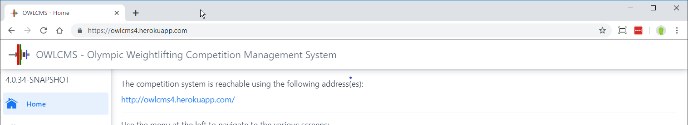
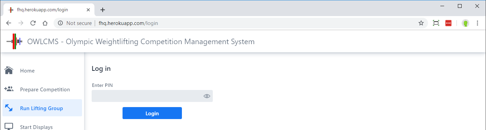

Heroku is a cloud service provider that provides an attractive free (0$) pricing plan for running programs like OWLCMS4.  When running on Heroku you only need a good Internet connection, and do not need to configure a master laptop.

## Read this first!

The instructions in this section may look a little bit daunting, but please don't go away. They are only needed once, and take about 15 minutes.  Once you have gone through that, the process will simply be

1. Download the current release when an interesting one is announced
2. Unzip the files somewhere
3. Go to the unzipped files and type a single command `heroku deploy:jar` to install the file on your account.

The process will then take a couple minutes (basically the time needed to transfer the files).


## Create an Heroku account and application

- Go to page https://heroku.com
- Create a free account. Remember the login and password information.
- You may create several applications, for example, one for your club, and one for your regional association.  You will need to perform the four steps below (application, database, logging, time zone) <u>once for each application</u>

#### Create your app

- Create an app -- this is the name under which your cloud copy of owlcms will be known. Pick an available name, typically the name of your club or federation.

  

  

#### Add a database

- On the application configuration page, click on the `Configure Add-ons` link, search for the `Postgres` plugin, and select it. 

  

  

- Select the free database plan; the Provision button will connect a database to your application.

#### Configure your time zone and locale

By default, Heroku will use Universal Time (UTC/Greenwich) so you need to tell Heroku what time zone you are in, so that OWLCMS4 produces meaningful time stamps.

- Go to the Settings screen, and select the **`Reveal Config Vars`** button at the right of the `Config Vars`section.
- Use the `Add` button to create a variable called `TZ` (for Time Zone).  To find the appropriate value for your location, see this [list of time zone codes](https://en.wikipedia.org/wiki/List_of_tz_database_time_zones)



You may also define a `LOCALE` configuration variable to force all displays to be in a given language.  This will take precedence over the [language setting](Preparation#display-language) defined on the Competition information screen.

#### Add logging (recommended)

Logging is useful is problems arise, in order to allow the application maintainer to figure out what is going on.

- Add a second add-on called `PaperTrail` using the `Find more add-ons` button.  This will allow you to see the logs for the application and download them.  Use the free plan.

  

- Click on `Papertrail`. You also need configure your Time Zone on PaperTrail.  Use the Settings link at the top of the page, and then access your Profile.

- In order to see the application logs, go to the bottom of the page and click on the looking glass icon at the bottom. You will be using the `Web app output` entry in the future to see the logs 

  

  - 


## Install and configure the deployment tools

The process is slightly different depending on your environment.  Click on the link for your environment to get the instructions.

- [Windows instructions](Heroku_Install_Windows) for installing the deployment tools

- [Mac OS and Linux instructions](Heroku_Install_Linux) for installing the deployment tools

  

## Deploy OWLCMS4 to Heroku

> The rest of this section assumes that you have been successful in the [Install and configure the deployment tools](#install-and-configure-the-deployment-tools) step above and that a `HEROKU_APP` environment variable exists.  If it doesn't exist, or if you have several applications, you can always explicitly add  ` --app myHerokuAppName` at the end of the `heroku` commands (notice that there is a space before and after `--app`)


- Get the current installation file ending in `.zip` from the <https://github.com/jflamy/owlcms4/releases> page (see the "Assets" section)
  
  
  
- Download the release and unzip it release to a directory by double-clicking on it.   The location does not matter, pick something meaningful to you and that you will remember.
  
- Start a new command shell and go to the directory where you just unzipped the files.
  ```bash
   cd *the_directory_where_you_unzipped_the_files*
  ```

  Check that the `.jar` file is present in the directory using `dir` (Windows) or `ls` (Mac, Linux)
  
- Run the deploy command 

  ```bash
   heroku deploy:jar owlcms.jar
  ```
  

Reference: https://devcenter.heroku.com/articles/deploying-executable-jar-files


## Accessing the application

- Open a browser with the address `https://myHerokuApp.herokuapp.com` (replacing of course `myHerokuApp` with the name of your own application) name
- If the application is not running, it will a take a few seconds for Heroku to start it.  This is because the no-cost plan shuts down applications that have been idle for a few hours.  The data is still in the database, and nothing is lost.  For the price of 0$, that's a good deal.
- On the first line there will be a reminder of the web address (URL) to be used for the other screens




## Control access to the application

  In a cloud setup, the application address will be visible to attendees on some screens, and mischievous users could access it.  It is therefore recommended to limit access to the application.  This is done by setting two environment variables:

- `PIN` is an arbitrary strings of characters that will be requested when starting the first screen whenever you start a new session (typically, once per browser, or when the system is restarted).  If you configure a PIN, the first time someone opens the application, a login screen will appear.

  

- For additional protection, `IP` is a comma-separated list of allowed addresses.  This ensures that only logins from you competition site should be allowed. In order to find the proper value:

  - From your competition site, browse to https://google.com and 
  - Type the string  `my ip`  in the search box.  
    This will display the address of your competition site router as seen from the cloud.  
  - You should see a set of four numbers separated by dots like `24.157.203.247`  . Write down or copy this value, it will be used for the `IP` parameter below.                               

- For regional competitions or club meets, you may decide just to use a `PIN`.

#### Configuring the security settings

The simplest way is to use the Heroku dashboard for the application and add the IP and PIN variables under the Settings tab, in the `Config Vars` section.  You must of course use the IP address or your own network as explained above.

  

## Demonstration mode

- If you want to run in demo mode with fictitious athletes, add a configuration variable `OWLCMS_DEMOMODE` with the value `true` (small letters). See [above](#configuring-the-security-settings) for an example of setting config vars.
  If you do so, the database will be kept in memory, and will not affect the data in your real database.  The fake data will be regenerated every time the application is restarted. In particular, if you are using the free tier on Heroku, the application is restarted after 1h of idle time.
- To run again with your real database and host a competition, just delete the `OWLCMS_DEMOMODE` config var.

## Configuration Parameters

See the [Configuration Parameters](./Configuration.md ':include') page to see additional configuration options in addition to the ones presented on this page.
