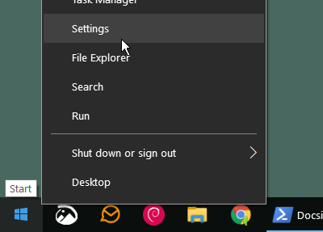
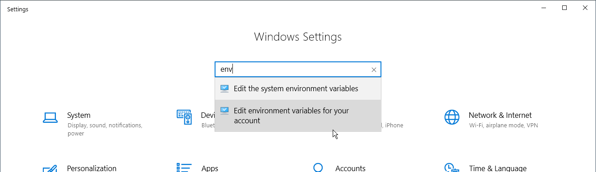
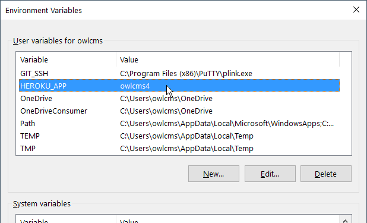

# Install and configure the deployment tools (Windows)

The following tools are required to install or update OWLCMS4 on the cloud.  <u>This process is only required once</u>.

### Install the Heroku Command-Line Interface

-  Go to page https://devcenter.heroku.com/articles/heroku-cli#download-and-install

- Get the Windows installer for the Heroku CLI (command-line interface).  Ignore the note on the page about installing Git, we don't actually need it.

- Run the installer

- Click on the Windows icon at the bottom left and type `cmd` to open a command-line window

- Run the following commands
  
  ```bash
  heroku login
  heroku plugins:install java 
  ```
These commands are only needed once.  The `login` command will open a browser window and ask you to login on your Heroku account.
  
### Install Java

The plugin we just downloaded above requires Java to operate.

  - Go to https://adoptopenjdk.net/ 
  - Download the JDK8 version for your environment and install it -- the default options are fine. 

### Define your application name

- Time-saving tip: if you want to avoid typing `--app myHerokuAppName` on all the commands, you can define an environment variable called `HEROKU_APP` with your application name.  You only need to do this <u>once</u>.

  - right-click on the Windows icon at the bottom left, click on Settings. 

    

  - In the Search box, type "env" and select the option for the user variables
  
    
  
    
  
  - Define your variable HEROKU_APP with your own application name and save
  
    
    
  - Exit your command shells if any (cmd) and start new ones so the variable is defined
  


