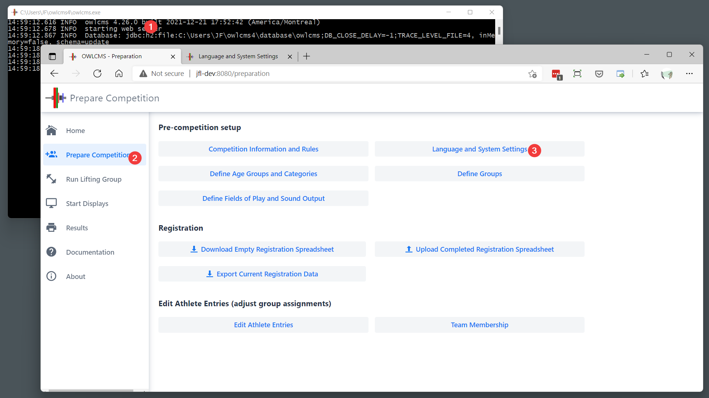
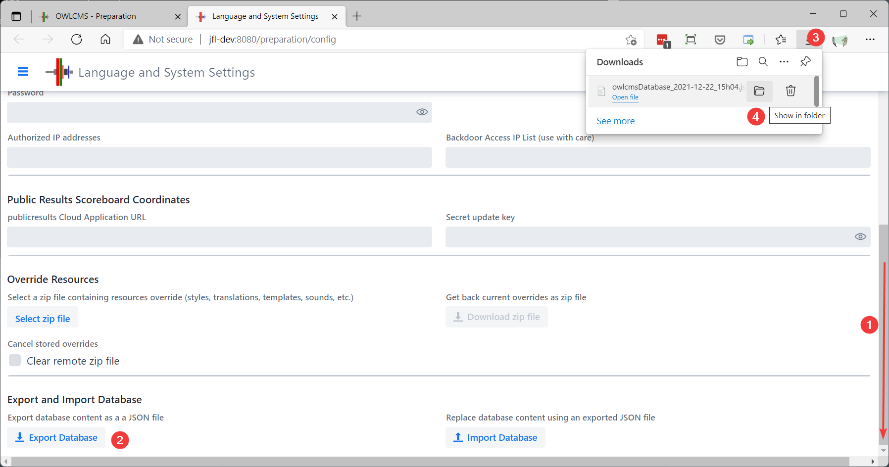
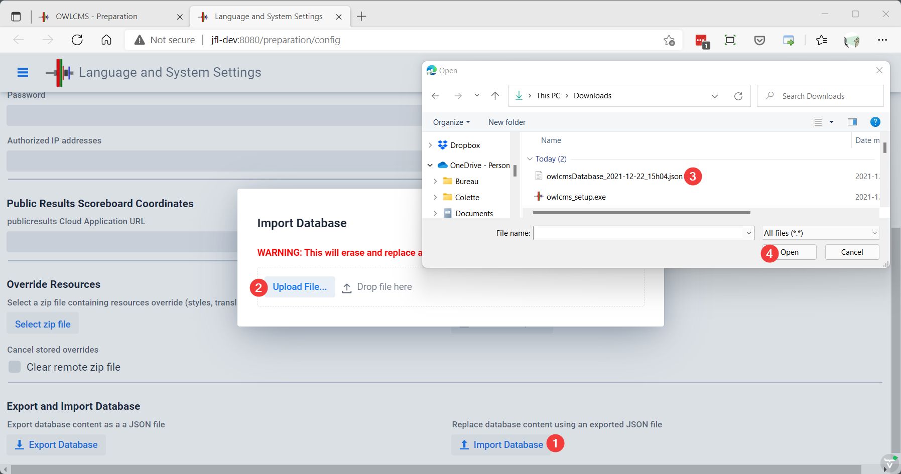

# Database Conversion Using Import/Export

Converting the database is required for two main reasons

- Moving between incompatible versions of the database engine (in December 2021, the H2 database used on local installation was updated to a new incompatible format, as part of an Internet-wide wave of security fixes)
- Moving between different databases (for example, H2 on a laptop to Postgres on the cloud)

The H2 migration is used as an example.

## Update to the most recent compatible version

This step is <u>required</u> for migrating a laptop installation between versions earlier than 4.26 and versions 4.27 and above.  

In order to export the database, an owlcms version using the old versions of the database library must be used.

> For H2, the last version compatible with the old database format is 4.26.  <u>**In order to convert your database to 4.27 or later, you need to first update to 4.26**</u>, otherwise you will lose the day and month of your athlete's birth dates (that bug was fixed in 4.26).
>
> To update, download the installer from https://github.com/owlcms/owlcms4/releases/tag/4.26.0  Your existing database will not be modified.

## Export the database content

owlcms exports the database content in a neutral format that is independent of the database used for storage.

1.  start your updated version (4.26) and go to the "Languages and Settings" page.

2. Scroll to the bottom of the settings page, and select "Export Database".  The exported file will be stored where your normal downloads go.  "Show in folder" will bring you there. The example is for Edge, but Chrome has a similar feature (look at the bottom of the screen instead)

   

## Install the new version

If you are updating a laptop, install the new version (4.27 or above).  If you are moving to the cloud, start your cloud application.

## Import the database

After starting the new version, go to the Settings page again, but this time use the "Import" function.  Locate your file in your "Downloads" folder, and click Open.  That's it.

