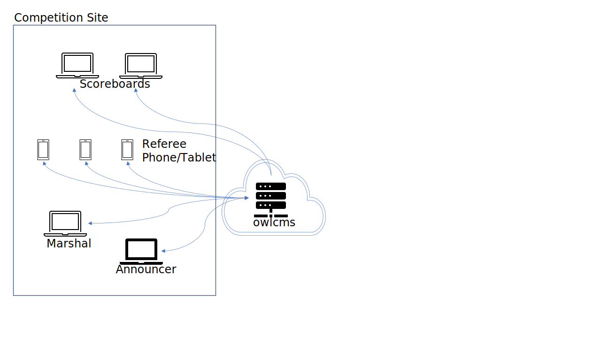
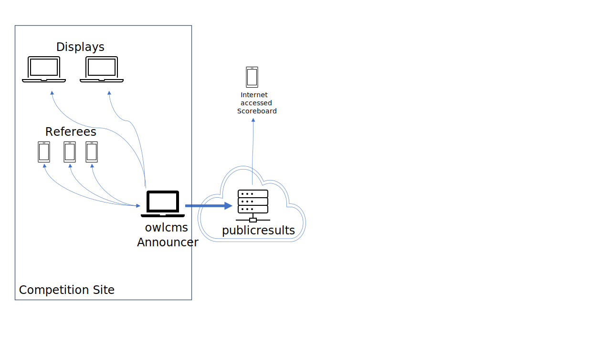

Several installation options are possible, depending on what is available at the competition site and the size of the competition.

- Stand-alone installation, if you prefer to run things locally ([description below](#stand-alone-laptop-installation))
  - [Windows Stand-alone Installation](LocalWindowsSetup)
  - [Linux, Raspberry or Mac Stand-alone Installation](LocalLinuxMacSetup)

- Cloud-based installation, where all you need are browsers (and a good internet connection). This is a good option for club competitions and virtual competitions. ([description below](#cloud-based-installation))

  - [Fly Cloud Installation Instructions](Fly).  

## Stand-alone: Laptop installation

In a local stand-alone setup, there is no reliance on a trustworthy internet connection, but owlcms needs to be installed on a reasonably recent laptop with adequate performance.

- The owlcms software runs on a laptop (labeled owlcms in the diagram) which acts as a web server to the other screens and displays.

- The primary laptop and all the other screens and official stations are connected to a wi-fi network or physically cabled to a router.

- All the displays are driven by a web browser - all the laptops, phones and tablets have one.

- You can run owlcms on the same machine as one of the officials.  It is often the case that owlcms runs on the same machine as the announcer or the competition secretary.

- In the following drawing, phones are used as the referee device.  But you can actually referee using hand signals, flags, phones, or dedicated keypads (USB or Bluetooth). See [this page](Refereeing) for the refereeing options

  

See the following instructions

  * [Windows Stand-alone Installation](LocalWindowsSetup)
  * [Linux, Raspberry or Mac Stand-alone Installation](LocalLinuxMacSetup)

## Cloud-Based Installation

In this scenario, the owlcms software runs as a web site on the Internet, but it is your own private copy, with your own database.  All that is needed is a good internet connection from the competition site.

In the following drawing, phones are used as the referee device.  But you can actually referee using hand signals, flags, phones, or dedicated keypads (USB or Bluetooth). See [this page](Refereeing) for the refereeing options.All the various display screens and devices connect to the cloud using the facilities network at the competition site.

The preferred cloud deployment solution is hosting on **fly.io**.  Fly.io is a service available world-wide where owlcms can be hosted free of charge.  owlcms has a [web application to automate the installation](https://owlcms-cloud.fly.dev) on the fly.io cloud.  For details, see the [Fly Cloud Installation Instructions](Fly).  

If you have your own hosting, you can also deploy a docker image using [Docker Instructions](Docker) 

## Public Scoreboard

A complementary module to owlcms allows anyone with Internet access to see the competition scoreboard, live and without delay, including the down signal and decisions. For example, you can connect an on-site major competition with the public scoreboard running in the cloud.
See the [Public Scoreboard](PublicResults) page for more information.  Note that this module is normally installed in the cloud and its installation is described in the [Fly Cloud Installation Instructions](Fly).