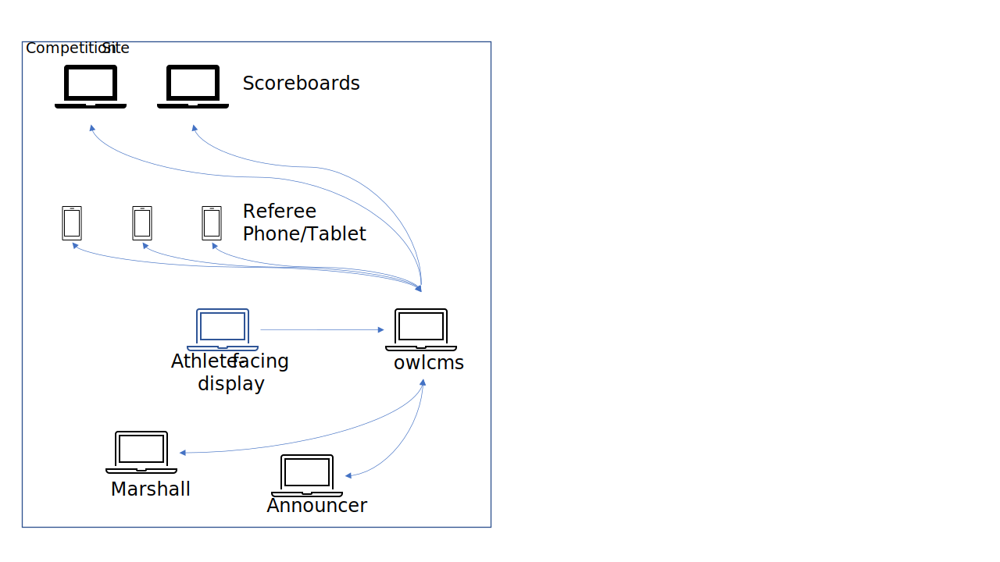
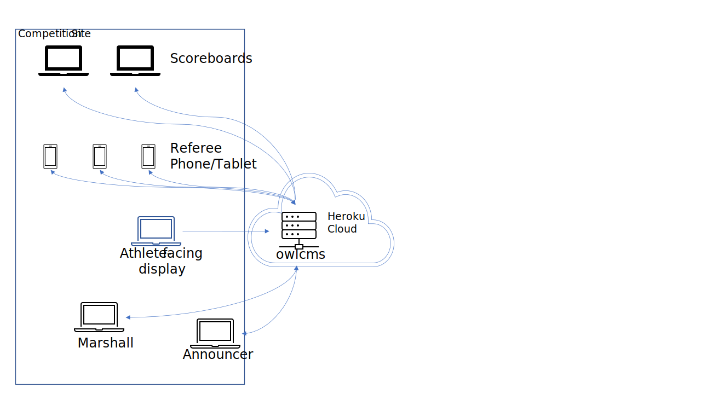

Several installation options are possible, depending on what is available at the competition site and the size of the competition.

- Stand-alone installation, if you prefer to run things locally ([details below](#stand-alone-laptop-installation))
  - [Windows Stand-alone Installation](LocalWindowsSetup)
  - [Linux or Mac Stand-alone Installation](LocalLinuxMacSetup)

- Cloud-based options, where all you need are browsers (and a good internet connection).  Such setups are ideal for virtual competitions. ([more details below](#cloud-based-installation))

  - [Fly Cloud Installation Instructions](Fly). 
  - (Deprecated) [Heroku Cloud Installation Instructions](Heroku)

- Finally, there is an optional module to provide remote scoreboards.  These are typically used during virtual competitions, or when the public cannot see the scoreboard.  The public results scoreboard is normally installed in the cloud. See the [Public Scoreboard](PublicResults) page for more information. 

## Stand-alone: Laptop installation

In a local stand-alone setup, there is no reliance on a trustworthy internet connection, but owlcms needs to be installed on a reasonably recent laptop with adequate performance.

- The OWLCMS software runs on a laptop (labeled owlcms in the diagram) which acts as a web server to the other screens and displays.

- The primary laptop and all the other screens and official stations are connected to a wi-fi network or physically cabled to a router.

- All the displays are driven by a web browser - all the laptops, phones and tablets have one.

- You can run owlcms on the same machine as one of the officials.  It is often the case that owlcms runs on the same machine as the announcer or the competition secretary.

- In the following drawing phones are used as the referee device.  But you can actually referee using hand signals, flags, phones, or dedicated keypads (USB or Bluetooth). See [this page](Refereeing)

  

See the following instructions

  * [Windows Stand-alone Installation](LocalWindowsSetup)
  * [Linux or Mac Stand-alone Installation](LocalLinuxMacSetup)

## Cloud-Based Installation

In this scenario, the owlcms software runs as a web site on the Internet, but it is your own private copy, with your own database.  All that is needed is a good internet connection from the competition site.

We provide instructions for the following variations

- **Fly.io**: Fly.io is in practice free because running owlcms costs about 10 cents per day BUT there is no billing for less than 5$ usage per month. No software needs to be installed locally to create a fly.io application (only 3 commands need to be typed). See the [Fly Cloud Installation Instructions](Fly).  
- **Heroku**: (Deprecated).  Heroku is no longer free, and what used to be a very simple installation process is no longer available -- the current process is unfortunately much more involved. See [Heroku Cloud Installation Instructions](Heroku).  For this reason we strongly recommend using fly.io
  Current pricing is 5$ per month for all the applications you can use in "Economy mode", but there is an extra 5$ per month for *each* database (each owlcms application needs one).  Hosting one owlcms and one publicresults costs 10$ per month because only owlcms needs a database.
- **Docker**: if you have your own hosting, you can deploy a docker image using [Docker Instructions](Docker) 
- **Kubernetes**: see [self-hosted Kubernetes instructions](DigitalOcean)

All the various display screens and devices connect to the cloud using the competition site's network.

In the following diagram phones are shown as the referee device.  But you can actually referee using hand signals, flags, phones, or dedicated keypads (USB or Bluetooth). See [this page](Refereeing)

## Public Scoreboard

A complementary module to owlcms allows anyone with Internet access to see the competition scoreboard.  This means that anyone in the audience with a phone can follow the scoreboard on site.  People watching live streaming or participating in a virtual competition can also see the scoreboard (including the countdown and decisions). And finally, coaches in the warmup room can be given a Wifi connection and watch the scoreboard on a tablet.

See the [Public Scoreboard](PublicResults) page for more information.  Note that this module is normally installed in the cloud and its installation is covered in the [Heroku Cloud Installation Instructions](Heroku) and [Fly Cloud Installation Instructions](Fly).