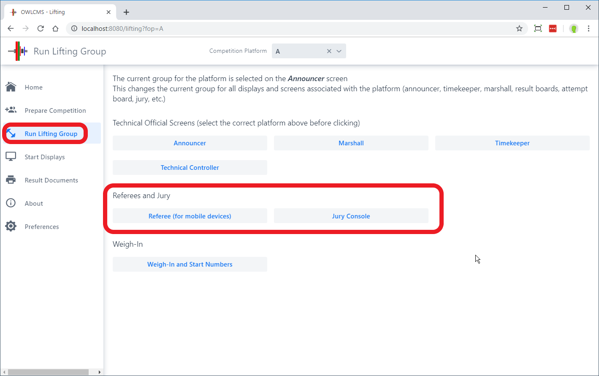
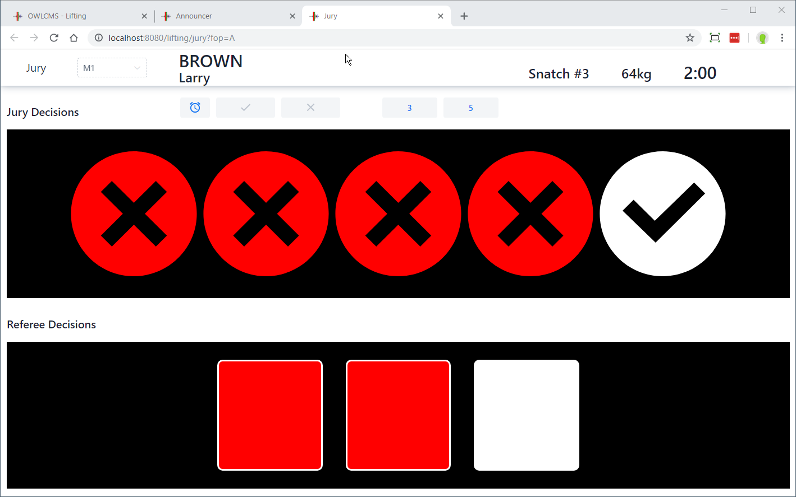
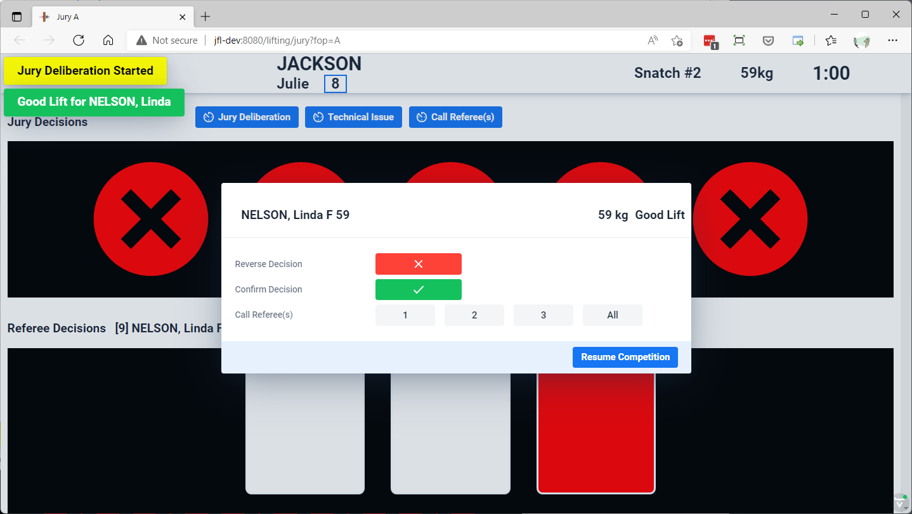
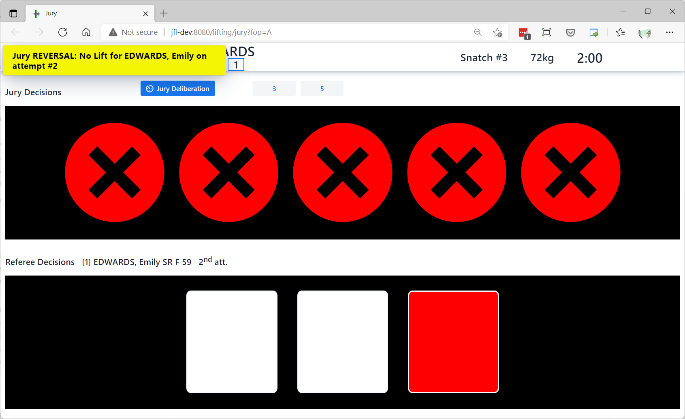
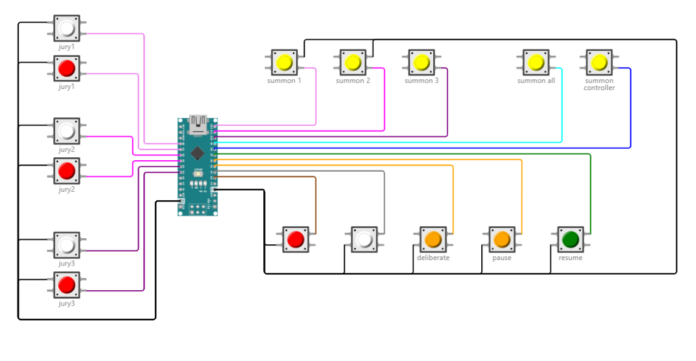
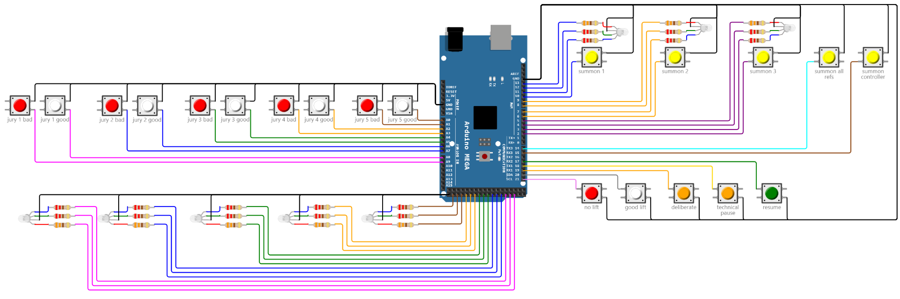

The jury is operated from the Jury Console page.  In order to use a Jury  you need 3 or 5 keypad devices connected to the computer running the Jury Console.  You may optionally have a separate keypad for the jury president (see below) in order to initiate deliberation and transmit decisions.

The jury console is started from the "run a lifting group" page.

 

## Jury Console

The jury console operates according to IWF rules:

- In the bottom part of the screen the referee decisions are shown <u>as soon as they are made</u>  
- In the top part of the screen, the decisions circle for a jury member shows that he or she has made a decision, but the individual decisions are only shown in red or white <u>after they have all been given</u>.

## Jury Deliberation

The jury console now allows direct reversal/confirmation of lifts 

  - The Jury Deliberation button opens a dialog whereby the lift can be confirmed or reversed,
  - During deliberation, it is possible to call the referees to the Jury table.  The referees get a notification on their device if the device is feedback-capable (such as a phone or a full-feedback keypad).

Jury decisions are shown in yellow to the other technical officials consoles to keep them informed.  The decisions are also shown on the attempt board.

## Calling Referees

The "Call Referee(s)" button is used to summon referees to the Jury Table outside of a lift-reversal deliberation.  It is also possible to start a technical break if the Jury notices something is wrong with the platform or the equipment.

## Jury Devices

There are two ways to build jury devices.  The first way is to emulate a keyboard (one-way to owlcms), the second way is to use an Arduino to communicate with owlcms (bi-directional).

### Jury Keypads

##### Jury Member Keypad

Each jury member must have a button keypad connected to the laptop (either directly, via a USB hub, or via Bluetooth). 

The same conventions are used as for the refereeing keypads.  You can use the same devices for the first three jury members as for the three referees.

| Jury# | Good | Bad  |
| ----- | ---- | ---- |
| 1     | 1    | 2    |
| 2     | 3    | 4    |
| 3     | 5    | 6    |
| 4     | 7    | 8    |
| 5     | 9    | 0    |

##### Jury President Keypad

> If you intend to build a jury president keypad, you should consider the Arduino-based [button-only jury box](#button-only-jury-box) below, since the hardware is identical, and you can save yourself the programming.

An additional keypad can be connected to the Jury console, which would typically be operated by the Jury president.  This keypad also works using keyboard shortcuts.

In order to support a jury console keypad, the following shortcuts are bound.  Depending on how your device behaves, you may have to send either the lowercase letter or the uppercase letter, <u>please try both</u> !

- "d" opens the deliberation dialog and starts a jury break (`KeyD` event code)
- "g" to indicate a good lift  (`KeyG` event code)
- "b" to indicate a bad lift  (`KeyB` event code)
- "c" to call the technical controller (ex: for a loading error where the athlete will need to make a decision) (`KeyC` event code)
- "t" to start a technical break if the Jury spots a technical issue (`KeyT` event code.)  The process is the same as for a deliberation. "c" can be used to call the controller, and "Escape" ends the technical pause.
- "h", "i", "j" and "k".  Call referee 1, referee 2, referee 3 and all referees.
- "Escape" to close the dialog and ends the jury break (`Escape` event code)

Please refer to [this document](https://www.w3.org/TR/uievents-code/#key-alphanumeric-writing-system) for the exact definition of the event codes.

### Arduino-based Jury Devices

Another way to build a device is to use the MQTT protocol that owlcms supports which provides bi-directional communcations.   Commercially available devices that use this approach are being developed (see the [BlueOwl project](https://github.com/scottgonzales/blue-owl)).

But you can in fact use the same approach to build your own devices. Arduino boards are an affordable way to build your own devices.  Designs are available on [this page](https://github.com/owlcms/owlcms-firmata/tree/main/README.md) for working timekeeper, referee, and jury setups.  The Firmata firmware that runs on the Arduino and the [interface program for owlcms](https://github.com/owlcms/owlcms-firmata) are provided.  There is actually nothing to program.  

##### Button-only Jury Box

A simple button-only jury control box and the associated jury member buttons, using the owlcms display to look at decisions, is shown here.  This is the same hardware as required to build a jury keypad, except that you don't have anything to program since all the software is already provided.  You would only adjust the configuration file if you needed to use different pins in your build.

 

##### Full Jury Control Box with Indicator Lights

A full 5-member jury device is shown below.  In actual practice, you might want to include only 3 jury members and if so you would only keep 3 sets of buttons on the left.   This design includes all the green/red/white indicator lights and uses an Arduino Mega to provide more pins.

 

owlcms uses the MQTT protocol used in Internet-Of-Things automation and monitoring applications to talks to the devices.  See the [MQTT](MQTT) page for more details and for schematics that you can use for your own devices.  Commercially available pre-built devices using the same protocol are also being developed.

