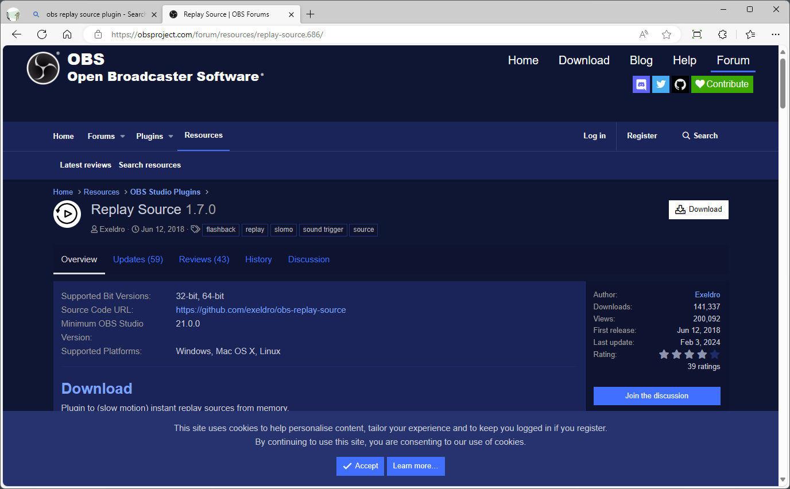
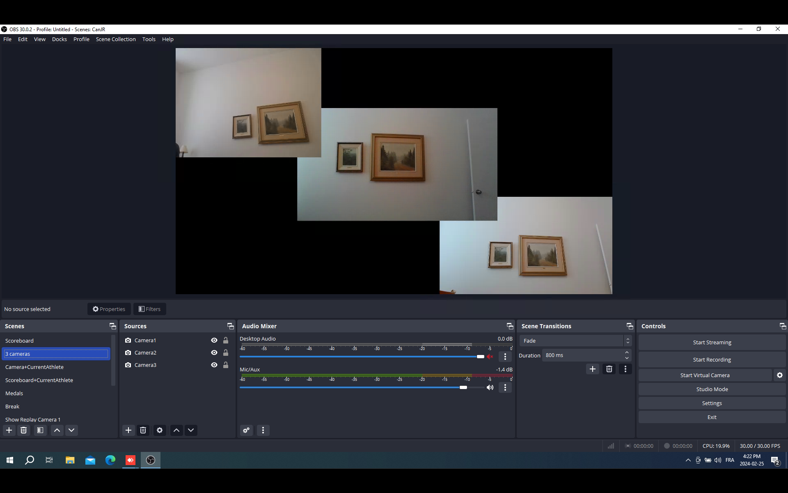
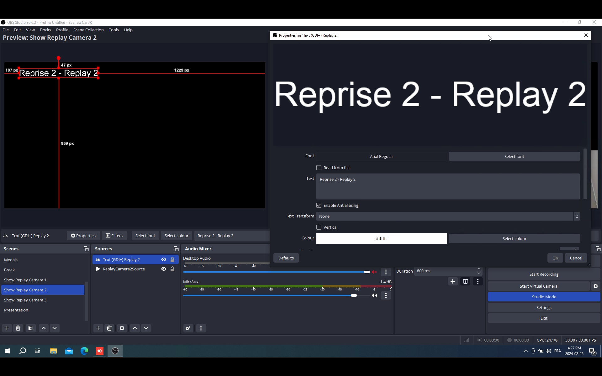
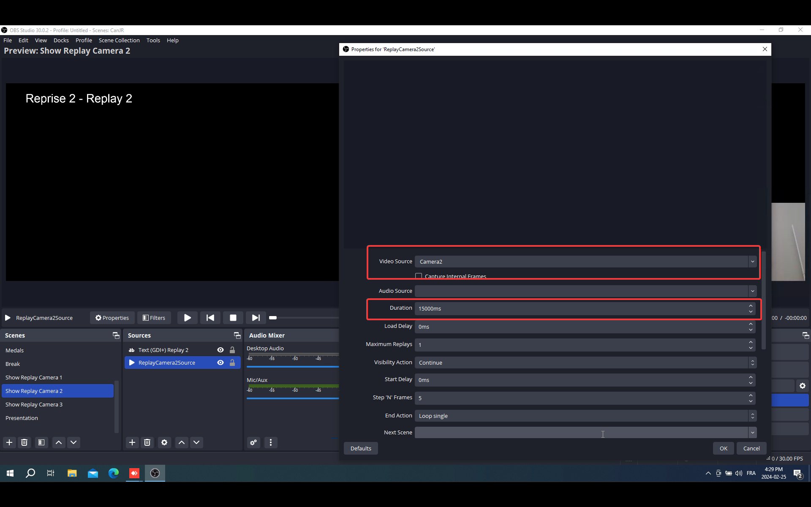
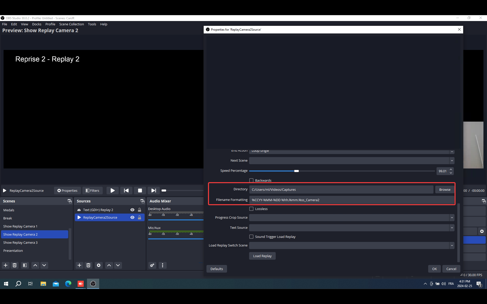
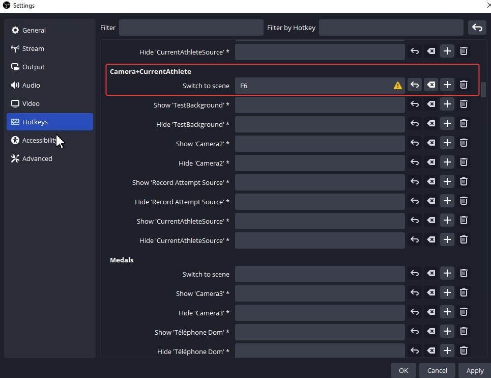
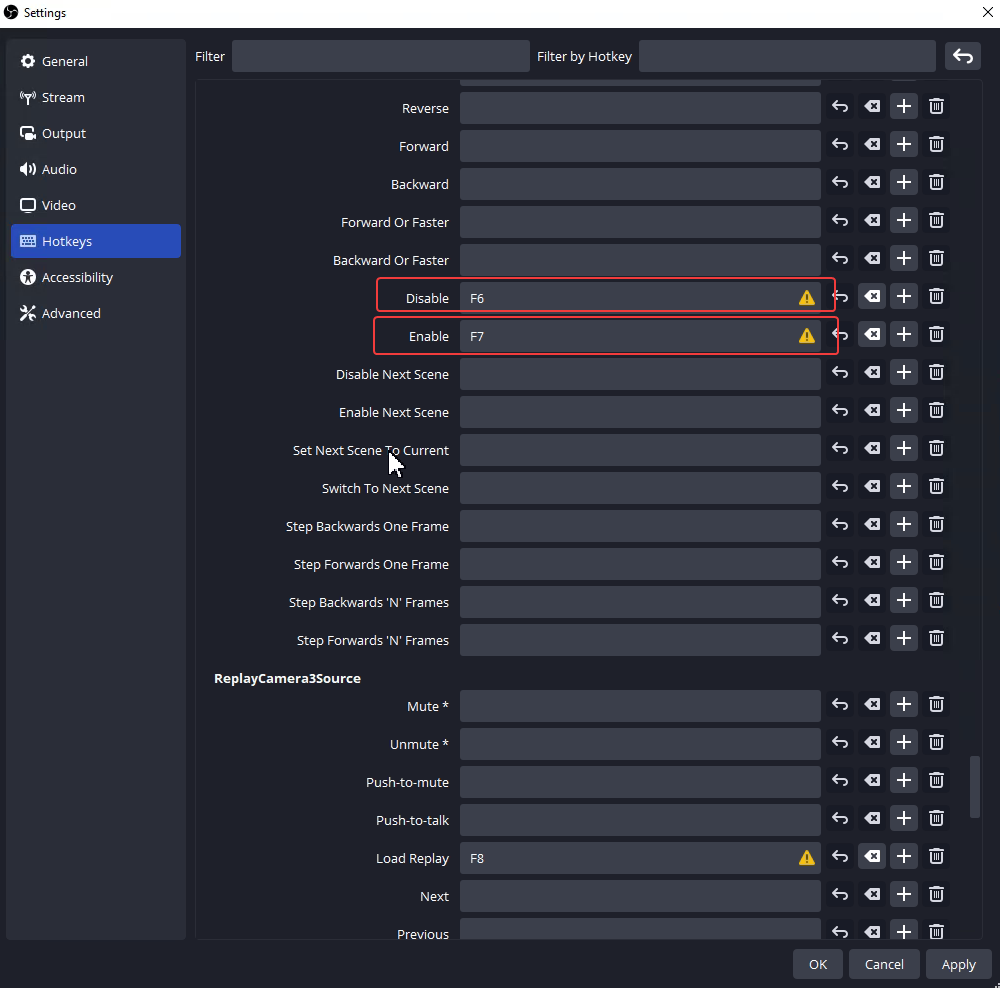
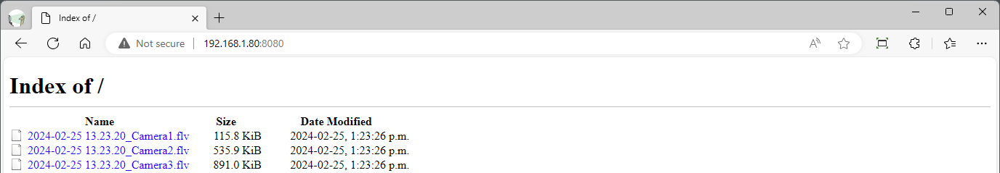

# Jury Replays Using OBS

If you are streaming to Facebook or YouTube using OBS, you can replays for the Jury at the same time without additional equipment (and you can also play the replays to your stream)

The recipe shown here will work for as many USB ports as there are on the machine doing the streaming (typically 4)

Equipment required:

- The OBS Laptop. It should have as many USB ports *on the computer* as you will plug USB cameras in. OBS requires that each camera be plugged in to a different USB port (you cannot use a hub.)  The OBS laptop is ideally a gaming laptop with multiple USB ports, an Ethernet port, and a GPU.
- 1 to 4 USB Cameras -- this can be a WebCam, or a HDMI camera with a USB converter.
- A Jury laptop for looking at the replays.

## Overview

OBS has a plugin called "Replay Source" that can memorize a certain duration of anything OBS can display, *independently of what is being streamed*.  We will setup the plugin as many times as we have cameras, each instance is independent of the others.

The workflow will be as follows

1. When the athlete enters the stage, we will use a hot key (**F6**) to reset the plugins.
2. When the athlete is at the bar and about to start lifting, we will use a second hotkey (**F7**) to start recording the replay.  The same hotkey will trigger all the different plugins -- all the cameras will be recording.
3. When the athlete has lowered the bar, we will use a third hotkey (**F8**) to end the replay.  All the plugins will write a file to disk containing the replay.
4. Typically the athlete walks off the stage happy or disappointed, and we see the coaches' reaction.
5. Then we show the replay, using a fourth hotkey (F9)

So the person in charge of the replays only has to perform the simple F6 - F7 - F8 sequence, plus F9 when appropriate to show the replay.

For the jury to get access to the replays, we run a tiny Web server on the OBS laptop.  The jury laptop is connected to that server. Then one only has to click on the last files at the bottom of the list, the files are listed in chronological order.  Each camera is in a separate file.

## OBS Setup

#### Installing the `Replay Source` plugin

Using `obs project replay source plugin` in google should bring you to the correct page.  Use the `Download` button to locate the installer for your operating system.

### Configuring the Replay Cameras

There is nothing special about configuring the cameras -- in this example, we show 3 cameras being used.  In actual practice, you will probably use 1 for the front, one for a diagonal view, one for the coaches reaction.  Whatever works.

For convenience, we create a scene with the cameras we make available to the jury.  In this setup we just use 3 webcams.

### Configuring the Replay Scenes

This part is slightly counter-intuitive.  The configuration of how the plugin will record is actually done at the same place we define how the plugin will *play back*.  So for each of our cameras that we want to be able to replay, we define a scene to *show* the replay.

If we have 3 cameras, we will do this 3 times.  This example is for Camera 2.

We create a scene, and add an overlay text so we know which replay is playing.  We suggest using a name like `Show Replay Camera 2` for the scene, so it is easier to locate in later steps.

Then we add the actual replay. This is done by adding a "Replay Source" source to the scene. We select the Camera we want to record and replay, and the maximum length (15-20 seconds is ok).  We suggest using a name like `ReplayCamera2Source` to make it easier to locate in later steps.

A little bit further down on the Replay Source configuration is the critical information for storing the replays

You must:

1. Select a directory where the files will be stored.  Somewhere under "Videos" is fine.
2. IMPORTANT: at the end of the proposed Filename magic string, add `_CameraX` (where is is the camera number).  This will ensure that we know what camera took what view.

### Configuring the Shortcut Hotkeys

OBS allows the same hotkey to trigger multiple actions.  It displays a yellow triangle when doing so, but that's exactly what we want.  To define the hotkeys, go to the the Settings/Hotkeys menu.

1. Locate the scene that should be shown when the athlete is lifting.  We will define a F6 Hotkey to go there and reset the replays.
   
2. Then we will define the hotkeys to deal with the replay.  We need to define how to start and save it.
   Because of the order in the list,  we define the hotkeys for saving first.  We need to scroll down in the list to find our `ReplayCamera2Source` source.  The **F8** key will load the replay and save it.

Then we scroll one screenful down, and find the entries for resetting and starting the replay recording.

If we have multiple cameras we do the same thing for the other cameras like `ReplayCamera1Source` and `ReplayCamera3Source`.  We use the same hotkeys for all the jury cameras.

### Making the Replays Available to the Jury

The replays are recorded on the OBS laptop.  A very simple way to make the replays available to the jury is to install a simple web server.  For the purpose of this example, we installed https://simplewebserver.org/ on the OBS laptop, and made its default file folder the location where OBS saves the files.

The files will be shown in ascending temporal order (more recent at the bottom). Simply refresh the view to get the latest files.   Because we added the suffix to the file name, we know which camera produced what.

