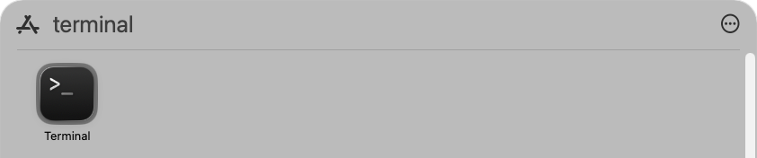
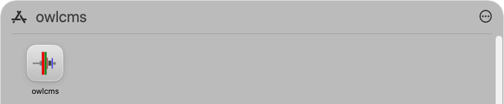

## macOS Installation 

macOS is opinionated about software that has not gone through the notarization process and generates needlessly alarming warnings, even when updating (see the [legacy installation](LocalMacSetupLegacy.md) for examples)

> Deepest apologies for having to use the Terminal.
> You will be asked to run two (2) commands and type your password once.

#### 1. (Needed only once) Install the `homebrew` Installation Manager

- Click on the text in the grey box just below. Move your mouse to the top right of the grey box. The text "Copy to Clipboard" will appear.  Move your mouse over it and click.  It should say "Copied"

  ```
  /bin/bash -c "$(curl -fsSL https://raw.githubusercontent.com/Homebrew/install/HEAD/install.sh)"
  ```

- Using the Application icon   in the Dock, type `Terminal` to locate the Terminal application. You should see something like this.

  

  - Start Terminal by clicking on the icon and click into that window
  - Paste what we just copied using `⌘V` (Command-V)
  - Type `↩` to start the installation (Return key).
  - You will be asked for your password
    -  Type your password (it will not be shown) and hit  `↩`  (Return)
  - Accept all the suggestions the script will make (hit Return or type yes as requested)
  - The installation will proceed and bring you back to a waiting Terminal.

#### 2. (Needed only once) Install the control panel

- If you have a newer Apple Silicon Mac (M1/M2/M3...) , do the same recipe as before, click on the text, move to the top Right, click to copy.
  ```
  /opt/homebrew/bin/brew install --cask owlcms/brew/controlpanel --force
  ```

  Go back to the terminal window, Paste and use Return `↩` to start the actual installation.

- For an older Intel Mac, the command to copy and paste is

  ```
  /usr/local/bin/brew install --cask owlcms/brew/controlpanel --force
  ```

- After the installation runs, OWLCMS control panel will be visible as owlcms in the Applications folder
  

- Clicking on the icon will now start the control panel.  We are done.


If you later want to update the control panel, see [this page](LocalMacSetupBrewUpdate.md)
