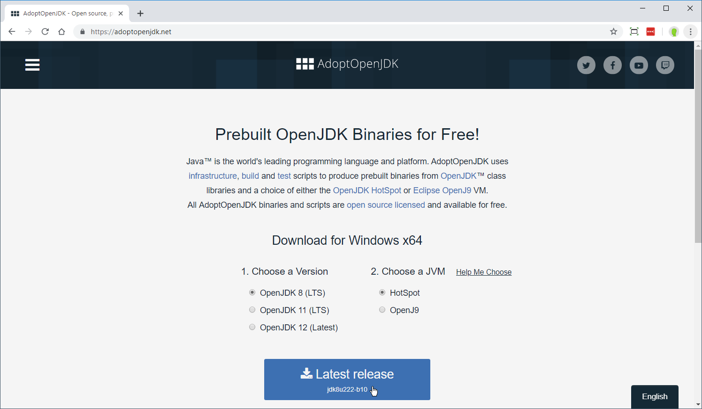
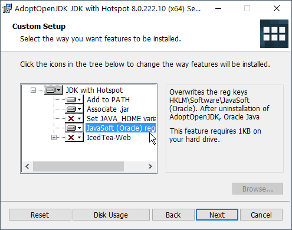

In a stand-alone setting, you do not need an Internet connection.  Everything runs locally at the competition site.  <u>One laptop is used to run the software and acts as a *master</u>*.  Only <u>one</u> laptop runs the owlcms software -- all the other screens connect to the master using a Web browser.

See the [Equipment Setup](EquipmentSetup.md) page for details on how the various computers are set up, from the simplest case of a  club meet to the full setup for national championships. Other than the master laptop, you can use any type of laptop or miniPCs (even 35US$ Raspberry Pi computers) to drive your screens.

## Pre-requisites for the master laptop

The master laptop requires **Java 8** to be installed. We recommend using the installer from https://adoptopenjdk.net/ 

- For Windows, click on the link above, and the correct installer for your version will be proposed.

  
- When installing, you will see a screen with options, we recommend you enable the option for JavaSoft registry variables (use the dropdown next to the option to enable it)

  

- On MacOS or Linux, get the installer from the link above, and use the default options.

## Installing the owlcms server software

This step is performed only on the master laptop.

- Get the current zip file from <https://github.com/jflamy/owlcms4/releases> (see the "Assets" section)

- On Windows,
  - Double-click on the zip file, and double-click on `owlcms.exe` .
  - You will be prompted to extract the files to a directory.  If your login is called `myfederation` we suggest you use something like `C:\Users\myfederation\owlcms` as the unzipped location. 
  - If you do so, you will be able to type `cd %USERPROFILE%\owlcms` to go to your installation directory.
- On MacOS or Linux
  - Double-click on the zip file, and extract the files to a directory.  We suggest you use `~/owlcms` as the unzipped location.
- Notes:
  - The database will be created in a directory named `database` 
  - Log files will be created in a directory called `logs` . If you report bugs, you will be asked to send a copy of the files found in that directory (and possibly a copy of the files in the database folder as well).

