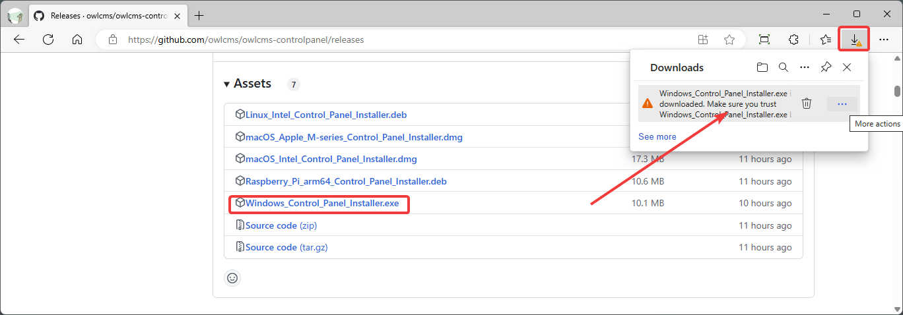
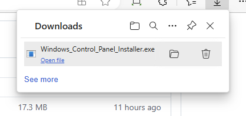
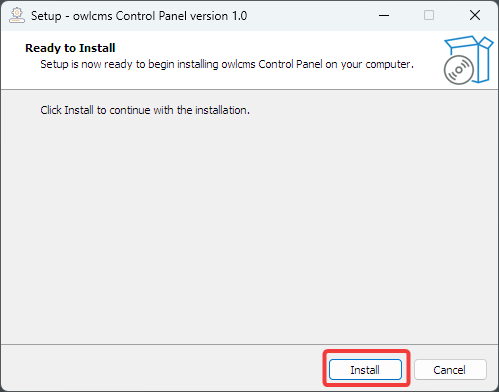
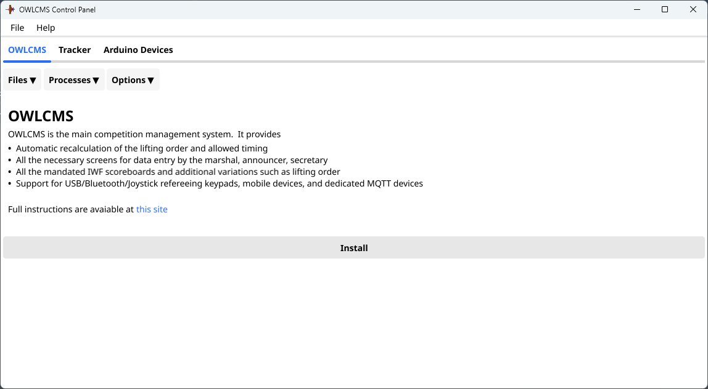

## Windows Installation

### Installation

- Click on this link: [Release Repository](https://github.com/owlcms/owlcms-controlpanel/releases).  **Scroll down to the Assets section**.
  
- Download the file named **Windows_Control_Panel_Installer** 
  If you get Warnings about the file as in the picture, see [these instructions](DefenderOff)

  

> **Caution: Windows may <u>falsely</u> signal the presence of a virus and refuse to download.**
>
> - There is no absolutely no virus in the installer, Windows is confused.  The false detection has been reported to Microsoft
> - Workaround: you look in the Assets list, you will find a file called `owlcms-controlpanel.exe`   This is the actual program that the installer would have installed.
> - Download `owlcms-controlpanel.exe`   This does not trigger the alert.  Move the file from your download area to your desktop.  Go to [Running owlcms](#running-owlcms) at the bottom of this page for the next steps.

- Once the file downloads, use the "Open File" link, or go to you Downloads folder and execute the file.

  

- This will start the installer.  The installer will add an "owlcms Control Panel" icon on the Desktop, and a section in the start menu.

  

### Running OWLCMS

- To run the program, double-click on the Desktop Icon, or use the entry for "owlcms Control Panel" in the start menu
  - The first time you run the file, it is possible that Windows will complain.  Should that be the case Click on **More Info** and then, at the bottom, click on **Run Anyway**

- The first time you run the Control Panel, it will detect that no version is installed and download the current version of owlcms, and the Java runtime files necessary to execute it.
  
- You will then see the Control Panel
- Once this is done, you can **follow the steps shown in the [Local Control Panel Overview](LocalControlPanel)**
