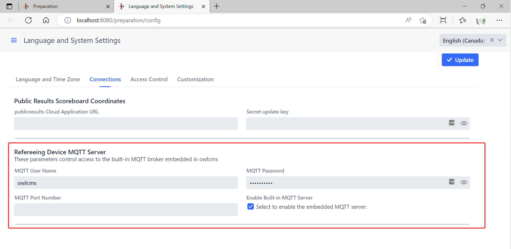

## MQTT Server

MQTT is used for communication between refereeing, jury and timekeeper devices built using Arduino, ESP32, Raspberry Pi and other device controllers.

owlcms now includes an MQTT server to support these exchanges.

Sample projects that use MQTT for communication between devices and owlcms include:

- https://github.com/jflamy/owlcms-esp32 contains Arduino code and simple circuit schematics to build a simple refereeing device with an indicator LED and a buzzer to remind a referee to enter a decision.

- [scottgonzalez/blue-owl: Technical Official device integration for OWLCMS (github.com)](https://github.com/scottgonzalez/blue-owl) is another example, using Johnny-Five to drive the device controllers.
- https://github.com/kingbutter/owlcms4-ref-m5stack-core2 uses the M5Stack devices as a basis for touchscreen-based refereeing devices.

The devices and owlcms use the MQTT protocol to communicate with each other.  The communication goes through an MQTT server that can be installed on the local area network or in the cloud.  MQTT is very lightweight and is used in home automation, in industrial telemetry application and other "Internet of Things" (IoT) settings.

See [MQTT Messages](MQTTMessages) for details on how MQTT is used.


### Configuration of the built-in MQTT server

By default, owlcms will start an MQTT server in anonymous mode. If there is no username,  any process can connect to the owlcms machine on port 1883 using any username and any password.

If you have a wired network with no wifi you might be comfortable doing that, but we do suggest that you add a  username and password.

The simplest way of doing this is using the user interface.  The values you set in these fields are the values you will use from your MQTT device controllers.



> These fields were previously used to configure how owlcms connected to an external server such as Mosquitto or aedes.  *They no longer do.*  If you need to connect to an external server, you will need to use the method described further below.


## Configuration Variables

If you configure the MQTT Server in the database, the settings are valid when that database is in use.

If you want something more permanent you can use either environement variables or Java system properties.

On Windows, you can do as follows

1. Go to the installation directory, and locate the `owlcms.l4j.ini` file (depending on your Windows configuration, the `.ini` extension can be hidden).  
2. The following three properties can be defined -- they play the same role as the fields in the database.

```
# MQTT for refereeing devices
-DmqttUserName=owlcms
-DmqttPassword=some_Password_you_choose
-DmqttPort=1883
```

> NOTE that the variable `mqttServer` is NOT defined (see the next section)

3. You can also use the three equivalent environment variables OWLCMS_MQTTUSERNAME, OWLCMS_MQTTPASSWORD and OWLCMS_MQTTPORT


## Using an External Server

Some cloud environments won't allow owlcms to provide the server (Heroku, for example).  For these situations, define the environment variable OWLCMS_MQTTSERVER in addition to the other (OWLCMS_MQTTUSERNAME, OWLCMS_MQTTPASSWORD and OWLCMS_MQTTPORT).  Then owlcms will use the external server instead of its built-in server. 

> As soon as you define -DmqttServer or define OWLCMS_MQTTSERVER the built-in server is not used.

