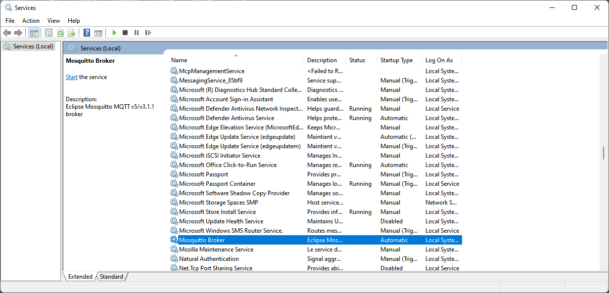
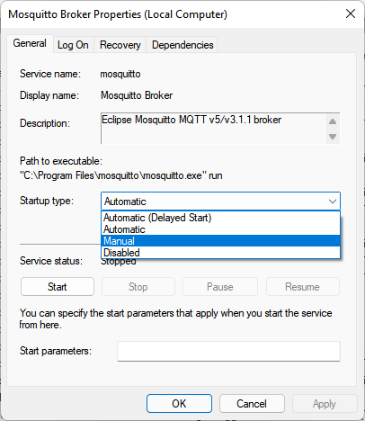
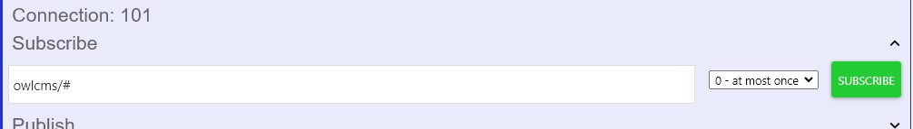
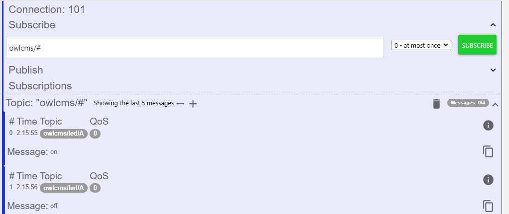

MQTT is used for communication between refereeing, jury and timekeeper devices built using Arduino, ESP32, Raspberry Pi and other device controllers.

For example

- https://github.com/jflamy/owlcms-esp32 contains Arduino code and simple circuit schematics to build a simple refereeing device with an indicator LED and a buzzer to remind a referee to enter a decision.

- [scottgonzalez/blue-owl: Technical Official device integration for OWLCMS (github.com)](https://github.com/scottgonzalez/blue-owl) is another example, using Johnny-Five to drive the device controllers.
- https://github.com/kingbutter/owlcms4-ref-m5stack-core2 uses the M5Stack devices as a basis for touchscreen-based refereeing devices.

The devices and owlcms use the MQTT protocol to communicate with each other.  The communication goes through an MQTT server that can be installed on the local area network or in the cloud.  MQTT is very lightweight and is used in home automation, in industrial telemetry application and other "Internet of Things" (IoT) settings.

See [MQTT Messages](MQTTMessages) for details on how MQTT is used.

### Local Installation of the MQTT server and tools

1. Install a local MQTT server.  We suggest [Mosquitto](https://mosquitto.org/download/).  You can install it on the same machine as your owlcms if running locally. The installer works silently and creates a background service.

2. For initial testing purposes, we will not be running Mosquitto as a service.  We will start it manually.

   1. Click on the Windows icon and type "Services"
   2. Scroll down in the list to find Mosquitto
   3. Right-click and select the Manual startup mode.

   

### Initial Configuration

1. Start a `cmd` window (click on the start menu icon and type `cmd` to locate it, or use the Windows-R keyboard shortcut).

2. Go to your home directory (or any directory that does not contain a space anywhere). Create a `mosquitto` subdirectory. This will be our <u>Mosquitto configuration directory</u>. 

   ```
   cd %HOMEPATH%
   mkdir mosquitto
   cd mosquitto
   ```

3. Copy the file "mosquitto.conf" from the Mosquitto installation directory to the configuration directory

   ```
   copy "C:\Program Files\Mosquitto\mosquitto.conf" .
   ```

4. Open the  `mosquitto.conf`  file.  Add the following lines at the top.  The `allow_anonymous` line is used for initial testing. After the initial tests, a password file should be added. This will be done later in the installation process.

   ```shell
   # owlcms config parameters  for mosquitto
   listener 1883
   allow_anonymous true
   connection_messages true
   log_timestamp true
   log_timestamp_format %Y-%m-%dT%H:%M:%S
   ```

5. From the configuration directory, start Mosquitto in "verbose" mode

   ```
   "C:\Program Files\Mosquitto\mosquitto.exe" -v -c mosquitto.conf
   ```

   You should now see all the traffic going through the server

6. Install a MQTT interactive tool for testing and monitoring.  An easy tool that runs as a Chrome application is [MQTTlens](https://chrome.google.com/webstore/detail/mqttlens/hemojaaeigabkbcookmlgmdigohjobjm?utm_source=chrome-app-launcher-info-dialog) . 

### Local configuration of owlcms

owlcms needs to connect to your MQTT server.  

1. Go to the installation directory, and locate the `owlcms.l4j.ini` file (depending on your Windows configuration, the `.ini`can be hidden).  
2. For our server without any passwords, add the following lines at the beginning of the file. Obviously, replace `192.168.0.101` with the actual IP address or name of your server (same as reported by owlcms when it starts up.)

```
-DmqttServer=192.168.0.101
-DmqttUserName=""
-DmqttPassword=""
-DmqttPort=1883
```

> Once we are done with the initial tests, we will add a password file (see [Passwords](#passwords) later in this page)

### Local Testing

In MQTT, all communications go through an intermediate server (often called the broker).  By subscribing to all the owlcms topics, we can effectively monitor everything that is going on.  Conversely, we can also simulate all the messages sent to the broker by the devices or by owlcms.

1. Start MQTTLens.

2. Create a connection to your local Mosquitto  and Save.
   

3. If you look at the mosquitto window, you should see something like

   ```
   2022-02-02T14:09:03: New client connected from 192.168.1.101:39899 as lens_QHQNpt4hPp5h5RWQBnRHBsmLXEX (p1, c1, k120, u'owlcms').
   ```

4. Create a Subscription to `owlcms/#` 
   This will show all the messages received that start with owlcms, no matter their depth) 
   Click "Subscribe"

5. Mosquitto will show something like

   ```
   2022-02-02T14:09:03: Received SUBSCRIBE from lens_QHQNpt4hPp5h5RWQBnRHBsmLXEX
   2022-02-02T14:09:03:    owlcms/# (QoS 0)
   ```

6. Start owlcms.  When owlcms starts, it sends a message to turn the LED on and off. So in the Subscription section of the application, you should see something like this for each of your platforms (`A` will be replaced by the actual name of your platform(s))

7. Mosquitto shows the message received from owlcms ("received publish") and the send to Lens ("sending publish").  "paho" is the name of the library used by owlcms.

   ```
   2022-02-02T14:15:55: Received PUBLISH from paho100726418685300 (d0, q1, r0, m1, 'owlcms/led/A', ... (2 bytes))
   2022-02-02T14:15:55: Sending PUBLISH to lens_QHQNpt4hPp5h5RWQBnRHBsmLXEX (d0, q0, r0, m0, 'owlcms/led/A', ... (2 bytes))
   ```

8. We can also simulate what the referee will send to Mosquitto. 
   For platform `A`, referee 1 will send its decisions on topic `owlcms/decision/A` . 
   The message is the referee number followed by a space and then `good` or `bad`

   

9. Mosquitto will display the results.  Notice that all the subscribers get the message, including lens itself.

```
2022-02-02T14:23:40: Received PUBLISH from lens_QHQNpt4hPp5h5RWQBnRHBsmLXEX (d0, q0, r0, m0, 'owlcms/decision/A', ... (6 bytes))
2022-02-02T14:23:40: Sending PUBLISH to paho100726418685300 (d0, q0, r0, m0, 'owlcms/decision/A', ... (6 bytes))
2022-02-02T14:23:40: Sending PUBLISH to lens_QHQNpt4hPp5h5RWQBnRHBsmLXEX (d0, q0, r0, m0, 'owlcms/decision/A', ... (6 bytes))
```

10. You can send a second message `2 good`. After the second decision, owlcms will send two messages to `owlcms/decisionRequest/A/3` indicating that referee 3 needs to make a decision. There will be an `on` message, and two seconds later, an `off` message.  The device will use this to remind the referee, and after two seconds, owlcms tells the device to end the reminder.  The device can either do its own timing (and ignore the end message), or wait for the owlcms message.

### Running Mosquitto as a background service.

Once everything works, you can let Windows run Mosquitto in the background and start automatically.   This step is optional. If you prefer watching what is going on, you can continue using a command window and run mosquitto from there.
- The Services program is used to set the starting mode to `Automatic` (instead of `Manual` that we used in the first installation steps)
- **IMPORTANT**: copy your `mosquitto.conf` file from your personal directory to the `Program File\Mosquitto` directory. There is no convenient way to tell the service to find your configuration file elsewhere.   Because your password file is indicated explicitly in the conf file, you can leave it where it is.
- The Services command is also used to Stop/Start/Restart Mosquitto

### Cloud configuration and testing

The process is the very similar to configuring the Mosquitto connection parameters.  The difference is that you will be using a cloud MQTT server, with nothing to install locally.

You want a cloud server that requires a login and a password.  We suggest StackHero because it has a free test mode (but only available through Heroku).  Since most people that use owlcms in the cloud use Heroku, this is actually convenient.

1. Create a Heroku account if you don't have one.
2. Create <u>a new application</u> to be used for MQTT.  You can have only one free MQTT server. So you will need to keep this application around, you won't create a new one for every meet.  Give it a meaningful name.
3. Add the StackHero Mosquitto add-on to your new application (under Resources).  Select the `Test` plan which is free.
4. Click on the link to configure a username and password
5. For configurating owlcms and mqttLens, follow the same instructions as above, using the hostname, username and password from the StackHero Mosquitto configuration page.

### Passwords

Once initial testing is done, you should add passwords to the configuration.

1. Go to your Mosquitto configuration directory

2. The following *creates* (`-c`) a new password file, with a user `owlcms` (you can use whatever username you want).
   You will be prompted to enter a password (twice).  

   ```
   "C:\Program Files\mosquitto\mosquitto_passwd.exe" -c pwfile owlcms
   ```

   > The file contains an undecipherable encoding of the password.  If you just want <u>to change a password</u>, or need to add another user, <u>call `mosquitto_passwd` *without* the `-c`</u> (otherwise you will erase and recreate a new file.)

3. Change the beginning of the mosquitto.conf file to look like the following.  Use the correct full path for the password file in your configuration directory. The name must not have any blanks, and you cannot use quotes.

   ```
   listener 1883
   allow_anonymous false
   password_file C:\users\jf\mosquitto\pwfile
   connection_messages true
   log_type error
   log_type warning
   log_type notice
   log_type information
   log_timestamp true
   log_timestamp_format %Y-%m-%dT%H:%M:%S
   ```

4. In the owlcms installation directory, change the owlcms.l4j.ini configuration file to use the username and password
