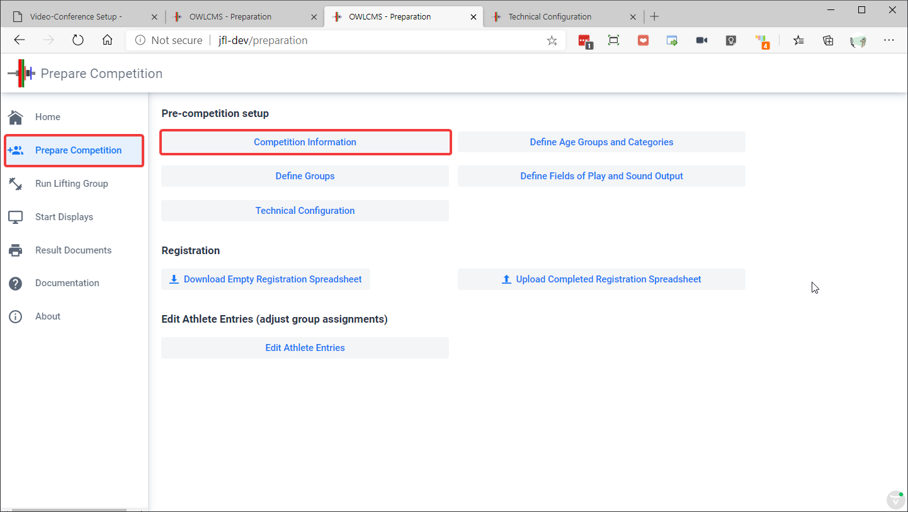
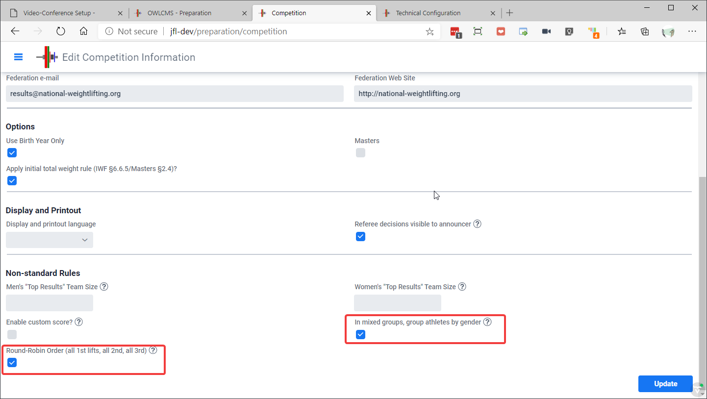

Two modifications to the rules can be used to simplify the proceedings of a virtual competition.

1. **Round-robin ordering**.  Within a group, athletes take their first snatch attempt from lightest to heaviest weight.  Then a short pause is given where athletes can change their second attempt.  Then all second attempts are taken (no changes allowed).  A second pause is given to adjust third attempts. Then all athletes take their third attempts.  
   The process is then repeated for clean and jerk.
2. **Gender-based ordering**.  Within a mixed group, all women go first, then all men.  
3. **Both modifications together**: in a mixed virtual competition, all women take first snatch, then men take first snatch.  Short weight-adjustment pause.  All women take second snatch, all men take second snatch, and so on.

In order to activate these rules,

1. Go to to the Competition Preparation page

2. Scroll to the bottom and select the checkmarks for the rules you want to activate.

