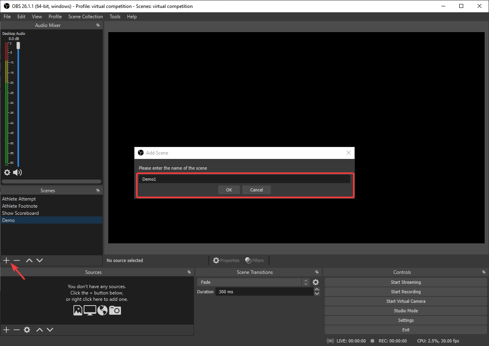
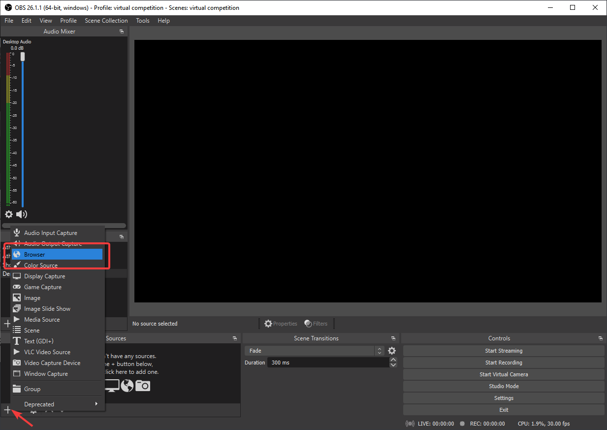
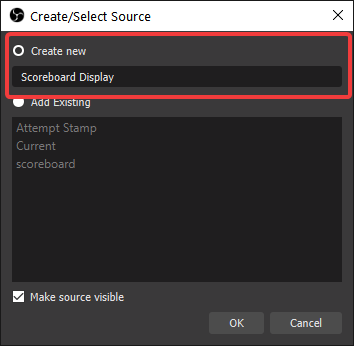
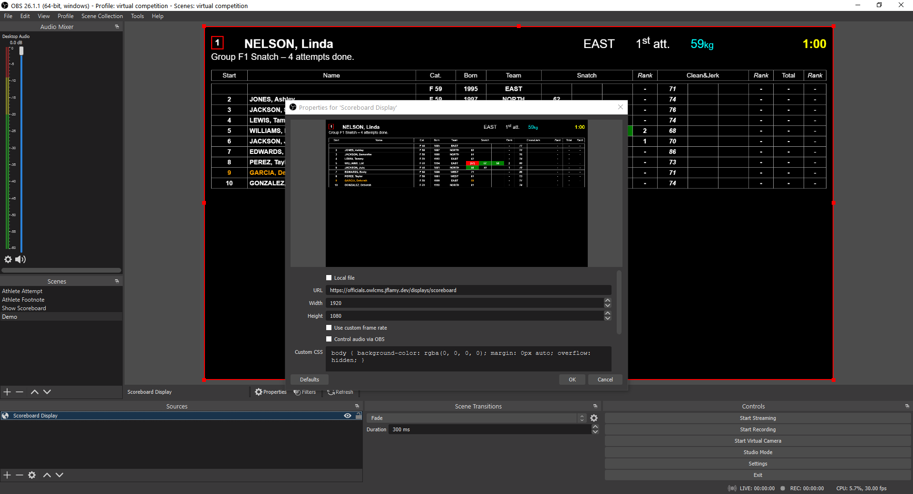
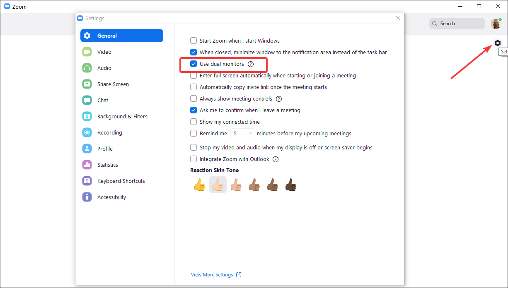
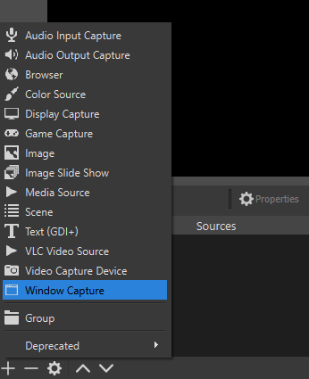
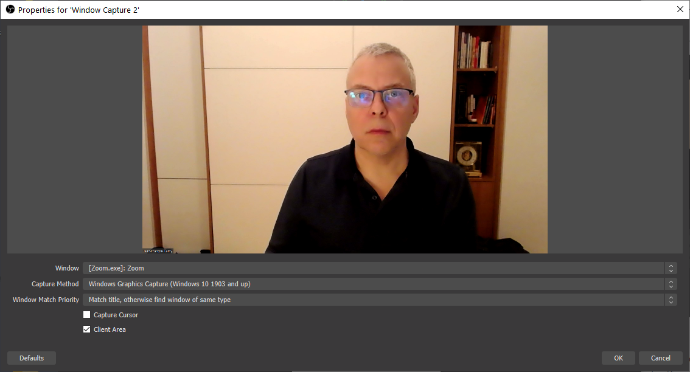
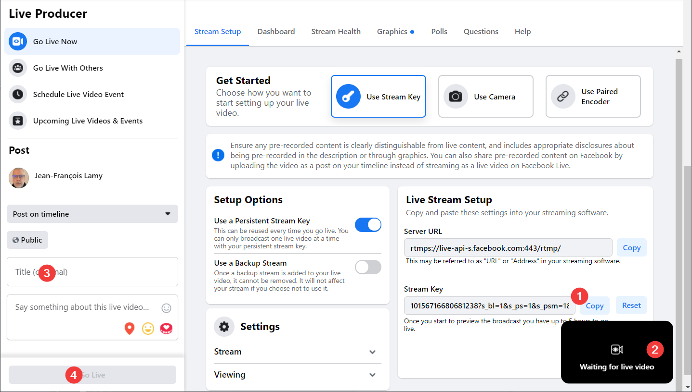
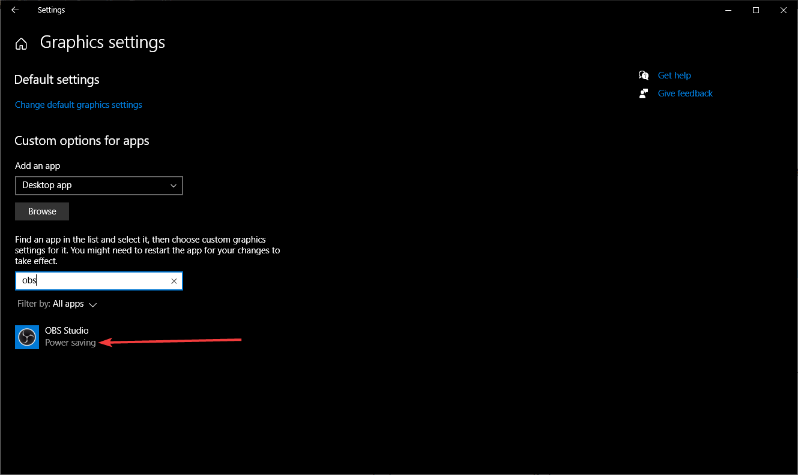

# Broadcasting a Virtual Competition using OBS

This page explains how to broacast a Virtual Meet using Zoom and OBS (Open Broadcast Software).

Requirements:

1. A laptop and at least one external monitor.
2. A Zoom license.
3. The [OBS Studio](https://obsproject.com/) free software that will combine what we want to show and stream it out.
4. A Facebook or YouTube account -- we will use Facebook live for this demo, but you can use whatever streaming service OBS Studio supports (including YouTube, Twitch, etc.)

## Setup owlcms with dummy data

In order to define the views, we need enough information to have meaningful displays. You can do the setup using any owlcms you have -- you will just need to adjust the URLs for your actual competition site once it is up.

1. Start owlcms and enter enough information to get a group going
2. Go to "Start Displays" and start an Attempt Board
3. Also start a Scoreboard
4. Also start a Current Athlete view

## Install OBS

Download [OBS Studio](https://obsproject.com/) and install it.

In OBS Studio, you combine individual elements called *sources* to create *scenes*.  In our example, we will create two scenes

- One scene will take our laptop screen (completely) as one source and overlay the owlcms attempt board as a second surce (OBS has a built-in browser that we can use as a source)
- A second scene will take the full scoreboard.
- You can have as many scenes as you want, you could have others using slide shows or videos from your sponsors as sources, etc.

## Define a Scoreboard Scene

Let's create a Scoreboard scene to be used during introductions, breaks, and medals. Switching to that scene in the scene list will send the scoreboard to the live stream.

**Create a Scene.** Click on the + below the Scenes pane and give the Scene a name.  You can rename it afterwards.

**Create a Source:** Next we can add as many video and sound sources as we want.  For our first scene we just need a "Browser" view for the owlcms scoreboard.  OBS Studio has a built-in web browser just for that purpose.

Click on the + below the Sources pane and select Browser.  

Select "Create New" and give your source a unique name (this is because you can reuse the same source in several scenes).

Hit OK, Type the URL to the owlcms display.  <u>Use 1920  and 1080 as the dimensions</u>, we will shrink and crop later if needed.

Hit OK. OBS then displays the current scene, with the source highlighted in red.

## 

Close the definition pane.  Whenever you click on the scene in the list at the left, the video output switches to that scene.

## Setup Zoom

Start Zoom and go to Home, and then click on the settings Icon at the top right.  Make sure that "Use Dual Monitors" is selected.

#### Setup your Zoom windows on monitor #1

- The general idea is that we will select an athlete from the gallery view, and put the spotlight on that athlete (right-click and select "replace spotlight").
- So we want 
  - one window with the gallery view and the chat, and
  - a second window with the selected video.  This is what we get with the "Use dual monitors" - but all windows can actually be on a single screen.
- 

#### Selecting the participant to be broadcast

- Make sure you are in Gallery View - there is an icon at the top right of the Zoom Meeting window that shows all the participants.  This is not compulsory but makes life easier
- Right-click on the participant that should be shown to all
- Select "Spotlight" or "Replace Spotlight" - the video preview window will switch accordingly.

#### Prepare for Broadcast

- The window with the video preview can be made full-screen by **double-clicking the white title bar**.  This is what we need for broacast.
- Then you can bring back the other windows on top (using Alt-tab on Windows).  
- The full-screen video will remain available underneath, and remains usable as a source.

## Define a Scene with Live Video and an Attempt Board

The second scene will be built with two elements. 

- We will use a Window Capture to get our video from the Zoom window that shows the meet.
- We will use the owlcms attempt board and shrink it so it occupies a corner of the screen.  This will show the athlete's info, the requested weight, the timer, and the decisions.

**Create the scene**: Same as before, create a new scene with a meaningful name -- say "Athlete+Board"

**Create the Live Video source:** Create a Window Capture source using the + sign at the bottom of the source pane.

**Name the source:** Give the source a meaningful name, like "Live" or "ZoomVideo".

**Select the window:** There will be several entries for Zoom.exe.  We do *not* want the one called Zoom Meeting as will show the participant gallery.  One called just Zoom.exe will show the video preview, that's the one we pick.   If you maximize the Zoom window by double-clicking on its title bar, you will see that the full screen area is indeed used.

Troubleshooting: If you see a black area instead of your screen or window, go to the Troubleshooting section at the bottom of this page.

Now we overlay the attempt board.

**Create the Attempt Board Source:** We now redo the same process as before for the scoreboard, but this time we use the Attempt Board as our URL.  So we create a source using the + at the bottom, select "Browser" as our type, give it a meaningful name like "Attempt Board".

**Define the properties:** We use the URL for the display (ends with "/display/attemptBoard"). We make it full-size (1920 x 1080).

**Shrink the view:**  Using the handles, you can shrink the view and also drag it to where you want.

## Previous Attempts and Ranks

There is another view  available on owlcms that shows the current athlete's previous attempt.  You can add another browser view to the scene to show the "Current Athlete" display which includes that informatio.

We do as before

1. Create a new Browser Source.   Copy the URL from the Current Athlete display.  Use the full screen 1920x1080 resolution
2. Select the new source and right-click.  Select the "Filters" option near the bottom of the menu.
3. Add a new "Effects Filters", select "Crop/Pad".  This will allow us to select the part we want.

4. Perform the cropping - the values typed are applied immediately.

   

5. Close and position on the screen.
   

## Sound

Notice in the OBS images above that there are two sound mixers

- The first one captures all the sounds on your desktop, including those coming from Zoom, and broadcasts them.  So you should turn off all your applications, and keep only one scoreboard making noise.
- The second one is your own microphone.  Make sure it is muted by clicking on the speaker at the bottom of the column.  Unmute if you actually want to be heard on the broadcast.

## Setup Streaming

We will use Facebook as an example.  Other streaming services work much the same way.

For Facebook, we suggest that you create one event per group, to make it easier for people to retrieve each session.  

1. Create the Event, select Facebook Live as the type, go through the wizard, provide title and description
2. Once the event is created, you will see a "Setup Live Video" button on the event
3. 

In order to stream to Facebook Live, go to the File menu and select Settings.   Select Facebook Live as your streaming service.  Click on the "Get Streaming Key" entry

4. 

## Additional Notes for Facebook Events

Competitions often run late.  You may want to create different events for each session, and schedule them.

If you do so, you should use "Manual" mode instead of automatic.  This means that you will need to update the streaming key from the meeting to OBS on every session, but you will be able to control exactly when each event starts and stops.

## Troubleshooting: Select the Graphics Card for OBS

This step is sometimes needed for laptops that have two video cards (such as "gaming" laptops).  OBS Studio can only capture full-screen video from one card at a time.  The setting is done using the Windows Graphics Settings. 

- Click on the Windows icon at the bottom left and locate the"Graphics Settings" menu
- Locate the OBS Studio app and set the PowerSaving

