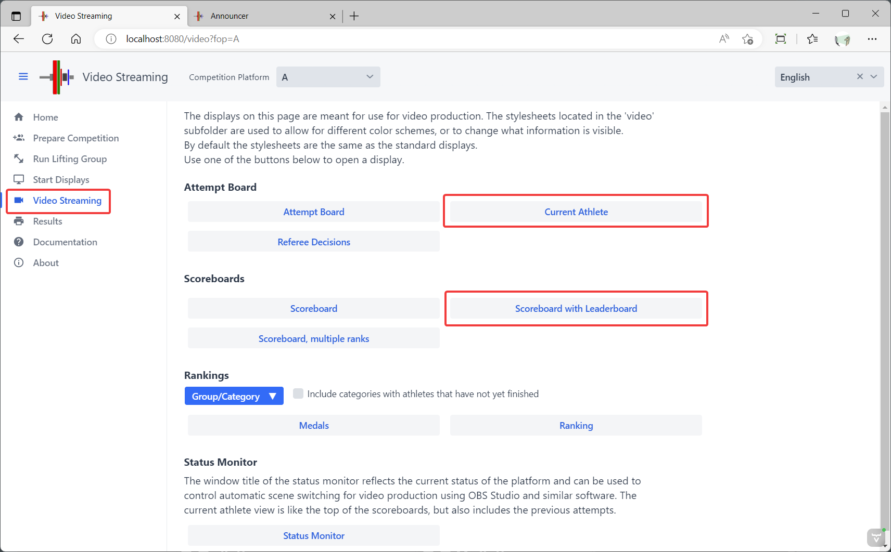
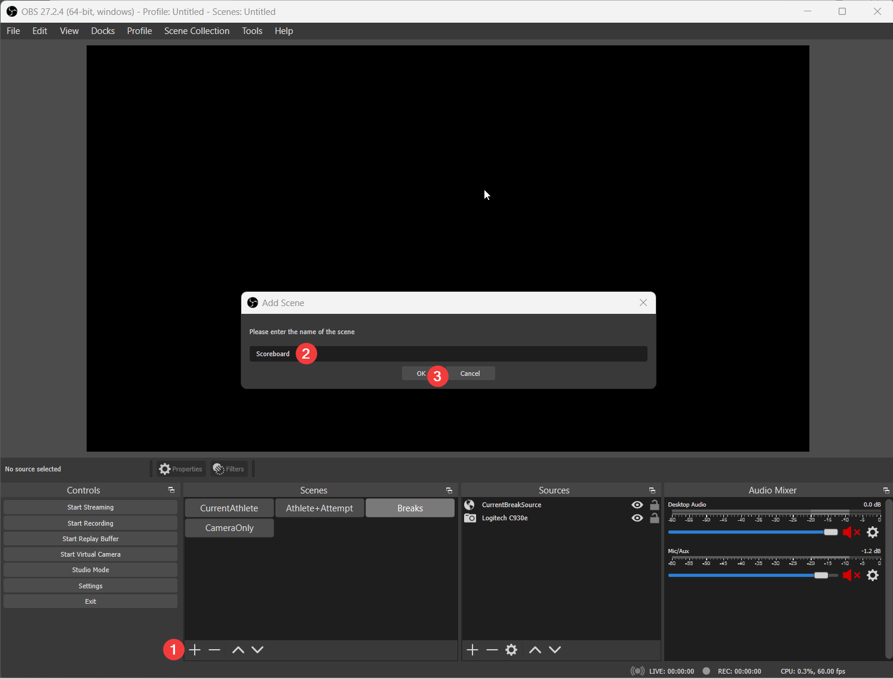
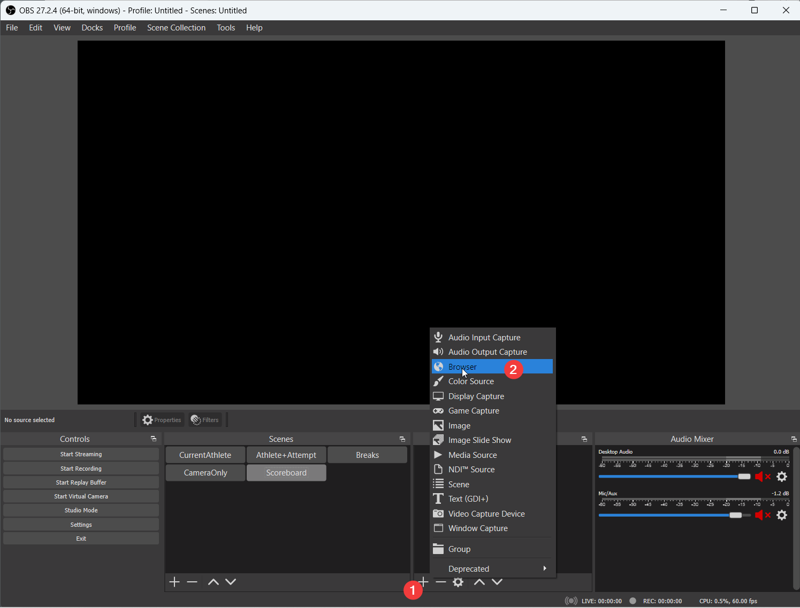
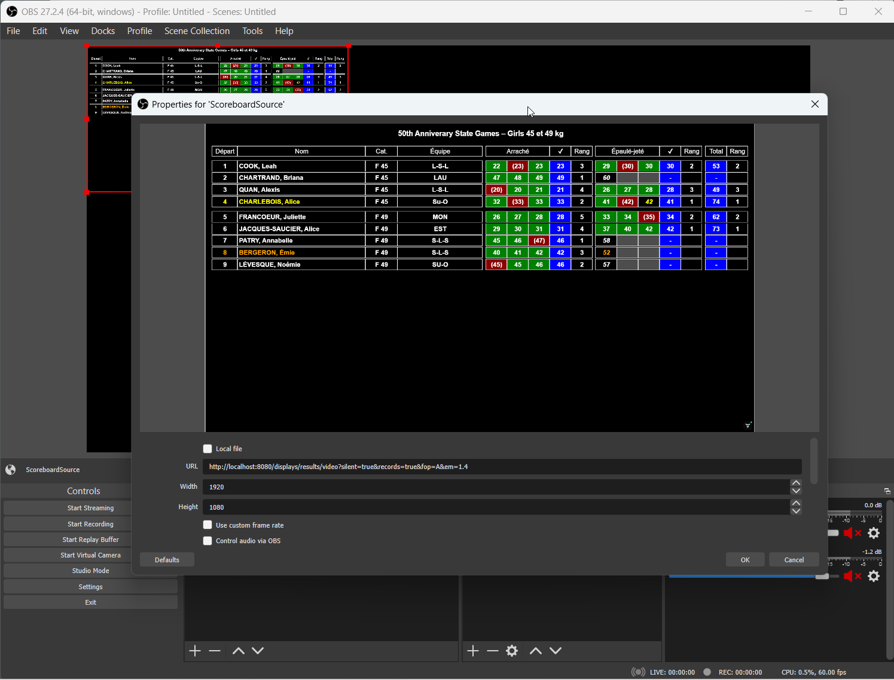
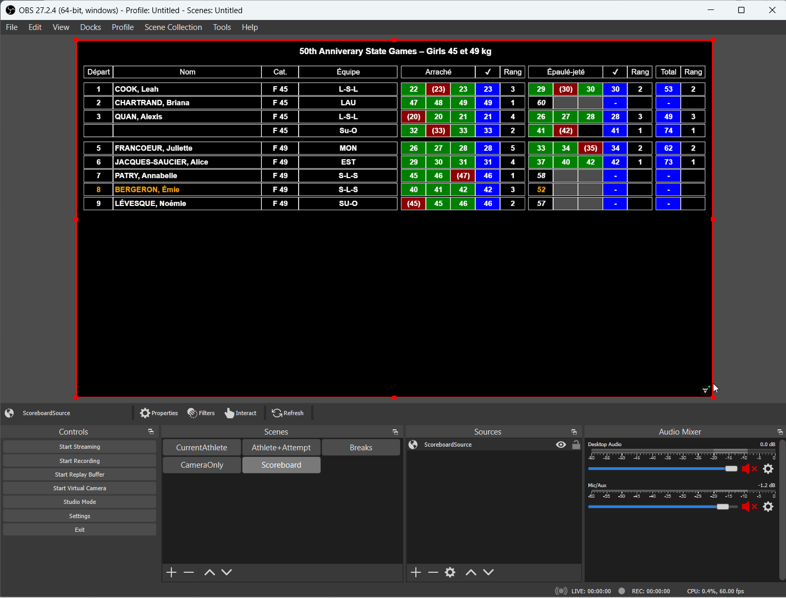
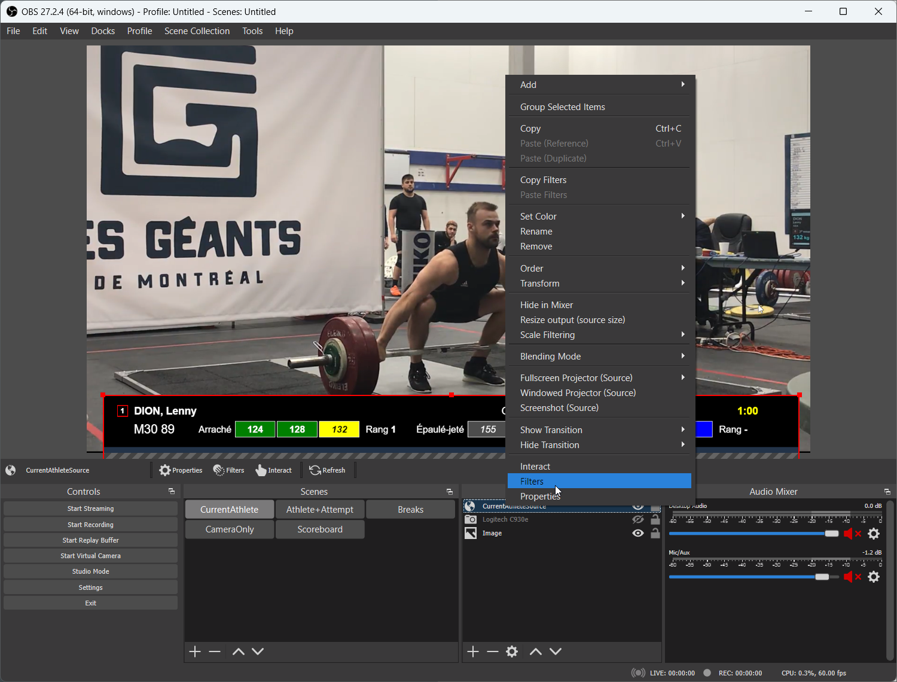
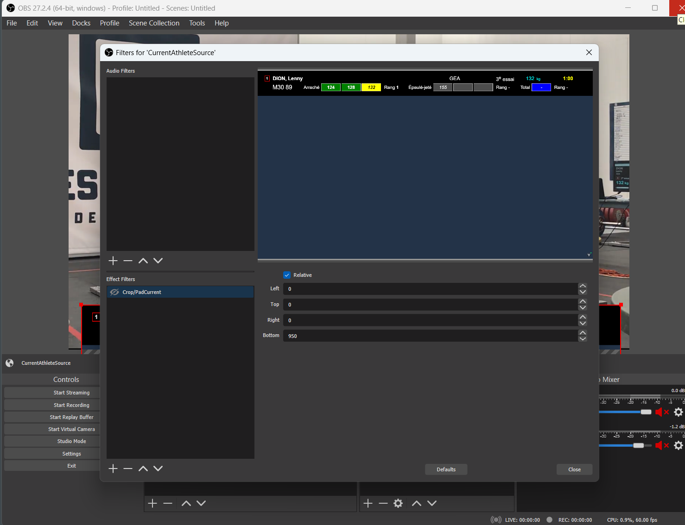
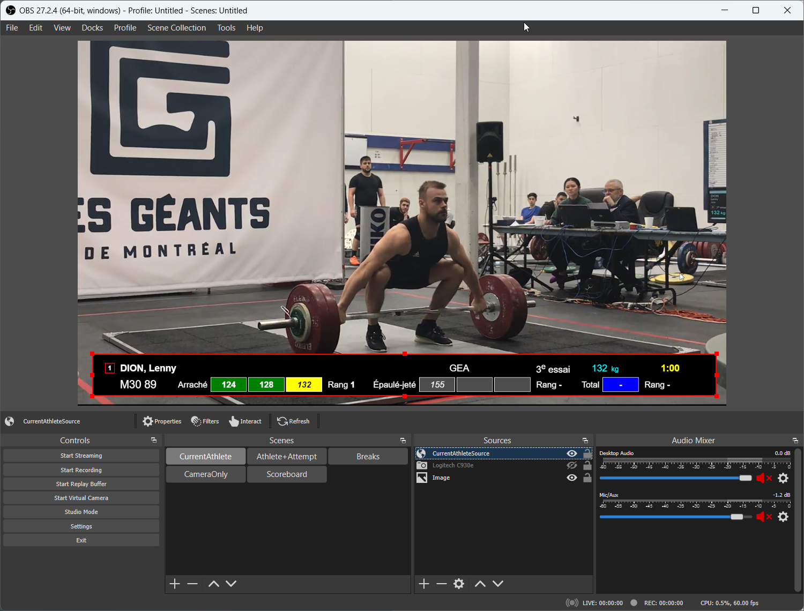
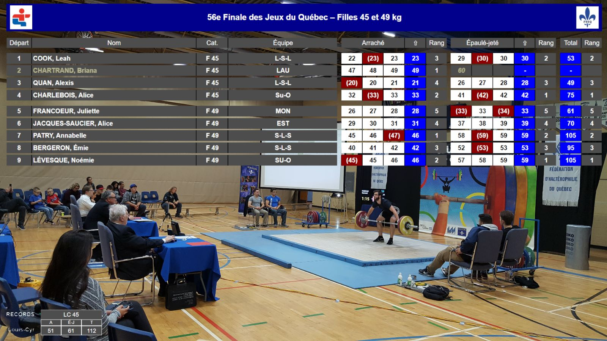

# Broadcasting a Competition using OBS

This page explains how to broadcast a Meet using OBS (Open Broadcast Software).  The process is the same for a live meet or for a virtual meet.  For a live meet, you will use a "video capture source".  For a Zoom meet, you will use a window running zoom, or a monitor showing zoom as a source.

Requirements:

1. A laptop and at least one external monitor.
3. The [OBS Studio](https://obsproject.com/) free software that will combine what we want to show and stream it out.
4. A Facebook or YouTube account -- we will use Facebook live for this demo, but you can use whatever streaming service OBS Studio supports (including YouTube, Twitch, etc.)

## 1. Install OBS

Download [OBS Studio](https://obsproject.com/) and install it.   

- If possible, get an image with a competition setup that you can use as a fake background for setting things up.
- Plug in your camera

In OBS Studio, you combine individual elements called ***sources*** to create ***scenes***.  In our example, we will create two scenes

- The first scene will just show the scoreboard.  OBS has a built-in browser, and it can use any URL as a *browser source*.
- The second scene will take three sources: the fake background, the camera input, and the current athlete information from owlcms as a browser source.  We will hide the fake background when we are done setting up
- You can have as many scenes as you want, you could have others using slide shows or videos from your sponsors as sources, etc

## 2. Setup owlcms with some data

In order to define the views, we need enough information to have meaningful displays. If you are not using the same setup as your competition site you will need to adjust the URLs once your actual competition site once it is up.

1. Start owlcms and enter enough information to get a group going.  Start the group as the announcer.
2. Go to "Video Streaming" and start a Scoreboard and start a Current Athlete view.
   

## 3. Define a Scene to Show the Scoreboard

Let's create a Scoreboard scene to be used during introductions, breaks, and medals. Switching to that scene in the scene list will send the scoreboard to the live stream.

**Create a Scene.** Click on the + below the Scenes pane and give the Scene a name.  You can rename it afterwards.

**Create a Source:** Next we can add as many video and sound sources as we want.  For our first scene we just need a "Browser" view for the owlcms scoreboard.  OBS Studio has a built-in web browser just for that purpose.

Click on the + below the Sources pane and select Browser.  

Select "Create New" and give your source a unique name (this is because you can reuse the same source in several scenes).

Then paste the URL for the scoreboard.  Use 1920 and 1080 for the size (full HD).

Close the dialog, and resize the source so it fills the screen.

Whenever you click on the scene in the list of scenes, the output will switch.  You can right-click in the scenes list to change from a grid list to a linear list.

### 5. Define a Scene combining Live Video and Current Athlete Info

The second scene will be built with three elements. 

1. a fake image to get our layout approximately correct (which we will hide when the setup is done)
2. a video source for the live video
3. the owlcms current athlete view

**Create the scene**: Same as before, create a new scene with a meaningful name -- say "Current Athlete"

#### 5.1 Add a background image

Create an "Image" source and pick a meaningful image from your competition site.

#### 5.2 Add the video source

Create a video source and select your camera.  Turn off the camera source by clicking on the "eye" icon.  We will turn the camera on once our layout is done.

#### 5.3 Add a Current Athlete Browser Source

**Create the Current Athlete Source:** We now redo the same process as before for the scoreboard, but this time we use the Attempt Board as our URL.  So we create a source using the + at the bottom, select "Browser" as our type, give it a meaningful name like "Attempt Board".

**Define the properties:** We use the URL for the current attempt. We make it full-size (1920 x 1080).  We use the handles to move the top of the source where we want it, and make it slightly narrower than the screen area.

**Crop the view** We only need the top part.  To crop, we add a filter to the current athlete browser source.  We select the source and right-click to select "Filter"

We then change the parameters to crop the bottom.  We use 950 as the bottom crop value and then we apply

We can use the handles to fine-tune the position and size.

#### 5.4 Final Steps

You can now go to your scenes and click on the eyes to hide the background image and enable your camera.

## 6. Advanced Options

### 6.1 Medals and Rankings

You can use the medals and the ranking screen to show information during ceremonies.  If you add these scoreboard as sources, you will be able to control which group is shown independently of what is selected by the announcer.  For example, if group F2 has been presented and is warming up, and the medal ceremony for group H1 starts, you can go to the Video Streaming screen in owlcms and select H1.  The rankings and the medals video source will switch to F2 so the commentator can talk about the F2 medals.  The on-site scoreboards are independent, and controlled by the speaker.

### 6.2 Style Editing, Colors, Transparency, Logos

The style sheets for the video streaming are actually separate from those used on-site.  You can change the color scheme for the videos without affecting the main site.  The video style sheets are located in `local/styles/video` .  Note that if you change the styles, the OBS cache will need to be emptied.  On Windows, it is located in `%appdata%\obs-studio\plugin_config\obs-browser\Cache` -- exit OBS and delete everything inside.

- For example, you can change the scoreboard background to be a pure green (#00ff00) and use a color filter to remove the green -- the scoreboard will then be on a transparent background.
- You can change the color of the video header to create a banner
- You can edit the style of the video header to include logos

All these steps can be performed by a Web Designer (since the styles use standard CSS) or by the author of the program (but as a paid consulting service).

## 7. Setup Streaming

The steps necessary to setup streaming on Facebook Live are described on [this page](Streaming).  The process for YouTube is similar (grab a Stream Key, apply it to OBS, Start Streaming.)

## 8. Broadcasting a Zoom Virtual meet

When broadcasting a virtual meet to facebook or youtube, the process is essentially the same, except that in practical terms you need to use two monitors.  

Zoom will display the current athlete on one monitor.  You will use the OBS Display Capture to use that as the video source, instead of the Camera.

##### Troubleshooting: Select the Graphics Card for OBS

This step is sometimes needed for laptops that have two video cards (such as "gaming" laptops).  OBS Studio can only capture full-screen video from one card at a time.  The setting is done using the Windows Graphics Settings. 

- Click on the Windows icon at the bottom left and locate the"Graphics Settings" menu
- Locate the OBS Studio app and set the PowerSaving

