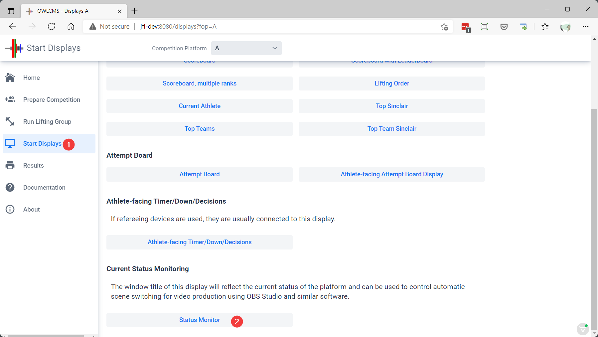
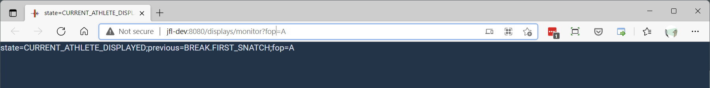
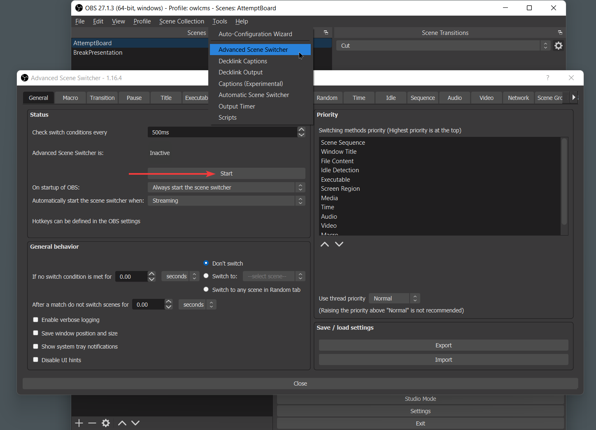
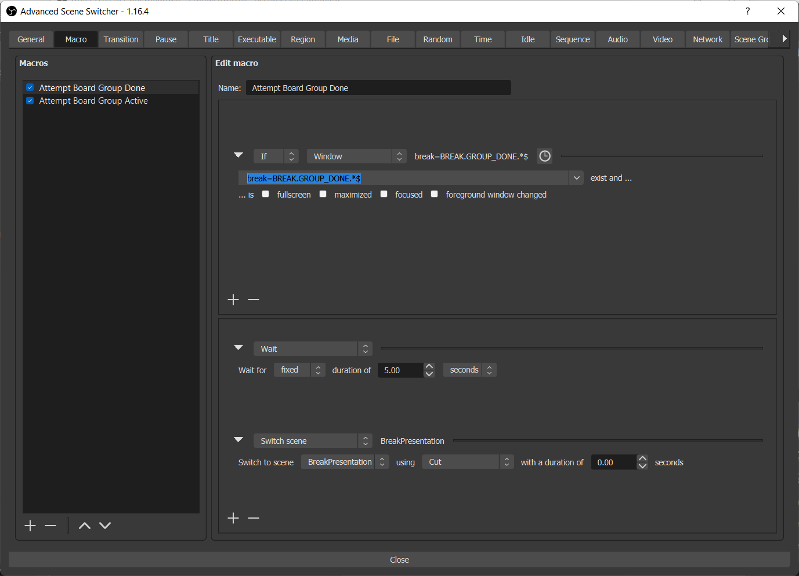
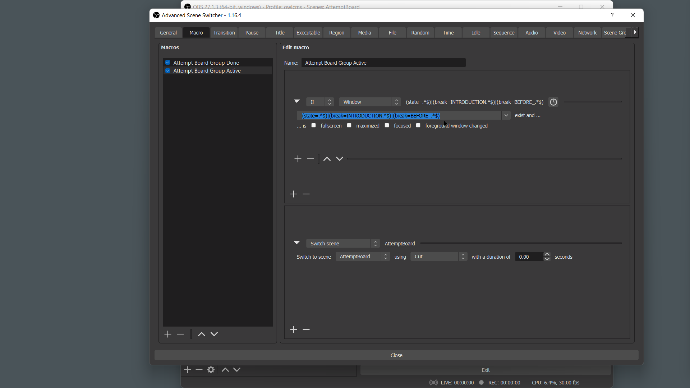

## Automatic Video Scene Switching

Here are example scenarios where the ability to control video output is useful

- On the attempt board, or on the main scoreboard, you want to show a video or a slide show during breaks
- You are live streaming and you would like to switch to the athlete when the timer starts, and to show the scoreboard after a lift, automatically.
- You would like something special to be shown when there is a jury decision given
- You would like to switch to a different scene during medals presentation, etc.

The suggested way to do all of these is to use [OBS Studio](https://obsproject.com/) with an additional plug-in module called the [Advanced Scene Switcher](https://obsproject.com/forum/resources/advanced-scene-switcher.395/).  This module can track what is going on on the computer, and in particular, can trigger actions when certain window titles are present.

## Field of Play Status Monitor

owlcms includes a special-purpose output that displays the competition status in the browser title bar.  It also shows it in the main window, but that is for human readability, and is not actually used for video switching.

For example, instead of starting a browser as your attempt board display, you will start OBS.  OBS will open the browser and your presentation, and decide which to show by looking at what the status monitor window title is.

1. On the machine where you want to run OBS, start the status monitor

2. The status monitor starts in its own tab.  Close the other tabs so it is alone in a window.  The window content is the same as what is actually in the title (even though the title is visually cut off.)  In the following example, the title indicates that the athlete information is visible on the various displays and scoreboards (CURRENT_ATHLETE_DISPLAYED). 
   We can also see that the previous state was the break before first snatch (BREAK.FIRST_SNATCH).  This would allow sophisticated scenarios where the switching depends on what was being shown.

   

General rules:

- When the competition is in a break, the line starts with `break=`
- When the competition is not in a break, the line starts with `state=`

## Installing the Scene Switching Plugin

1. Stop OBS if running
2. Go to [[Advanced Scene Switcher | OBS Forums (obsproject.com)](https://obsproject.com/forum/resources/advanced-scene-switcher.395/)](https://obsproject.com/forum/resources/advanced-scene-switcher.395/) and scroll down to the "Installing the Plugin" section for your operating system.
3. Restart OBS.
4. Go to the Tools / Advanced Scene Switcher menu, and start the plugin if needed. 

## Example: Switching at the end of a group

The following example is also available as a video demo: [Example video](https://user-images.githubusercontent.com/678663/147373848-89b91086-b16d-48c0-8f48-445f6c1ca828.mp4)

In this example, OBS is running on the machine that controls the attempt board.  We have two scenes defined.  One uses the browser source for the attempt board, the other shows a video. 

We define a "Group is done" macro as follows:

1. The top part is for the conditions that will trigger our scene change. We the status monitor window. 
   - The scene switcher checks every few hundred milliseconds for changes in the window titles.  
   - We want a match for `break=BREAK.GROUP_DONE.*$` 
     Note that `.*$` reads "anything up to the end".  We add this because otherwise the match would be on the exact title, and our title is longer (it includes the previous state and what platform we are on).
2. The bottom part is the sequence of actions we want
   - We wait a little while (we remain on our current scene "Attempt Board") 
   - and then switch to the video.

## Example: Switching on multiple conditions

We would like the display to switch back to the attempt board as soon as the announcer changes the state to "introduction" or when the timer for the start of competition is started.

We use an expression like `(state=.*$)|(break=INTRODUCTION.*$)|(break=BEFORE_.*$)` to detect the three interesting states, and switch back to the attempt board scene.

- Each of the three sets of parentheses describes a possible condition. 
- The `|` separates the possible alternatives
- As before, each condition ends with `.*$` to match anything up to the end of the line.

In actual life, you would probably consider BREAK_BEFORE as a separate conditions, and wait 8 minutes before switching, or do whatever you want.