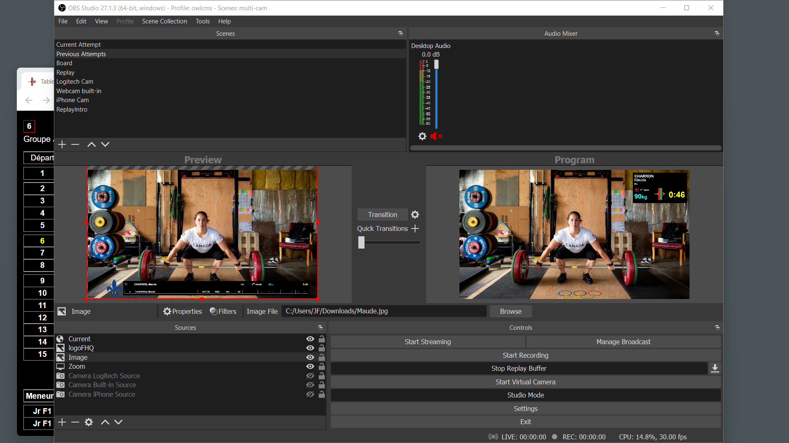
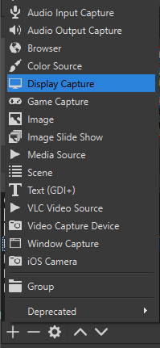
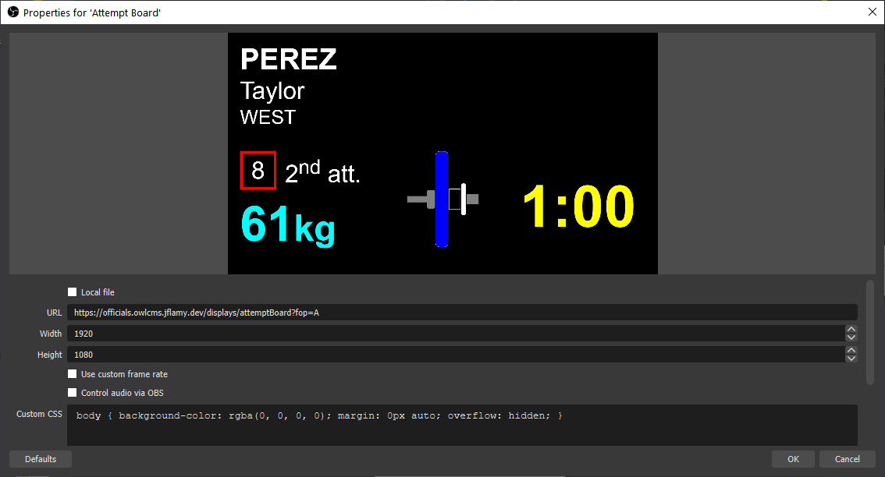
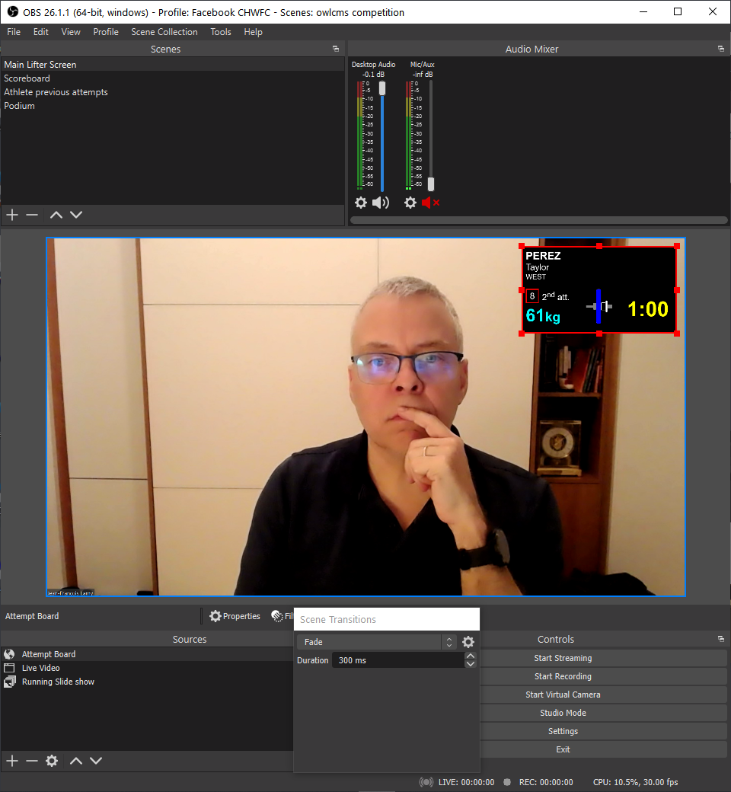
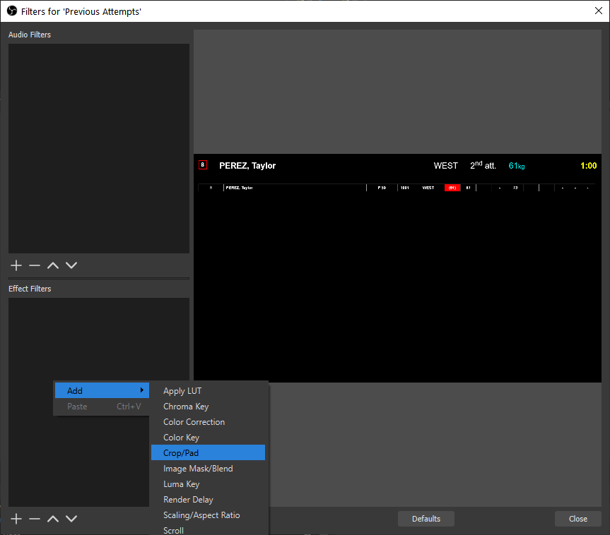
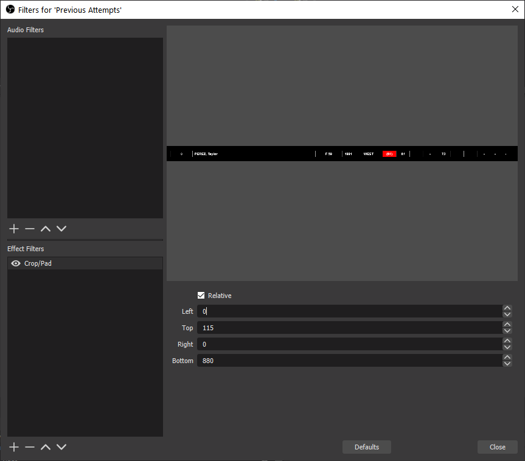
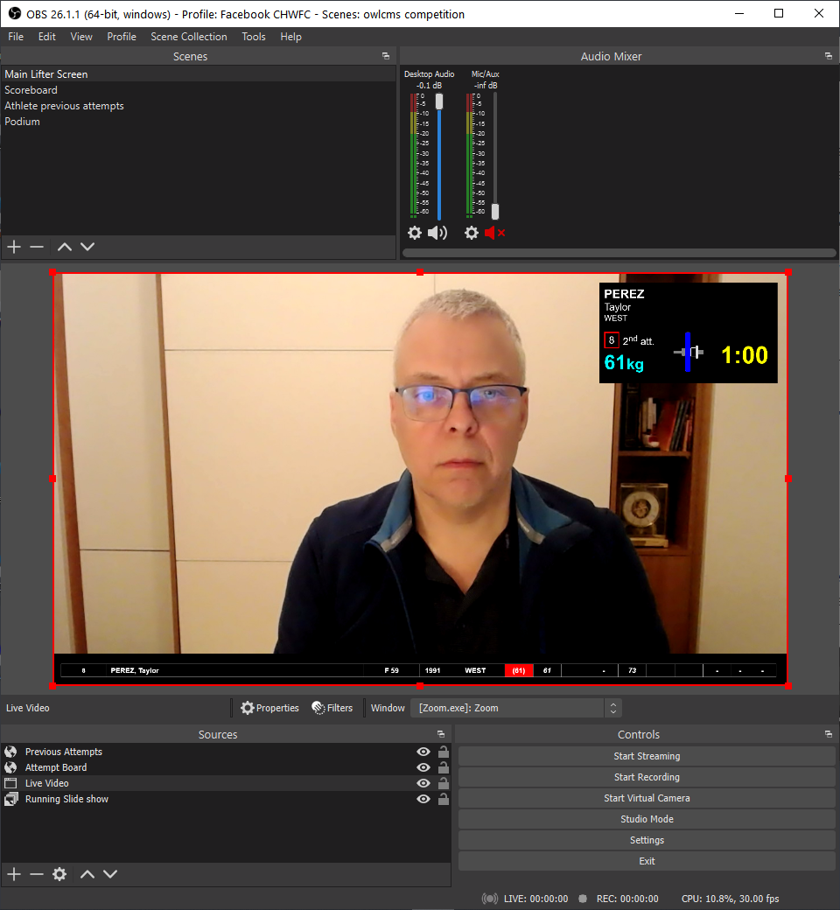

# Broadcasting a Competition using OBS

This page explains how to broadcast a Meet using OBS (Open Broadcast Software).  The process is the same for a live meet or for a virtual meet.  For a live meet, you will use a "video capture source".  For a Zoom meet, you will use a window running zoom, or a monitor showing zoom as a source.

Requirements:

1. A laptop and at least one external monitor.
3. The [OBS Studio](https://obsproject.com/) free software that will combine what we want to show and stream it out.
4. A Facebook or YouTube account -- we will use Facebook live for this demo, but you can use whatever streaming service OBS Studio supports (including YouTube, Twitch, etc.)

## 1. Setup owlcms with dummy data

In order to define the views, we need enough information to have meaningful displays. You can do the setup using any owlcms you have -- you will just need to adjust the URLs for your actual competition site once it is up.

1. Start owlcms and enter enough information to get a group going
2. Go to "Start Displays" and start an Attempt Board
3. Also start a Scoreboard
4. Also start a Current Athlete view

## 2. Install OBS

Download [OBS Studio](https://obsproject.com/) and install it.

In OBS Studio, you combine individual elements called *sources* to create *scenes*.  In our example, we will create two scenes

- The first scene will just show the scoreboard
- The second scene will take the current athlete view from Zoom and add the owlcms attempt board as a second source and add the previous attempts for the athlete as a third source
- You can have as many scenes as you want, you could have others using slide shows or videos from your sponsors as sources, etc

## 4. Setup Monitor 2 for OBS

Setup the second screen to include OBS and whatever owlcms screens you would like to monitor.  We suggest that you monitor the scoreboard or the lifting order screen to see in advance who needs to be brought in the spotlight.

## 5 Create the Scenes

### 5.1 Define a Scene to Show the Scoreboard

Let's create a Scoreboard scene to be used during introductions, breaks, and medals. Switching to that scene in the scene list will send the scoreboard to the live stream.

**Create a Scene.** Click on the + below the Scenes pane and give the Scene a name.  You can rename it afterwards.

**Create a Source:** Next we can add as many video and sound sources as we want.  For our first scene we just need a "Browser" view for the owlcms scoreboard.  OBS Studio has a built-in web browser just for that purpose.

Click on the + below the Sources pane and select Browser.  

Select "Create New" and give your source a unique name (this is because you can reuse the same source in several scenes).

Hit OK, Type the URL to the owlcms display.  <u>Use 1920  and 1080 as the dimensions</u>, we will shrink and crop later if needed.

Hit OK. OBS then displays the current scene, with the source highlighted in red.

Close the definition pane.  Whenever you click on the scene in the list at the left, the video output switches to that scene.

### 5.2 Define a Scene combining Live Video and Athlete Info

The second scene will be built with three elements. 

1. a Window Capture to get our video from the live video or Zoom window that shows the meet.
2. the owlcms attempt board and shrink it so it occupies a corner of the screen.  This will show the athlete's info, the requested weight, the timer, and the decisions.
3. the owlcms Current Athlete view to show previous attempts and current ranking

**Create the scene**: Same as before, create a new scene with a meaningful name -- say "Athlete+Board"

#### 5.2.1 Add a Live Video Source

**Create the Live Video source:** Create a <u>Display Capture</u> source using the + sign at the bottom of the source pane.  Select your Monitor where Zoom is running, or select the live vido source.  You may alternately, if you are familiar with OBS, use a Window Capture.

**Name the source:** Give the source a meaningful name, like "Live" or "ZoomVideo".

**Select the screen** 

- If you use a Display Capture, select the monitor where Zoom is displaying full screen.  <u>This is the simplest option.</u>
- If you create a window capture, There will be several entries for Zoom.exe.  We do *not* want the one called Zoom Meeting as will show the participant gallery.  One called just Zoom.exe will show the video preview, that's the one we pick.  

Troubleshooting: If you see a black area instead of your screen or window, go to the Troubleshooting section at the bottom of this page.

#### 5.2.2 Add an Attempt Board Browser Source

**Create the Attempt Board Source:** We now redo the same process as before for the scoreboard, but this time we use the Attempt Board as our URL.  So we create a source using the + at the bottom, select "Browser" as our type, give it a meaningful name like "Attempt Board".

**Define the properties:** We use the URL for the display (ends with "/display/attemptBoard"). We make it full-size (1920 x 1080).

**Shrink the view:**  Using the handles, you can shrink the view and also drag it to where you want.  In this example, we are using the Zoom host's video as a live background,

#### 5.2.3 Add Current Attempt Browser Source

There is another view  available on owlcms that shows the current athlete's previous attempt.  You can add another browser view to the scene to show the "Current Athlete" display which includes that informatio.

We do as before

1. Create a new Browser Source.   Copy the URL from the Current Athlete display.  Use the full screen 1920x1080 resolution
2. Select the new source and right-click.  Select the "Filters" option near the bottom of the menu.
3. Add a new "Effects Filters", select "Crop/Pad".  This will allow us to select the part we want.

4. Perform the cropping - the values typed are applied immediately.

   

5. Close and position on the screen.
   

## 6. Setup Sound

Notice in the OBS images above that there are two sound mixers

- The first one captures all the sounds on your desktop, including those coming from Zoom, and broadcasts them.  So you should turn off all your applications, and keep only one scoreboard making noise.
- The second one is your own microphone.  Make sure it is muted by clicking on the speaker at the bottom of the column.  Unmute if you actually want to be heard on the broadcast.

## 7. Setup Streaming

The steps necessary to setup streaming on Facebook Live are described on [this page](Streaming).  The process for YouTube is similar (grab a Stream Key, apply it to OBS, Start Streaming.)

## Troubleshooting: Select the Graphics Card for OBS

This step is sometimes needed for laptops that have two video cards (such as "gaming" laptops).  OBS Studio can only capture full-screen video from one card at a time.  The setting is done using the Windows Graphics Settings. 

- Click on the Windows icon at the bottom left and locate the"Graphics Settings" menu
- Locate the OBS Studio app and set the PowerSaving

