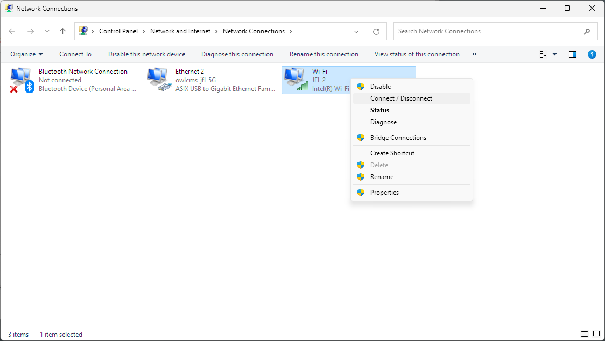
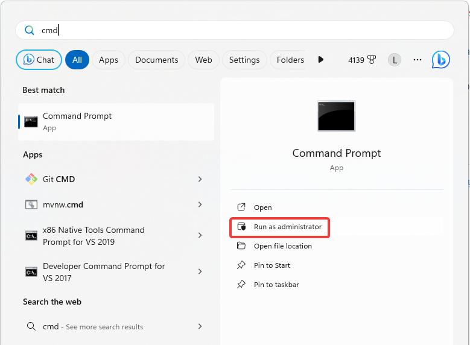
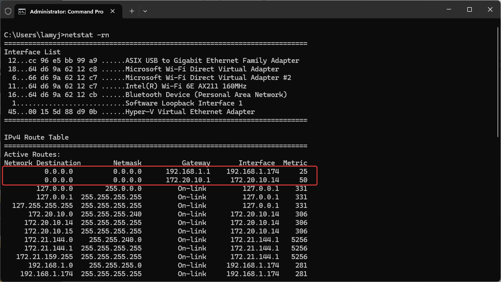
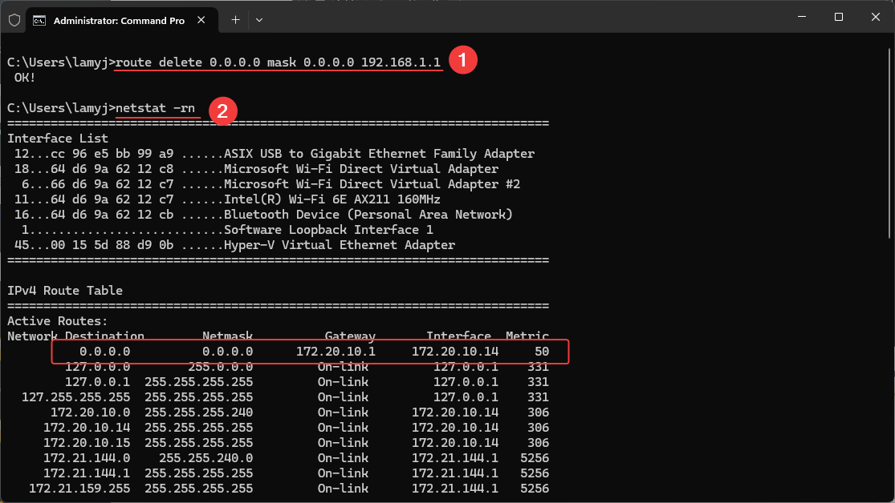

# Internet Access using a Wi-Fi HotSpot

If you are running a competition at a site where there is no Internet, then you need your own competition router that will give you the usual 192.168.x.y networking so you can connect your various consoles and displays.

But still, you would like to run OBS and stream your competition.  Or you wish to connect your owlcms to a cloud publicresults. 

This is actually feasible using a phone hotspot. Let's take the OBS laptop as an example:

- OBS needs to connect to YouTube or Facebook to do the streaming.  We would like to use our phone as a WiFi hotspot to do the streaming since 1 day of competition is roughly 10GB of data and that's affordable in many countries.
- OBS needs to connect to owlcms for results.  We can use a wired connection to the router to connect OBS to owlcms, via the competition router.

The following recipe is for Windows 10 and 11.

## Enable both Wi-Fi and Ethernet on the laptop

The idea is to disable the automatic priority Windows gives to a wired connection and also to give both network adapters the same importance.

1. Follow the steps documented in this article https://www.makeuseof.com/use-wi-fi-ethernet-simultaneously-windows/
2. Make sure you are connected using a wire to your router, and using Wifi to your phone hotspot.  One way to do that is from the control panel, immediately after steps above.



## Tell Windows to use Wi-Fi to reach the Internet

Now we have a connection to router that is NOT connected to the Internet, where owlcms and all the displays are connected.  And a Wi-Fi connection to the phone, that IS connected.  We need to tell Windows to use the Wi-Fi exclusively to get to the Internet, and to forget about the router that it would normally use to get there.

> The following steps are not permanent. *They are reset after a reboot,* and need to be done again when you want to use Wi-Fi hotspot for the Internet and exclude the router.

The next steps requires running a command shell in Administrator mode.  Use the Start menu to locate the CMD command and run it as administrator.



We then issue a `netstat -rn` command to see the different routes that the machine has to reach the internet.  The two network destinations labelled `0.0.0.0` correspond to the Internet at large. We also see that Windows knows that wired is faster than Wi-Fi, so it will try to go through the router (and that won't work because it is not connected to the Internet.)



The gateway that starts with `192.168` is your local router.    This will be the same starting number that owlcms displays when it starts.  We want to remove that gateway because our router is NOT connected to the Internet, our phone is.

So we delete the route with this command -- use your own router address shown under `Gateway`.

```
route delete 0.0.0.0 mask 0.0.0.0 192.168.1.1
```

We can now see that there is only one `0.0.0.0` route, and that it goes through our phone.



Everything goes back to normal after a reboot.