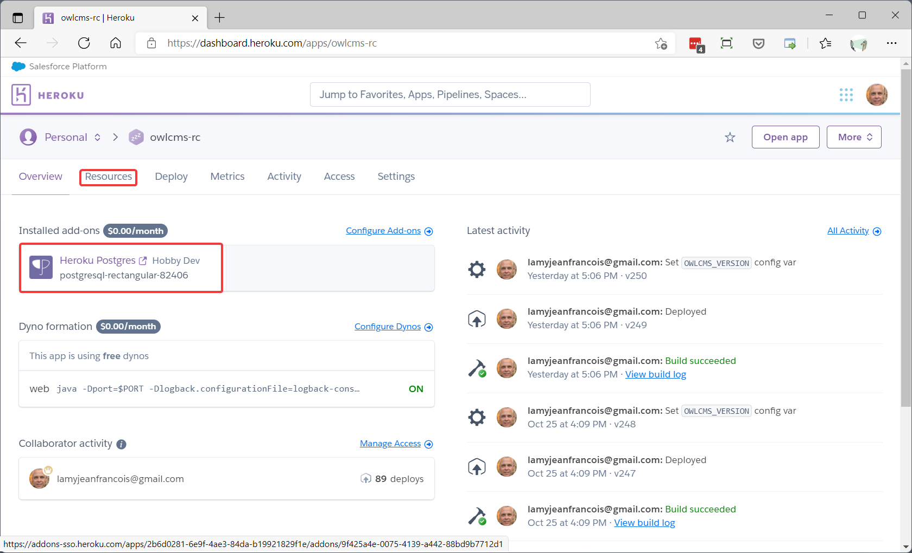
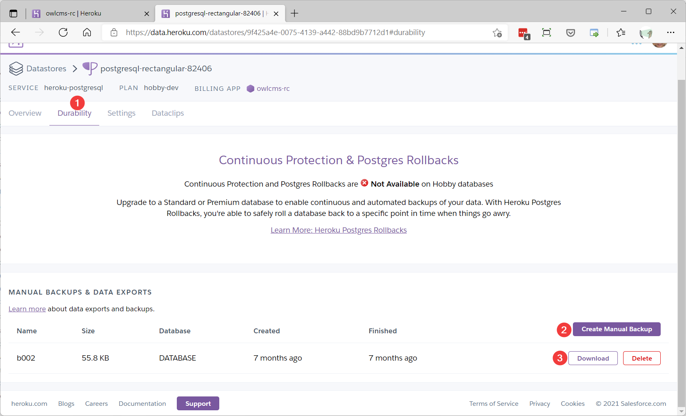
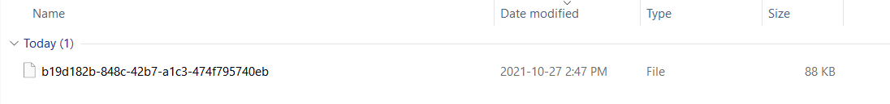
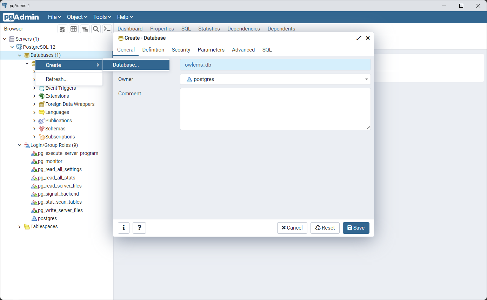
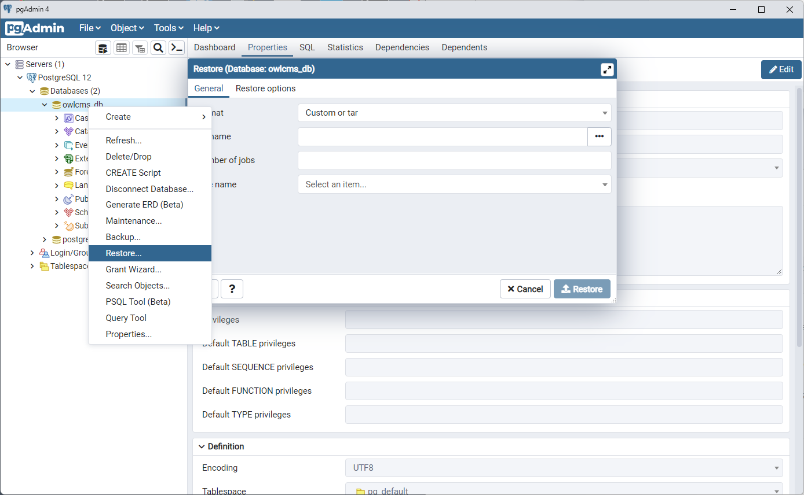
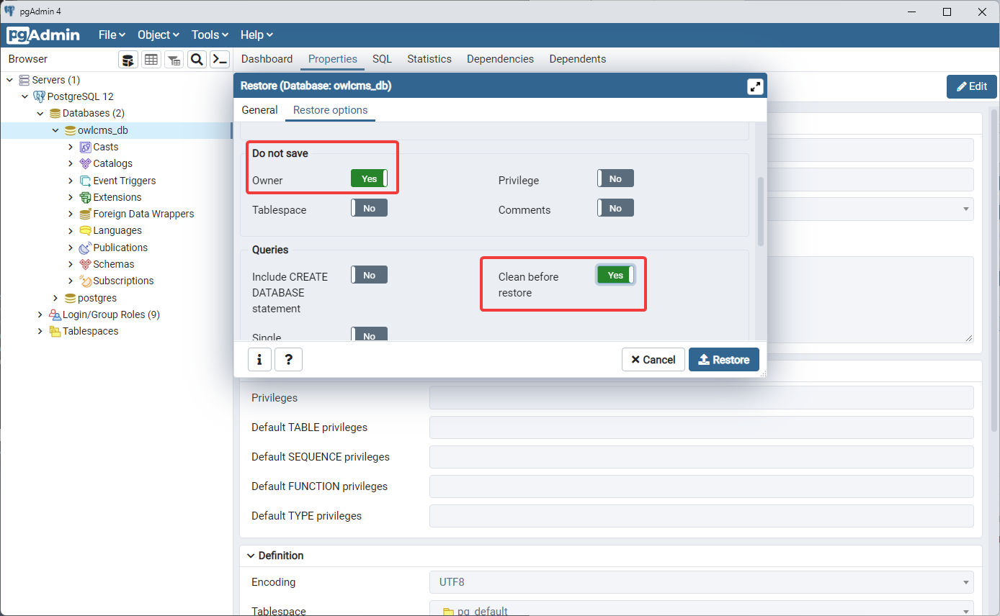
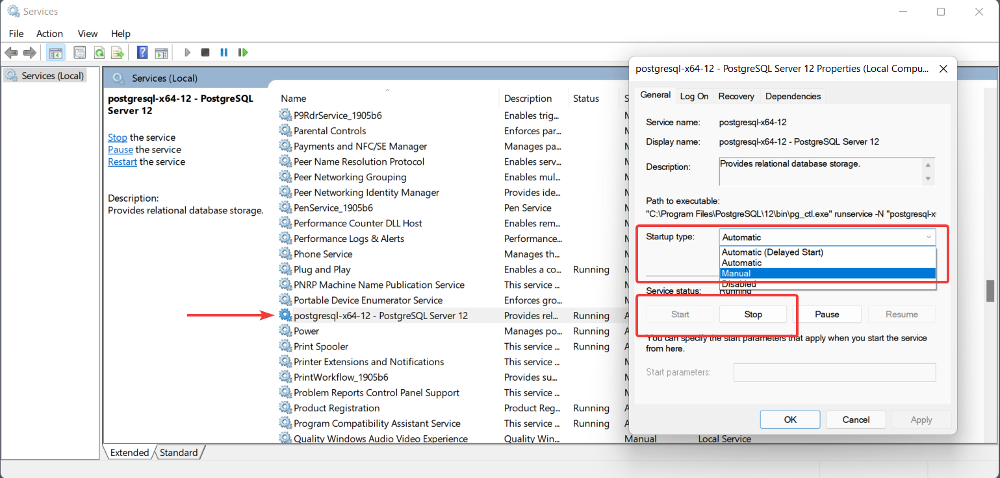

When running on a laptop, a simple database called H2 is used because it does not require installing additional software, and the database is a single file that can moved or transferred easily.

When running in the cloud, files are temporary and disappear when the application is restarted.  The alternative is to use a database provided by the cloud vendor, which is independent from the application and remains when the application is restarted.  Heroku (and most cloud vendors) support PostgreSQL.  Because the owlcms database is small, it fits in the free tier and there is no fee.

This document explains how to recover a PostgreSQL database from Heroku and run owlcms locally with that database.

## Creating a Heroku Backup

In order to create a backup, login to your Heroku application an go to the Resources section.  Click on the Postgres icon.



Then create a manual backup of the database by going to the Durability section.  Wait for a few seconds while the backup is processed.  You will need to refresh the page a few times. once the download link appears, download the backup.



The backup will go to your standard Download directory but will have a very long hexadecimal name.



Rename the file to something meaningful like  `herokuapp.dump`

## Initial Configuration of PostgreSQL

1. **Installation** This is only needed once.  Download PostgreSQL version 12 from the official site. Install it with the default options. You do not need SiteBuilder option so you can leave that out.
2. **Disable security** In order to keep things as simple as possible we will allow all the local connections to be trusted since the only user of the database is owlcms that is running on the same laptop
   1. Locate the installation directory (on Windows, this is likely
       `C:\Program Files\PostgreSQL\12\data`
       
   2. Edit the file `pg_hba.conf`.  Locate the line that mentions `host all all 127.0.0.1/32 md5`and replace the word `md5` with `trust`. The line should now look like

    ```host    all             all             127.0.0.1/32            trust```
   
   3. Save the file.
3. **Run `pgAdmin 4`** Run the `pgAdmin 4` program from the Start Menu (it is visible under the PostgreSQL group).  You will be prompted to create a master password, which is used by pgAdmin itself.
4. **Create the `owlcms_db` database** As a matter of principle, we create a separate `owlcms_db` database.    Right click on the `Databases` item, and create a database.  Use the default `postgres` user.
   

## Configuring owlcms to Use PostgreSQL

1. **Configuration** In your local installation directory, locate the file `owlcms.l4j.ini`.  At the top of the file, add the following two lines to match the database we just created.
   
    ```
-DJDBC_DATABASE_URL=jdbc:postgresql://localhost:5432/owlcms_db
-DJDBC_DATABASE_USERNAME=postgres
   ```
   This tells owlcms to use the PostgreSQL database driver, and to connect to the local PostgreSQL server for the `owlcms_db` database using the `postgres` user.  This simplistic configuration is only acceptable because we are running locally with no sensitive data.

2. **Testing**  If you start owlcms, it should now create the default tables in the PostgreSQL database and should open to a new empty competition.  On the very first startup, you may see warnings about missing tables, this is normal because owlcms creates them later in the startup sequence.

3. Stop owlcms

## Restoring a PostgreSQL backup

1. Select the Restore option: Right-click on the owlcms_db database and select "Restore"
   

2. Select the backup file
   

3. Set the restore options to recreate the tables and ignore the Heroku username

   1. Click on the "Restore Options" header.  Scroll down and set "Do not save Owner" to "Yes"
   2. Select "Clean before restore" to remove the existing tables.

   

4. Click on "Restore" to actually restore the backup and overwrite the database.

## Running owlcms under PostgreSQL

As long as the two "-D" settings [we added above](#Configuring-owlcms-to-Use-PostgreSQL) are present, owlcms will connect to PostgreSQL.

## Reverting to H2

To return to the standard configuration, you only need to add a `#` character at the beginning of the two lines to comment them out.

You probably don't want to have PostgreSQL start automatically at boot and running all the time if you are using H2.  

- on a Windows machine you can switch the service to "manual" mode instead of "automatic".  To do so, use the "Windows-R" shortcut to run the "services.msc" command.  Locate the PostgreSQL service, and double click on it. 

- set the Startup Type to manual
- Start and Stop the service using the buttons.  If the Startup is set to Manual, you will need to use Start to start the service.  Alternately, there is a command-line interface called pg_ctl that does the same.



## Loading a PostgreSQL Database to Heroku

Should that be necessary, follow the instructions in the [Heroku documentation](https://devcenter.heroku.com/articles/heroku-postgres-import-export#import-to-heroku-postgres).  You can use DropBox or some other file sharing system to store the database and make it accessible using an https link.