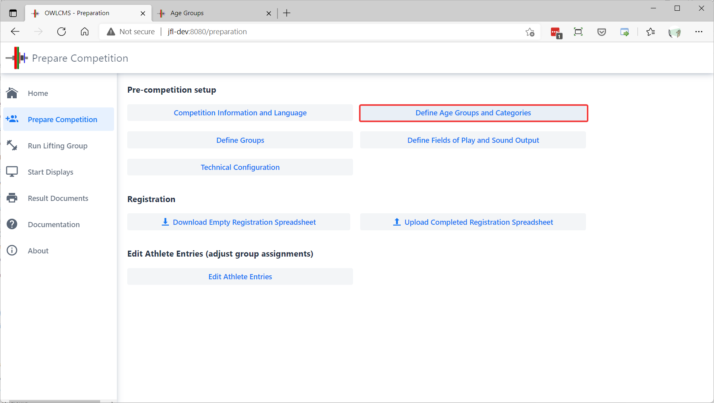
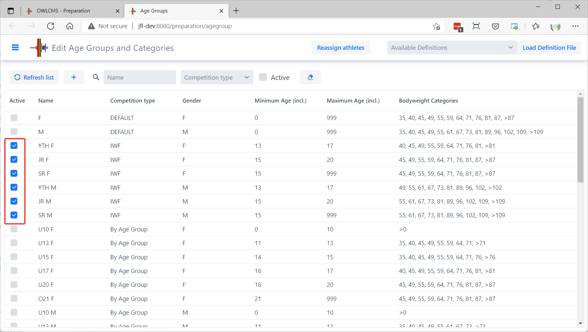
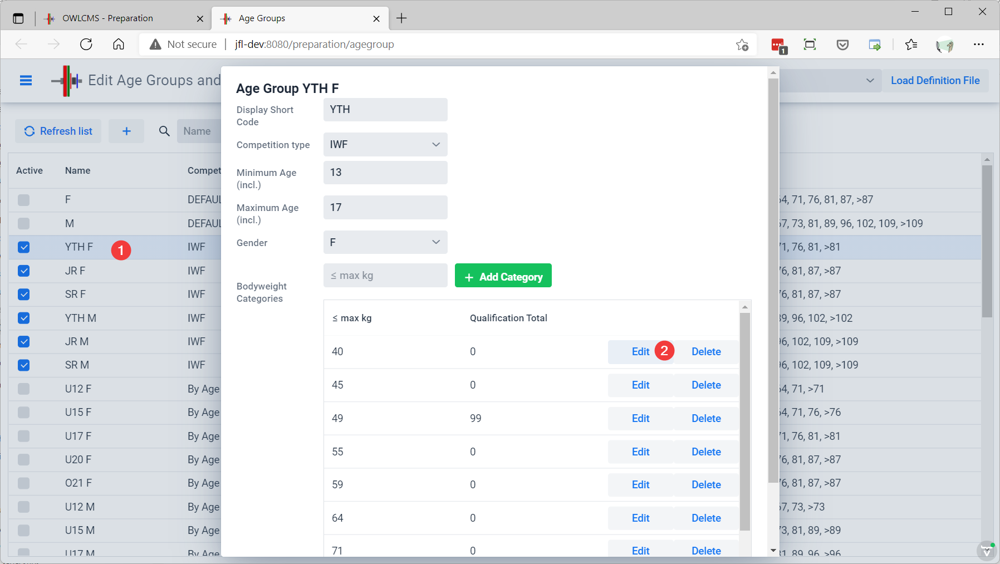
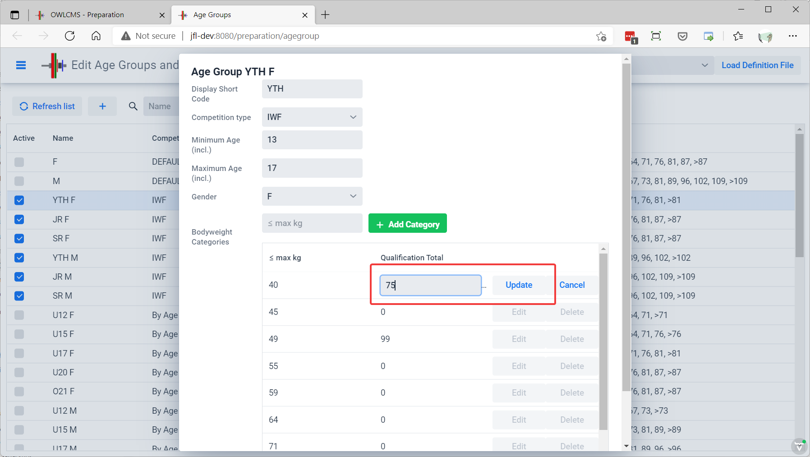
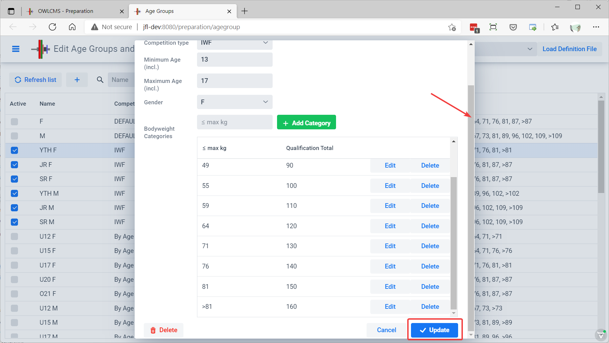
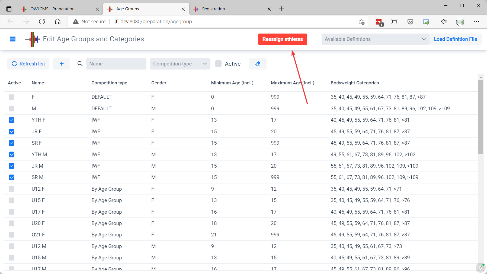
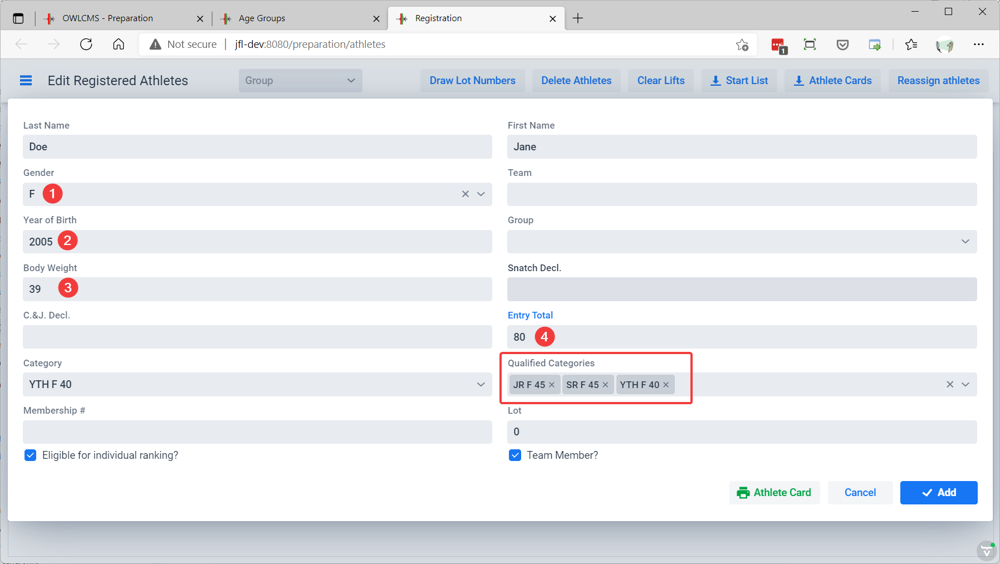

## Multiple Age Groups

Some competitions run multiple age groups together. There are many possible variations.  Three common ones are:

- Overlapping age groups.  For example, a national championship using IWF categories, where a 16 year-old athlete could be simultaneously eligible for the Youth, Junior and Senior categories.  The athlete can get several medals in the various categories.  Team points would normally be awarded separately (an athlete can be first in youth, but fifth in the juniors, etc.)
- Non-overlapping age groups. In some countries, there will be a U15 and U17 championship for adolescents, but the age groups are mutually exclusive.  The athlete will only get the medals for their birth age group.
- A Masters championship, where all the age groups are distinct, but the team rankings take into account all the points from all the age groups.

For this example, we will use a national championship with multiple age groups.  Typically, youth groups will go first, then juniors, then seniors, but the program does not require this.

### Selecting the Age Groups

Select the Age Group and Categories definition page

Use the checkmarks to select the groups you need.  For this example, we select the IWF age groups, which are pre-defined.

###  Editing Categories and Qualifying Totals

If you click on an age group in the list, you will see the list of bodyweight categories for the age group.  Clicking "Delete" will remove the category (for example, if you are using the Olympic subset for a meet). The green button allows you to add a category back, just enter the upper weight limit.

If you click on the Edit button, you can change the qualifying total for that body weight category for that age group.   The qualifying total for youths is likely lower than for juniors, and seniors.

Type the expected qualifying total, and click "Update".  Type 0 if there is no eligibility requirement.

After making the changes to all the categories in the age group, scroll down all the way to the bottom of the form, and use the blue "Update" button.

See further down on this page for a way to perform this task using a spreadsheet.

### Assigning Categories to All Athletes

If you have already loaded the athletes, the changes made can affect their eligibility in a category.  When you edit an age group (or the categories inside) you should reassign the categories using the button at the top.

### Category Assignment on the Registration Form

When editing an athlete, the eligible categories are shown. The main category for an athete can be selected -- this affects mostly the start number allocation.  Normally, the athlete will be allocated to the most specific category -- a 15 year-old will displayed on the scoreboard as a Youth.

You may remove an eligible category.  The athlete will then not score points in that category. Changing the entry total, gender, birth date and body weight causes the eligible categories to be recomputed.

### Entering Categories and Qualifying Totals using a Spreadsheet

Editing using an interactive page is convenient, but when the same categories are used in several competitions across a federation, it may be more convenient to define them using the AgeGroup spreadsheet.

If you are using owlcms in the cloud (on Heroku for example), you need to do this step on a laptop.  Once ready, you will be able to zip the files and upload them to your cloud setup.

On your laptop, locate the `local/agegroups` folder where the program is installed.  Copy the file under a different name.  For this example we will create age groups and qualifying totals for a U15 and U17 competition.  We will name our file `AgeGroups_U.xlsx ` and place it under the `local\agegroups` folder.

In the example above

- there are four age groups defined (U15 and U17 for women, U15 and U17 for men)
- the four groups are active (their checkmark will be selected)
- from column H onward, each cell defines the bodyweight categories
  - The U17 female group has bodyweight categories F40, F45, F49, F55, F59, F83 and so on.
  - All the body weight categories are defined on the first tab of the spreadsheet.  You can change the way they are named if you wish.
  - Empty cells are ignored
  - When a number is present after the category, it is the qualifying total
  - The example in red means that in category U17 F59, the qualifying total is 77

### Loading the Age Group File

In order to load the age group file, go to the top left of the Age Group and Categories definition page.  Select the file in the drop down.  A warning will be given since this will remove the previously defined age groups and will reassign the eligible categories.

### Using an Athlete Registration File

Since categories are computed based on the weight of the athlete, you only need to provide the expected category for the athlete, or the expected weight for the athlete.  If a category is given, the expected weight is inferred as the maximum weight for the category. Weight boundaries can be different in different age groups, so the actual weight will be used at weigh-in time for category assignment.

