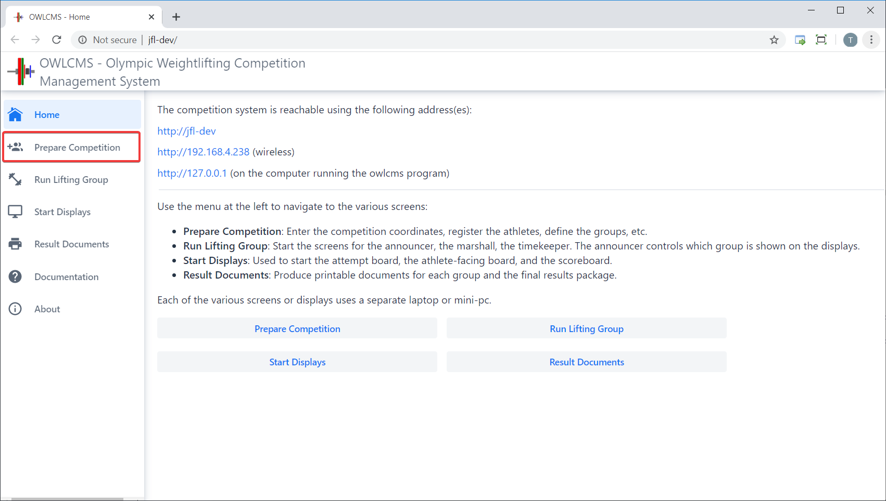
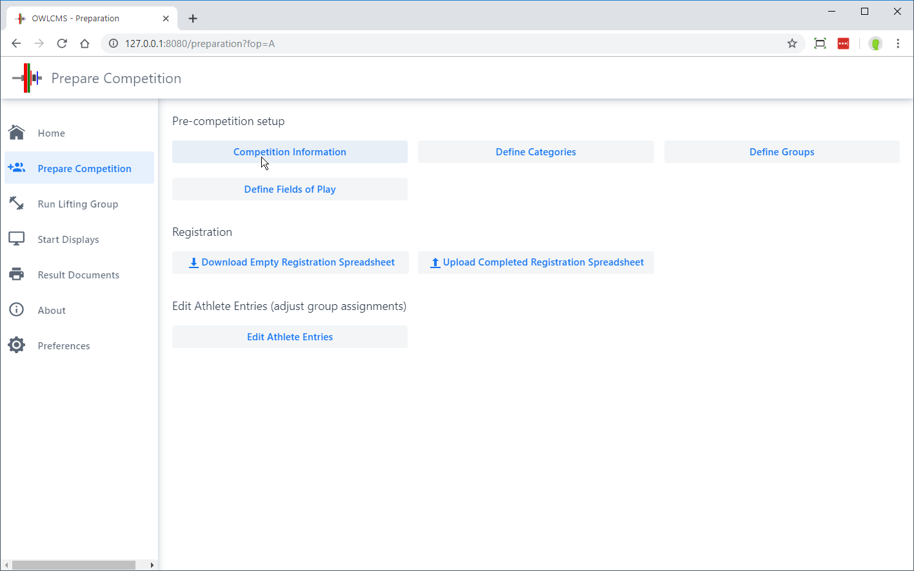
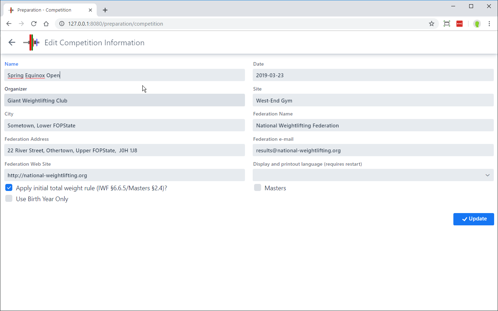
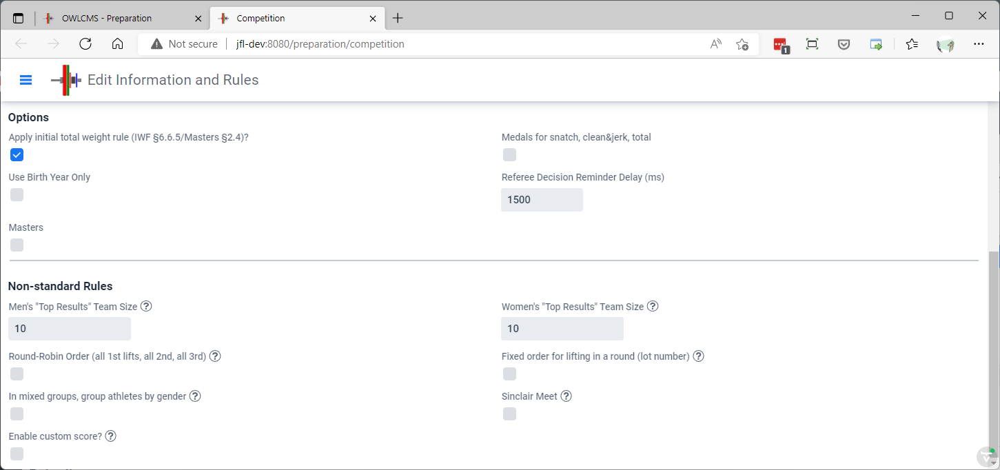
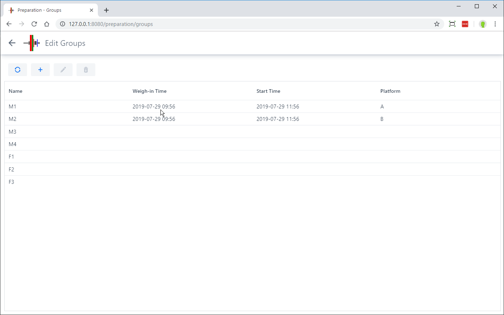
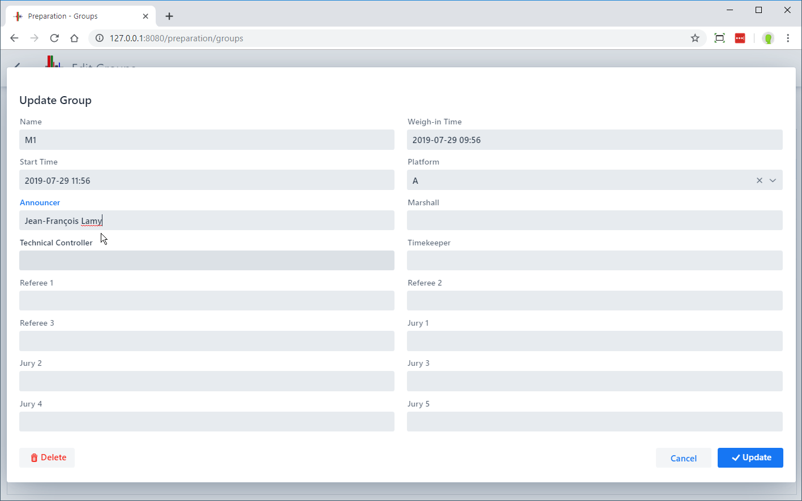
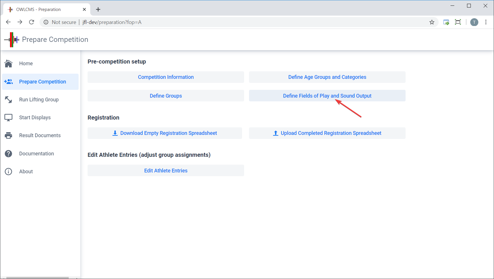
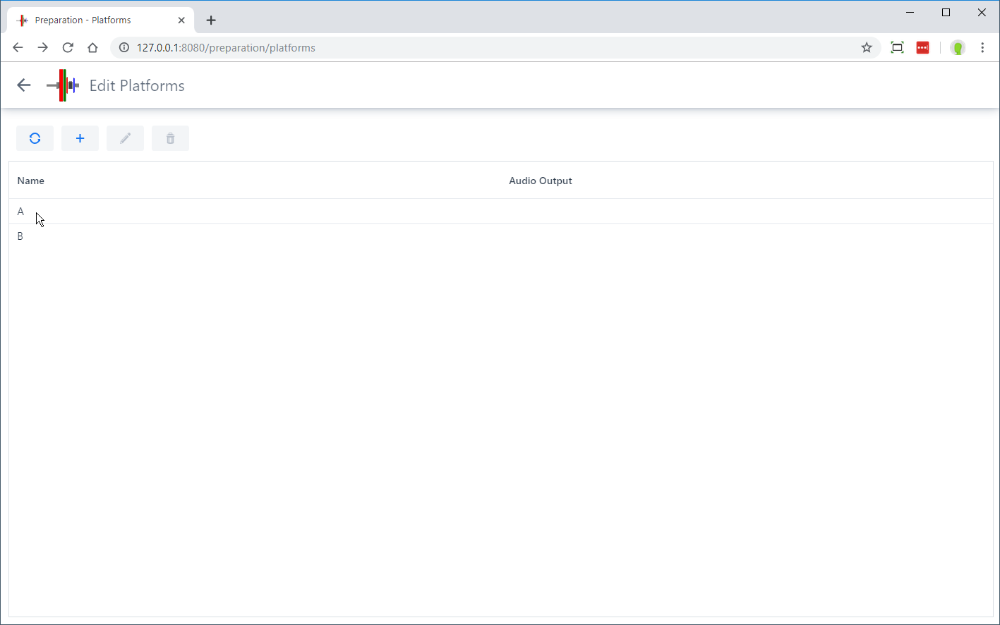
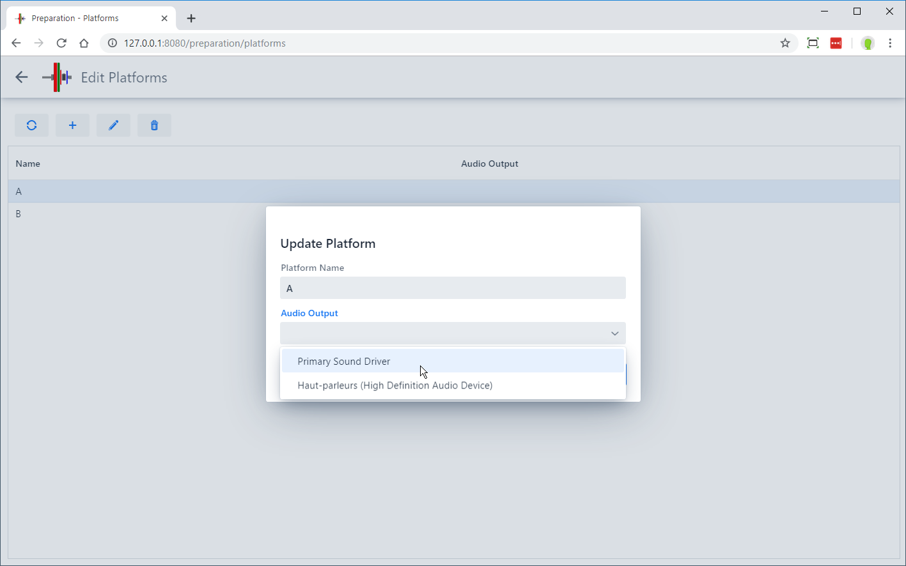

To prepare for a competition, select the `Prepare Competition` menu entry from the `Home` page.

 Using the buttons on the page allows you to setup each of the various aspects required for a meet.

## Competition Information

The `Edit Competition Information` button leads to a page where the name and other data about the competition is provided in order to use it on the various competition documents

 

#### Standard Competition Rules

The screen also allows selecting common variations on IWF rules.

- The `Apply initial total weight rule` determines whether the 20kg rule (15/10 for Masters) will be enforced.  Some local or regional meets do not enforce this rule.
- The `Use Birth Year Only` allows the use of only the 4-digit birth year for athletes, instead of a full date as required by IWF.
- The Masters switch is used when running a Masters-only competition, and is not required for competitions that have both Masters and non-Masters groups.

  - The Masters settings changes the sorting order for displays and weigh-ins -- Masters traditionally start with the older lifters, whereas in an age-group competition the younger age groups are typically listed and weighed-in first.
  - Note that the determination to apply the IWF 20kg or the IWF Masters 80% rule is automatic, based on whether the athlete is registered in a regular or Masters category.
- `Medals for snatch, clean & jerk, total` This setting controls whether there will be ranks and points awarded for the lifts, or only for the total.  It changes whether the corresponding columns are shown or not on the scoreboards
- `Referee Decision Reminder Delay` When using phones/tablets to referee, or MQTT devices that can provide feedback to the referee, this determines the delay before sending a reminder.

#### Non-Standard Rules

Additional options are used when running team, kid, or virtual competitions. 

- `Top Resuts Team Sizes`  in some competitions, points are awarded as usual, but the lifters who scored more points are the ones included in the team total. For example, there may be 10 athletes on the Men's team, but the 5 better point scores from the team will be used.  The number is how many athletes to count.
- `Round-Robin Order` In team leagues, it is common for all 1st lifts to be done before 2nd, and so on.
- `Group Athletes by Gender`  When hosting kid competitions, it is sometimes simpler to use round-robin, and in addition, have girls go first to avoid changing bars.
- `Fixed order for lifting` Some league competitions use round-robin play and also decide in advance the lifting order.  This setting means that the lot number assigned to the athlete decides the lifting order.
- `Enable Custom Score` This adds a box on the Athlete Card where a custom score can be entered.  This will typically be the total + bonus points or minus penalty points.  This is sometimes used for kid competitions for 5/6 or 6/6 performances.
- `Sinclair Meet` If this is selected, the program will behave as if there was a single male and a single female categories.  The scoreboards will show the Sinclair score, and the leader board will consider all the athletes of the same gender.

## Defining Age Groups and Categories

Different federations have different rules regarding age groups and the bodyweight categories used in each group.

By default, OWLCMS is set up for an informal club meeting, with no age restrictions and additional light body weight categories for kids.  We will use this simple setup for most of this tutorial.  

In the Default setting, athletes are assigned automatically to a category based on their bodyweight.

OWLCMS also supports the IWF scenarios, and more complex scenarios with multiple age groups, please refer to the [Define Age Groups and Categories](Categories) page for how to proceed for the following cases.
- Official IWF age groups and bodyweight categories.
- Masters competitions, where athletes are automatically assigned to an age group based on their birth date according to IWF Masters rules
- Age Group competitions where regional or national federations define the age group boundaries.

### Editing Competition Groups

From the `Prepare Competition` page, clicking `Define Groups` allows you to create or edit competition groups.  You can use the `+` on the list of groups to create additional groups.

Clicking on a group enables you to define a starting time (remove the information if you do not wish to define it in advance).  You may also enter the officials that will appear on the Excel spreadsheets produced as competition documents.

## Defining Fields of Play (Platforms)

OWLCMS supports multiple competition fields of play used at the same time.  A field of play corresponds to a platform and the corresponding warm-up area.   Displays and officials are associated with a field of play.

The `Define Fields of Play` button on the prepare competition page allows you to list the platforms. 

 Using the `+` button allows you to create additional fields of play.  Clicking once on a platform in the list allows you to edit it.  This is useful if you want to rename the platform, or if you want to change the way sound is handled on that platform.

### Associating an Audio output with a platform

Normally, the decision and attempt board on each field of play will emit sounds for the various timer warnings and for the down signal. 

> The recommended setup is to connect the speakers directly to the athlete-facing display.  This minimizes the delay between the visual down and the audible sound.  You do not want the down visual display to come from a different browser than the sound signal (as there can be a slight, confusing, delay between the two)

 However, in certain circumstances, this may not work (for example, some computer-browser combinations produce garbled sound).  You can then use the main laptop to produce the sounds instead.  If you are running locally on a laptop, then you can get the computer to generate the sound. 

Notes:

- if you need to produce sound from the main laptop for more than one platform, you will need one audio output per source.  The easiest way to add more (in addition to the audio headset jack) is to use an [*analog* USB converter](https://www.amazon.com/UGREEN-External-Headphone-Microphone-Desktops/dp/B01N905VOY/ref=lp_3015427011_1_5?s=pc&ie=UTF8&qid=1564421688&sr=1-5) -- do not use digital or wireless connections, they introduce perceptible lags and are needlessly expensive.  The various adapters available will appear in the list, you need to assign each platform with an adapter.

