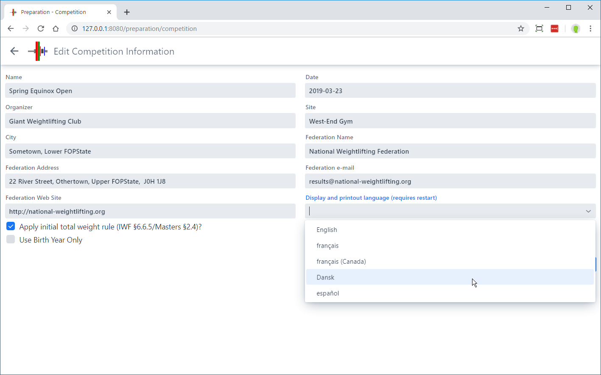
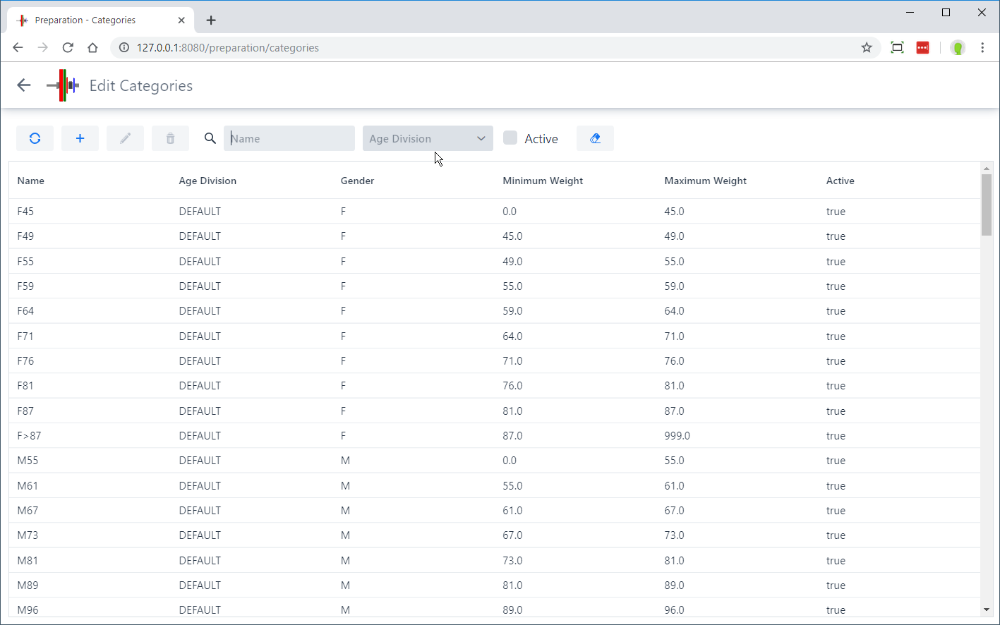
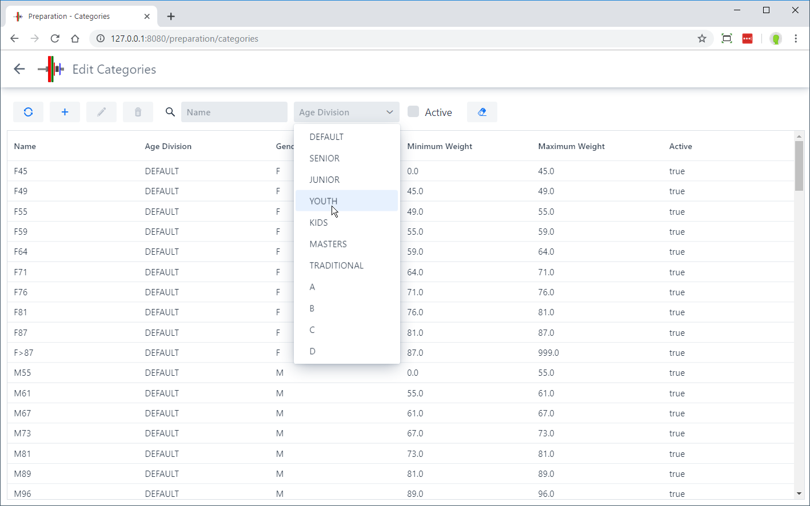
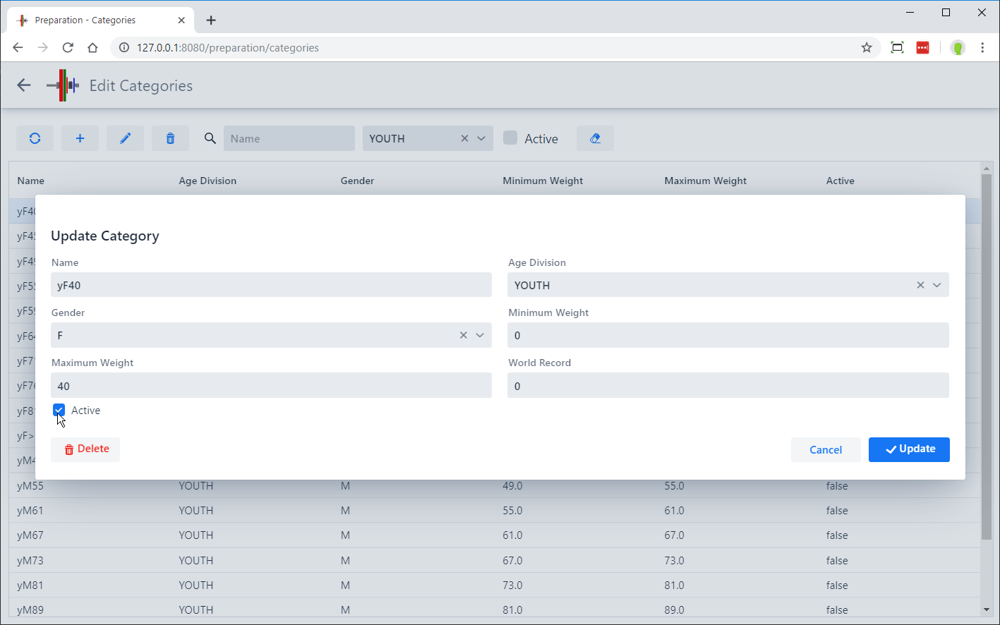
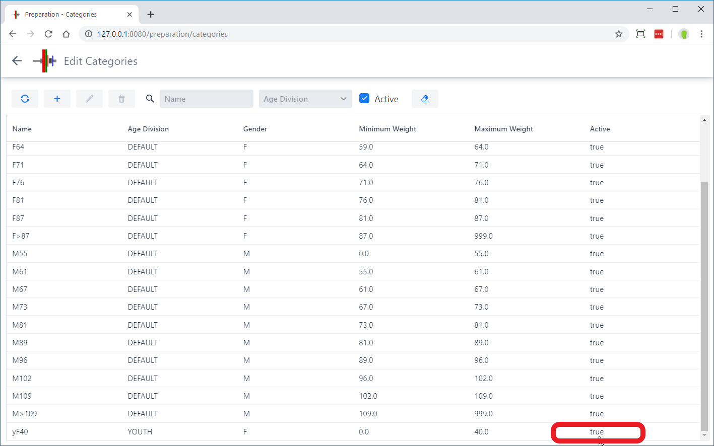

To prepare for a competition, select the `Prepare Competition` menu entry from the `Home` page.

This gives  you access to the the `Prepare Competition` page.  You may go to any other navigation page by using the menu at the left.  Using the buttons on the page allows you to setup each of the various aspects required for a meet.

## Competition Information

The `Edit Competition Information` button leads to a page where the information used on the various competition documents is defined.  It also allows options to be set that define the competition behavior.

- The `Apply initial total weight rule` determines whether the 20kg rule (20/15 for Masters) will be enforced.  Some local or regional meets do not enforce this rule.
- The `Use Birth Year Only` allows the use of only the 4-digit birth year for athletes, instead of a full date as required by IWF.

## Masters

The `Masters` checkbox determines whether there is an automatic classification of athletes according to the masters age groups, and whether Sinclair-Malone-Meltzer coefficients (SMM) are used for overall rankings.  *Note that the Masters setting currently applies to all groups -- it is a global setting for a meet.*

## Display Language

In countries where more than one language is spoken, the various computers used in a competition may be configured with different languages.  It is possible to force a single language to be used on all displays (owlcms will ignore the individual language preferences sent by each browser)

## Defining Age Divisions and Categories

OWLCMS, by default, uses the Senior IWF categories. Each category is also associated with an **Age Division**. 

Selecting the `Define Categories` button on the `Prepare Competition` page brings up a list of the defined categories, for all the age divisions.

### Multiple simultaneous age divisions

You can have multiple age divisions competing in the same meet and getting different medals by activating categories.  If you want to have Youths getting medals separately from Juniors and from Seniors, you would activate the categories from the Youth, Junior and Senior age divisions, and deactivate the DEFAULT categories.  OWLCMS will then consider M67 Youth different from M67 Junior different from M67 Senior, and award 3 medals. 

The line at the top allows you to search/filter the category list.  You can clear a filter by using the small `x` that appears if you define a value in a filtering box.  In this example we will show the youth categories.

If we then select the F45 category by clicking ONCE on it, we can use the checkbox at the bottom left to activate it.

Going back to the full list, we can use the filtering checkbox `Active` to see that the F45 Youth category is indeed active.

### Editing Competition Groups

From the `Prepare Competition` page, clicking `Edit Groups` allows you to create or edit competition groups.  You can use the `+` on the list of groups to create additional groups.

Clicking on a group enables you to define a starting time (remove the information if you do not wish to define it in advance).  You may also enter the officials that will appear on the Excel spreadsheets produced as competition documents.

## Defining Fields of Play (Platforms)

OWLCMS supports multiple competition fields of play used at the same time.  Each field of play corresponds to a platform and warm-up area with the associated displays and technical officials.

The `Define Fields of Play` button on the home page allows you to list the platforms. 

 Using the `+` button allows you to create additional ones.

Clicking ONCE on a platform in the list allows you to edit it.

### Associating an Audio output with a platform

Normally, the decision and attempt board on each field of play will emit sounds for the various timer warnings and for the down signal.  However, in certain circumstances, this may not work (for example, some computer-browser combinations produce garbled sound).  You can then use the main laptop to produce the sounds instead (which is how owlcms2 operated).  This is done by using a dropdown on the platform editing card. 

Notes:

- if you need to produce sound from the main laptop for more than one platform, you will need one audio output per source.  The easiest way to add more (in addition to the audio headset jack) is to use an [*analog* USB converter](https://www.amazon.com/UGREEN-External-Headphone-Microphone-Desktops/dp/B01N905VOY/ref=lp_3015427011_1_5?s=pc&ie=UTF8&qid=1564421688&sr=1-5) -- do not use digital or wireless connections, they introduce perceptible lags and are needlessly expensive.  The various adapters available will appear in the list, you need to assign each platform with an adapter.
- This technique does not work if you are running OWLCMS in the cloud.  In that case, find a computer with proper sound, and run the attempt board on that computer.  Just make sure that the attempt board is running in its own browser window, and that it is the selected tab.  You can bring other windows in front, the attempt board will still emit the sounds.

