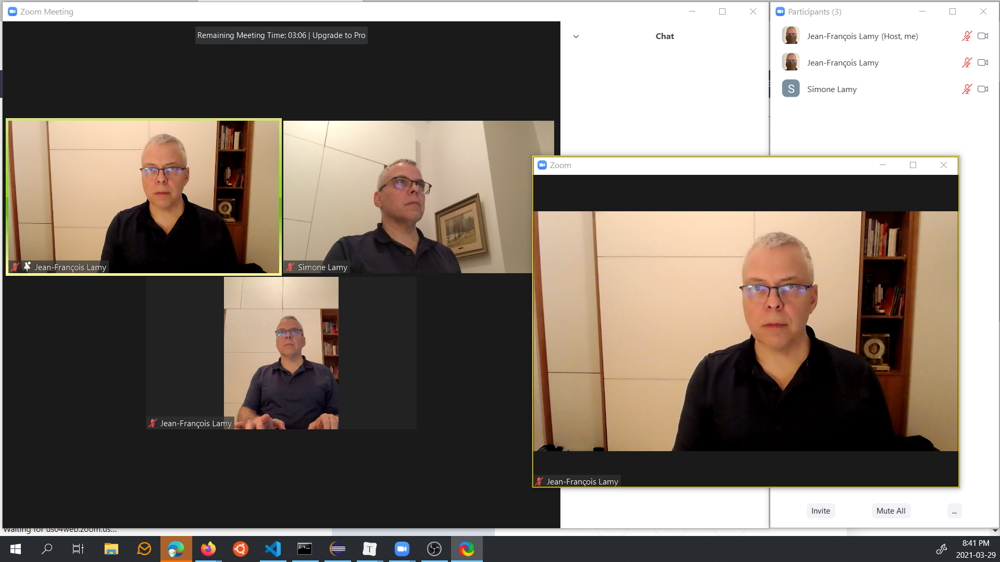

# Prepare Zoom for Broadcasting

Start Zoom and use the Home icon, and then click on the settings Icon at the top right.  Make sure that "Use Dual Monitors" is selected.

#### Setup your Zoom Windows

In this example, we use one of our two monitors to have all the Zoom windows.

- The general idea is that we will select an athlete from the gallery view, and put the spotlight on that athlete (right-click and select "replace spotlight").  This will change the view for all participants (including ourselves)
- See the picture below for a sample organization.  We have:
  - one window with the gallery view and the chat,
  - a second window with the selected video.  The "Use Dual Monitors" option and the actual presence of a second monitor is what gives us the the second window (with the yellow frame in the screen shot below) -- once the window is shown, it can be moved to any monitor.
  - Optionally, you can open the participants list as a pop-out.

#### Rehearse Current Athlete Selection

- For this step, you may need to invite other people.  You need at least two other participants to get all the menu options that will appear in a meet.  In the example window, we used an iPhone and an iPad with dummy accounts.

- Make sure you are in Gallery View - there is an icon at the top right of the Zoom Meeting window that shows all the participants.
- Right-click on the participant that you wish to select.
- Select "Spotlight" or "Replace Spotlight" - the video preview window will switch accordingly.

#### Rehearse the Broadcasting setup

The video preview window is shown to the right (with a faint yellow highlight) in the screen shot above. 

- Make the video preview window go full-screen by **double-clicking the white title bar**.  This is what we need for broadcast.
- Bring back the other windows to be on top (using Alt-tab on Windows).  
- The full-screen is still present underneath. This full-screen Zoom video window be used as a video source for OBS.