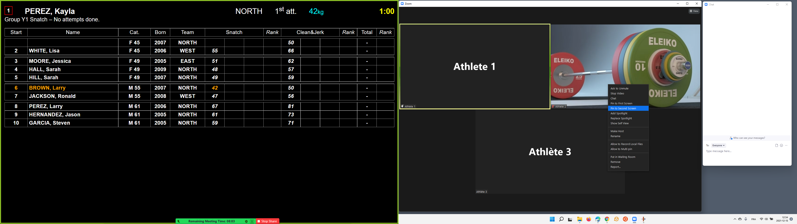

# Prepare Zoom for Broadcasting

Start Zoom and use the Home icon, and then click on the settings Icon at the top right.  Make sure that "Use Dual Monitors" is selected.

#### Setup the host's Zoom Windows

In this example, we use one of our two monitors to have all the Zoom control windows.  The other screen shows the scoreboard, which is shared in high resolution to all the participants.

- The general idea is that we will select an athlete from the gallery view, and put the spotlight on that athlete (right-click and select "replace spotlight").  This will change the view for all participants (including ourselves)
- See the picture below for a sample organization of the two screens (you can click on the image to enlarge it).  We have:
  - one screen at the right with the gallery view and the chat,
  - one screen at the left which is the host's main Zoom window. This is used to do a screen share of the scoreboard

#### 

#### Selection of the current athlete

- The current athlete and the next athlete can be monitored on the left screen (they blink or are highlighted)
- On the right screen, make sure you are in Gallery View - there is an icon at the top right of the Zoom Meeting window for selecting.  In this way you see all the participants.
- Right-click on the participant that you wish to select.
- Select "`Spotlight`" or "`Replace Spotlight`" in the context menu.  This will switch the video output on all the users.  
- As described [here](UserInstructionsForZoom), users can select whether they watch the video of the athlete or the scoreboard.

#### Rehearsal of the Broadcasting setup

To rehearse this step, you to invite other people.  

- You need at least two other participants to get all the menu options that will appear in a meet. 
- For our example, we used an iPhone and an iPad with dummy accounts, and a second laptop.  Video needs to be active on the participants to allow switching to a participant.  In our example, only Athlete 2 has the camera turned on, so that's the only view that can be selected for spotlighting.