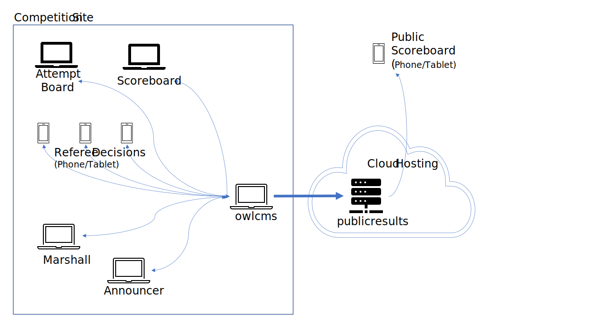
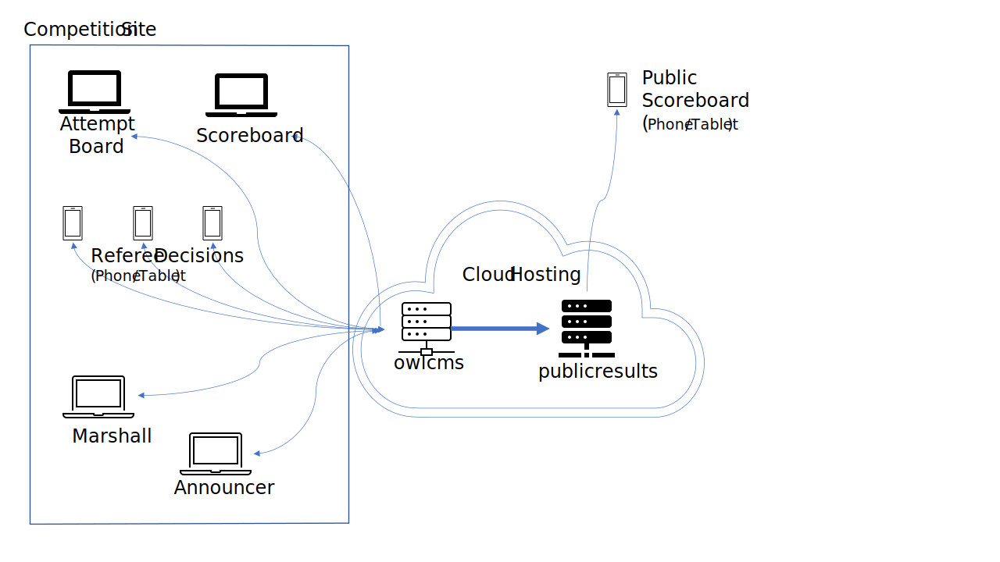

# Public Scoreboard

The `publicresults` application is used to make results available to the public, or to participants in virtual competitions.

The following example shows owlcms running standalone in a gym, sending information to publicresults running in the cloud where it is accessed by anyone with internet access.


- All significant events are shown on the remote scoreboards (clock start/stop, weight changes, lift decisions, etc.)  
- No matter how many people are watching the remote scoreboard, there is no impact on the competition owlcms

The other common configuration is when both owlcms and publicresults are in the cloud,  



## Install publicresults

The normal way to install publicresults is in the cloud.  See [this page](Fly) for details.  Note that if you only want to use publicresults and want to run owlcms locally, you can simply skip the section about installing owlcms

You can also install publicresults locally if you wish to give access to coaches, but don't have internet access. See [this page](PublicResults_Local) for details.

## Configure `owlcms` to send updates

1. Open the owlcms application on Heroku and go to the `Prepare Competition` - `Language and System Settings ` page.

     - paste the secret key on the right-hand side -- use the "eye" icon to see what you pasted.
     - copy and paste the correct URL for the publicresults application we opened in step 5.
     - Click on update.

     


 ## Test the setup

1. Create the athletes for a group

     - load a registration file or create an athlete
     - go to the weigh-in screen and add body weight and starting weights.

2. Go to the announcer page and select a group.
     

3. As soon as a group is selected, publicresults is updated.  Switch to the publicresults tab.   Because we have not started lifting, you should see the following.   If your site has more than one platform, you will see a page that allows you to select which platform you want to watch.

     

5. The announcer selects a group, and clicks on "Countdown to Introduction", and starts the countdown.
     

6. The publicresults screen immediately switches to the countdown.

7. From then on, the publicresults screen will track the competition. It just repeats the events taking place on the local scoreboard.


## Update the program when you update owlcms

- For fly.io, if your application is called `myclub-scoreboard` you would use

  ```
  fly deploy --app myclub-scoreboard -i owlcms/publicresults-stable --detach
  ```

  

- For Heroku Once you have created the application once, you can download a program that will check for updates and remote control Heroku to grab them.   See [Instructions](https://github.com/owlcms/owlcms-heroku-updater) and [Releases · owlcms/owlcms4-heroku-updater (github.com)](https://github.com/owlcms/owlcms4-heroku-updater/releases)

