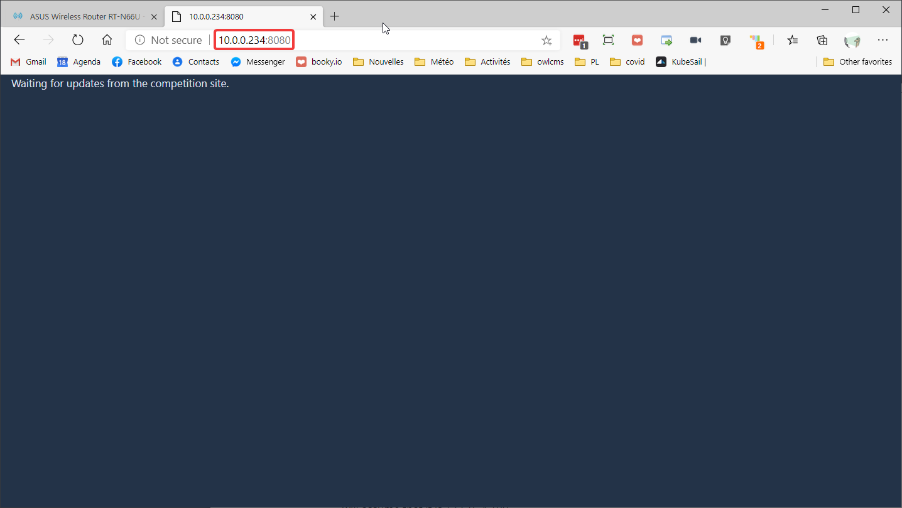
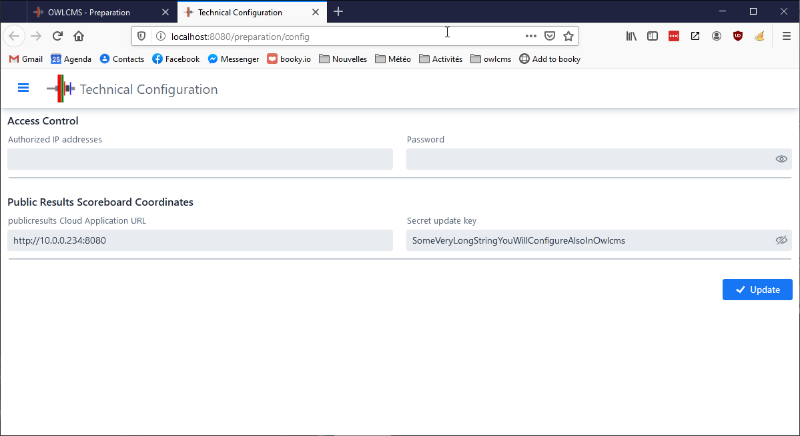

## Public Scoreboard Local Setup

If you have Internet access, we suggest that you install [`publicresults` in the cloud](PublicResults), because it is simpler.  

If there is no Internet, you can use a setup as follows to provide individual scoreboard displays.


It is strongly recommended to use two networks.

- For performance: the competition network should be separate so that there is no congestion and so that the timing and refereeing information flows as close to real-time as possible.  Splitting the WiFi traffic on two networks will also help with performance.
- For safety: disgruntled or mischievous persons could be tempted to from interfering with the competition network. The coaches should therefore be on a separate network.

### Competition Network

The competition router protects the competition network.  

- If you use a typical domestic or gaming router, by default it will call itself something like 192.168.0.1 and allocate addresses that start with 192.168.0.x.  
  - *We suggest that you change the default competition network to something different.*  If you connect the competition router to another router, it cannot have the same address.  Since the other router will likely have 192.168.0.1, we change our competition router to something else. changed the network used to 192.168.4.x.
  - The Competition Network should have a strong WPA2 security key configured that cannot be easily guessed.
- **Important**: The competition network is connected to the coaches network by running a wire <u>**from** the WAN/Internet port on the competition router **to** a LAN port on the coaches/public router</u>.  
  - By making the connection in that way, the competition router will prevent anything coming in on its WAN port from reaching the 192.168.4 private network *except* if the connection originated from the private network.  
  - So only connections initiated from the blue competition network to the orange competition network are possible, not the other way around
  - And because it is the (blue) owlcms server that opens the http connection to the (brown) publicserver machine, things work without any further setup.

### Coaches/Attendance Network

A second router provides WiFi access to the coaches and/or the public at the competition

- The second router can a second domestic router you provide, or it can be an existing school or gym  network. 
- The second router should have excellent WiFi capabilities, as it will be servicing many WiFi connections
- The second router should use a different network numbering than the competition router.  In our example  the second router is an existing router that allocates addresses in the 10.0.0.x range.  
- The `publicresults` machine will connect to the coaches router using an ethernet cable (ideally); 
  - In order to discover the address for the publicresults machine, you will need to run a local program such as "ipconfig" (see [this link](https://redisoft.uk/ipconfig-gui/) for a simple interface)
  - You will need to tell the owlmcs program to send the updates to that address (see below)
- You will provide the WPA key to the coaches so they can connect to the WiFi router
- You will need to tell the coaches the URL to use to reach the publicresults application.  In our example, that would be http://10.0.0.234:8080 (assuming the publicresults application has been configured on port 8080)

### Inter-network Traffic Flow Explained

The traffic between the routers works as follows

- When the competition router sees traffic for anything other than 192.168.1.x, it knows that it does not belong to itself and sends it to the WAN.  So a request for publicresults (10.0.0.234) from owlcms is automatically sent to the second router
- The second router recognizes 10.0.0.234 as belonging to itself and sends traffic tp the publicresults laptop.   It keeps all the 10.x.y.z traffic to itself.

If you need to stream video, the streaming machine will be on the competition network if you want to overlay the attempt board or other information on top of the video, so you have two options

- you can simply connect the coaching router to the internet.  The competition router will send all its internet traffic through its WAN port, and the coaches router will do the same.  This is known as a double-NAT configuration, or
- you can use a business-grade router for the competition network with the capability to have multiple WAN connections

### Configuration and Test

1. We need to configure publicresults so that it has a shared secret with owlcms
   Go to the installation location for publicresults and edit the `publicresults.l4j.ini` file.
   Make sure it has a line that defines the secret

   ```
   -Dupdatekey=SomeVeryLongStringYouWillConfigureAlsoInOwlcms
   ```

3. We can test the connection by going to the owlcms laptop and trying the the destination address with a browser
   
   
4. You can now test actual updates from the owlcms application. Configure owlcms on the `Prepare Competition`/`Language and System Settings` 
   
   - set the destination url for publicresults to the tested IP address (http://10.0.0.234:8080 in our example)
   - set the shared secret update key to what you used in the l4j.ini file (SomeVeryLongStringYouWillConfigureAlsoInOwlcms in our example)
   
4. 

### Hybrid Usage: Adding other devices on the Attendance Network

If you need to add other devices on the attendance network (a scoreboard, the marshall laptop, etc) they will not be able to reach the blue owlcms server.

You will need to configure the competition router to expose a port to the outside world.  This is the same process as used for gaming ports. 

1. Connect to the main router in admin mode
2. Locate the "Port Redirection" menu for your LAN
3. Designate a port number - we suggest you use a non-obvious one
4. Direct the traffic on that port to the owlcms server, on the port that owlcms uses (typically 8080)
    - For example, if owlcms is running on 192.162.1.100 port 8080, you would redirect some port (for example, 8978 to that address)
5. The main router appears as an ordinary machine on the secondary network.  It should normally be reachable under its own original address, as it is the one that gave the secondary network its address.
7. You should now be able to connect, from the secondary network, to the port exposed by the main router.