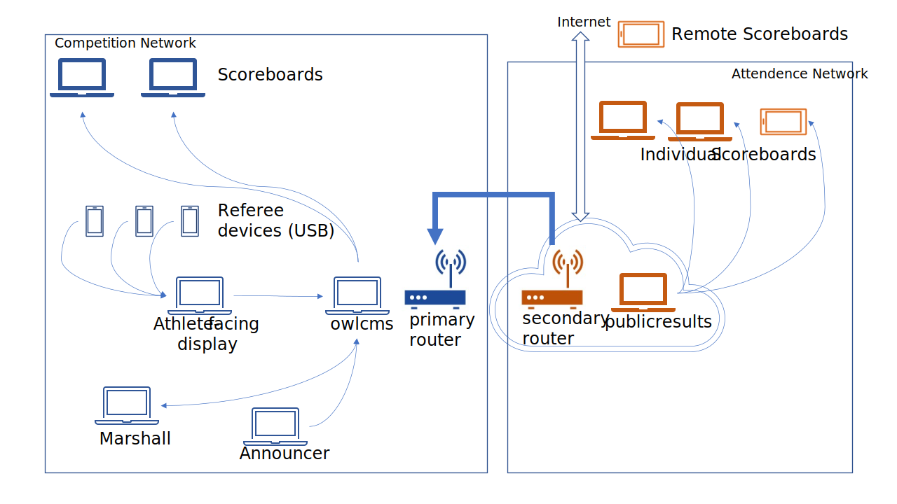

## Local Networking of the `publicresults` Application

Normally, `publicresults` is installed in the cloud.  If you have no Internet access and would still like the coaches to have access to the scoreboards, you can use a setup like the following.

NOTE: local setups are complicated, because you want to keep the competition network safe.  We don't suggest you attempt this unless you have access to someone comfortable setting up routing rules .

### Simple `publicresults` networking procedure

We do *not* recommend that you use this procedure in an actual competition unless you are *very* confident that coaches will not attempt to interfere with the competition network.  

In this setup there are two routers. The secondary router is acting as a gate so you can stop access by turning it off if users misbehave.

1. Install `owlcms` on the primary laptop and connect it to the primary router.  The primary router is the one used for the competition site.
   - Make sure to add a password to the site.
2. connect a second router (the "secondary router" to the primary router using an Ethernet wire.  Be sure to connect the secondary to one of the LAN ports of the primary router. 
   - Make sure there is an access key (WPA2) on the router.  This is the only protection you will have to prevent people in attendance from reaching the publicresults application.
   - Make sure that the WPA2 key for the primary network is not shared to people that don't need it, and is changed regularly.
3. install `publicresults` on a separate laptop.
4. connect the publicresults laptop using an ethernet wire to the **secondary** router.   In effect, the secondary router will be part of your local network -- the only thing separate is the WiFi traffic.
5. use the `ipconfig` command on the publicresults laptop to get its IP address, and configure owlcms to talk to the publicresults laptop. 

### Advanced networking procedure

1. Do NOT connect the secondary router to the primary
2. Configure the secondary router to have its own static address and that it will NOT use DHCP to fetch an address from the primary network.  We recommend using a 172.16.4.1 address so that you can clealy distinguish that subnet from the primary net.  All the machines on the secondary network should have addresses above 172.16.4.100 for the same reason.
   - How to do this depends on your specific router.  You will likely need to refer to the documentation, under "static WAN IP address".
3. Configure a fixed address (we suggest 172.16.4.10 for the publicresults laptop on the secondary network)
   - How to do this depends on your specific router.
   - Make sure that the publicresults laptop is reachable from other machines on the secondary network  -- if you start the publicresults application they should see the blue "waiting for updates" screen.
4. Add a route on the primary router to reach the secondary network. It is suggested to restrict traffic to the publicresults machine.  The route should specify the exact IP address of the publicresults laptop, and use a netmask of 32 bits (255.255.255.255) to make sure no other machine is reachable.
   - How to do this depends on your specific router.
5. Because of the nature of the connections used between the two programs (polling may take place), it is necessary to open a route from the secondary to the primary. It is critical to restrict traffic only to the owlcms laptop (using exact IP address and a full 32bit netmask).
6. Connect the two networks together.  Test that the owlcms laptop can reach the publicresults laptop (using `ping 172.16.4.10` in our example.).
7. Configure owlcms to update publicresults using a URL which, in our example, would be http://172.16.4.10

### Expert networking configuration

If you have a machine able to serve as many remote scoreboards as needed, you can open up your secondary router to the Internet (assuming of course you have an Internet access).  If you intend to do so, you must be extremely careful that the only routes between the primary and secondary networks are the ones created point-to-point in the Advanced configuration.

Given the availability of machines in the cloud with proper internet isolation, there should seldom if ever be a need to do such a setup.

