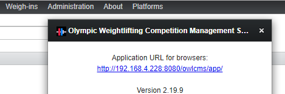

# Raspberry Pi as Cost-Effective Display Driver

The most cost effective way to run display screens is probably to use Raspbery Pi 3B devices.  You can find a full kit for roughly 75$ [(see for example this kit)](https://www.canakit.com/raspberry-pi-3-starter-kit.html).
A pre-configured operating system is available that provides all the required options (see instructions below).

##Hardware Features
Raspberry Pi 3B have the following features:

1.	Both Ethernet and WiFi
2.	4 USB ports
	-	a USB mouse is used for operation -- normally, clicking on icons and menus is all that is needed.  An on-screen keyboard is available if something needs to be typed (e.g. an address in the browser, or a wifi password)
	-	3 ports are open to connect USB refereeing devices, such as [Delcom USB Buttons](http://www.delcomproducts.com/productdetails.asp?PartNumber=706502-5M).  The operating system image has been tested for compatibility with these devices.
3.	HDMI port : you can drive any modern TV or monitor with a HDMI port.  Monitors with DVI-D ports can also be used with the proper cable (HDMI at one end, DVI-D at the other).  Older VGA monitors require an HDMI-to-VGA converter.
4.	Bluetooth: you can use Bluetooth devices built around the [Adafruit EZ-key](https://www.adafruit.com/product/1535) as refereeing devices.  

##Installation
To copy the installation on the SD card, proceed as follows:

1.	Install Etcher from the http://etcher.io site).
2.	Download the bootable Raspberry operating system from this location https://sourceforge.net/projects/owlcms2/files/RaspberryPi/ (the file is called an image because it is a exact copy of what is found on the bootable SD card).  The compressed file is 2GB (that's a big download) and occupies 8GB once copied to an SD card.
3.	Use a USB adapter (typically provided with the Blackberry kit) to insert the SD card into your Windows PC
4.	Run Etcher to write the image file to your SD card
5.	Insert the SD card in the Blackberry and boot

##Configuration

1.	Locate the address of the OWLCMS server: on the server laptop, click the "About" button.  This will show the address and port of the OWLCMS server

	

	In this example, the address of the server is `192.168.4.228` and the port is `8080` (the number after the ":").  If there is no number after the ":", then the port is 80, which is the standard.

2.	On the desktop, double-click on the CONFIGURATION icon and check that the address is correct.  In this example the `SERVER=` line is indeed 192.168.4.228 and the `PORT=` is 8080.  If there had been no port specified in the URL at step 1, then the port would be 80 .

	

3.	Double-click on the "OPEN OWLCMS" barbell Icon.

	

	This will open the browser in full-screen mode.  You can use the right-click on the mouse to exit full-screen.  To get back in full-screen mode, right-click again and locate in the menu the square icon next to the zoom levels.

##End of Competition
Raspberry Pi do not have a power switch. It is therefore extremely advisable to shut down the device cleanly before unplugging power.
1. At the end of the competition, right-click on the Competition browser screen to exit Full-Screen mode
2. Double-click on the Shutdown icon or use the System menu to shut down.

