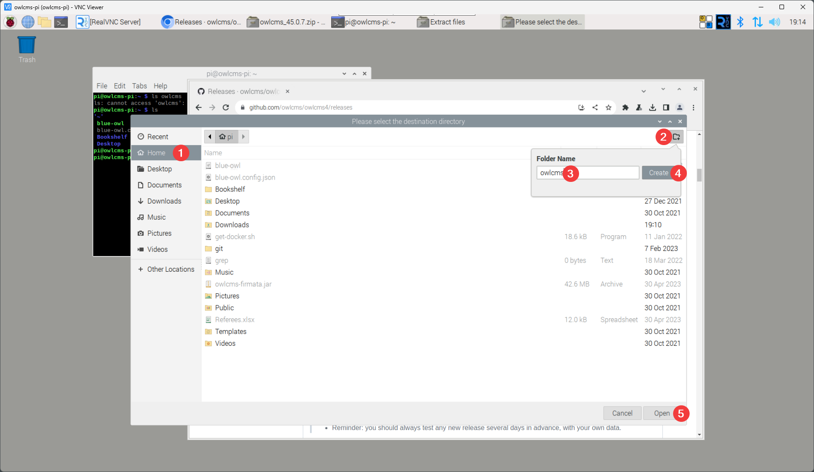

# Installing owlcms on RaspberryOS

Open a browser (the blue globe in the top bar) and go to the releases directory https://github.com/owlcms/owlcms4/releases

Download the zip file and open it

- The zip application will open. Select Extract. 

- Make sure you unselect the Ensure a containing directory checkbox. 
- Click on the folder icon to open the file destination dialog, move on to the next step

- Select the `Home` directory in the list on the left-hand side
- At the top right click on the folder icon
- Type the name of a folder you want to create in your home directory, click Create
- Click on Open at the bottom right

- Start a terminal window; you will be in your home directory
- Type `cd owlcms` (use the name of the folder you created)
- Type `java -jar owlcms.jar`

The address of the Raspberry Pi will be shown on the home page.

