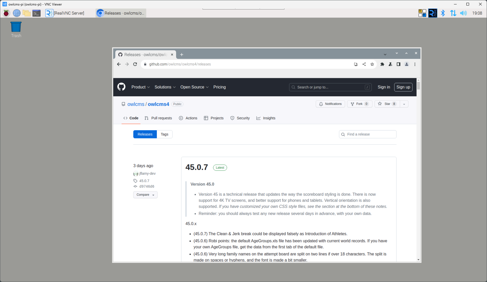
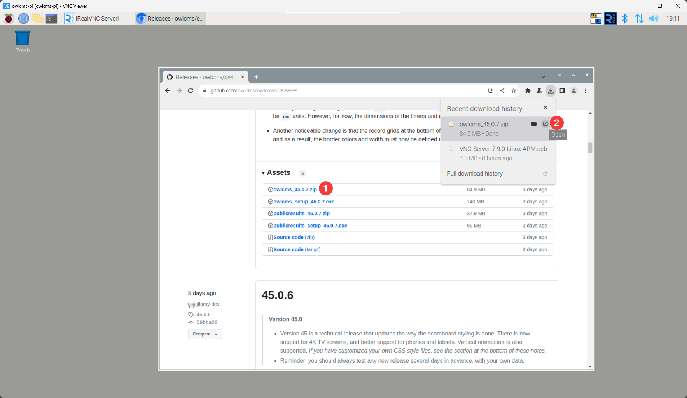
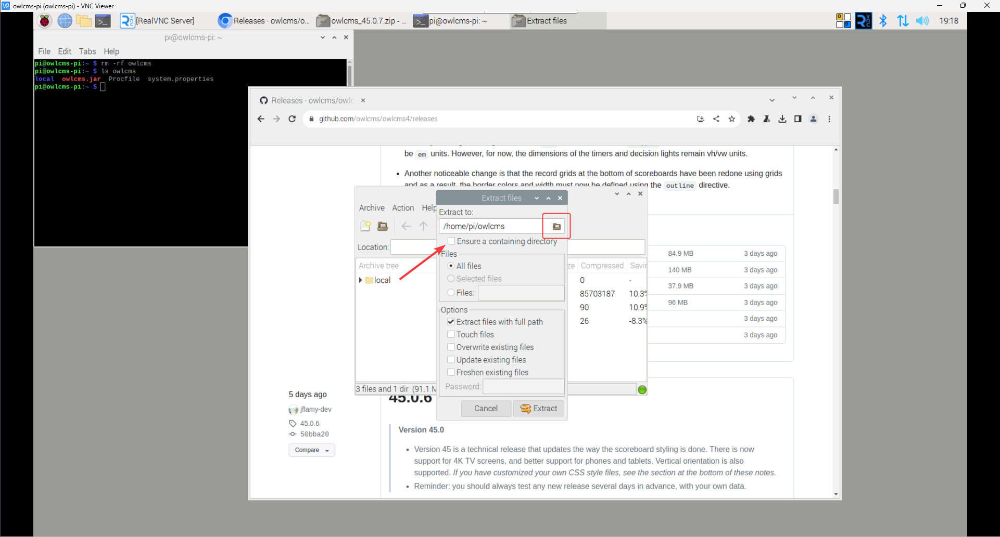
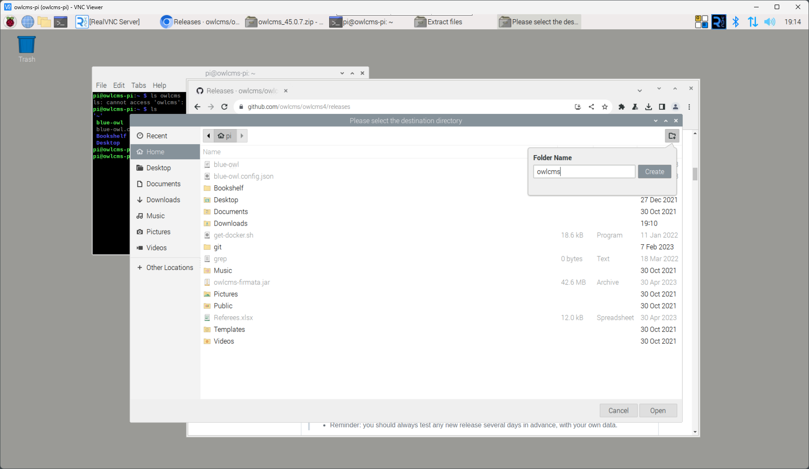
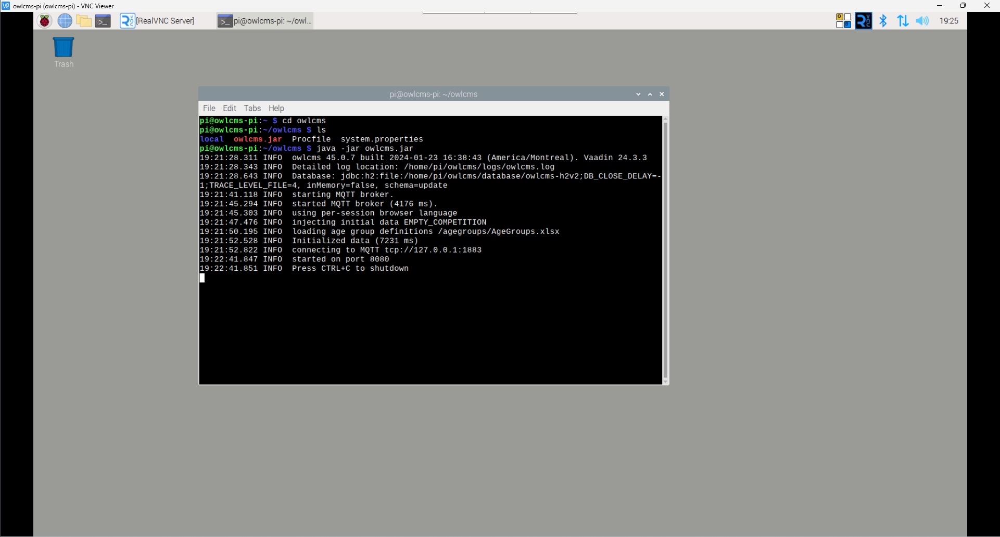
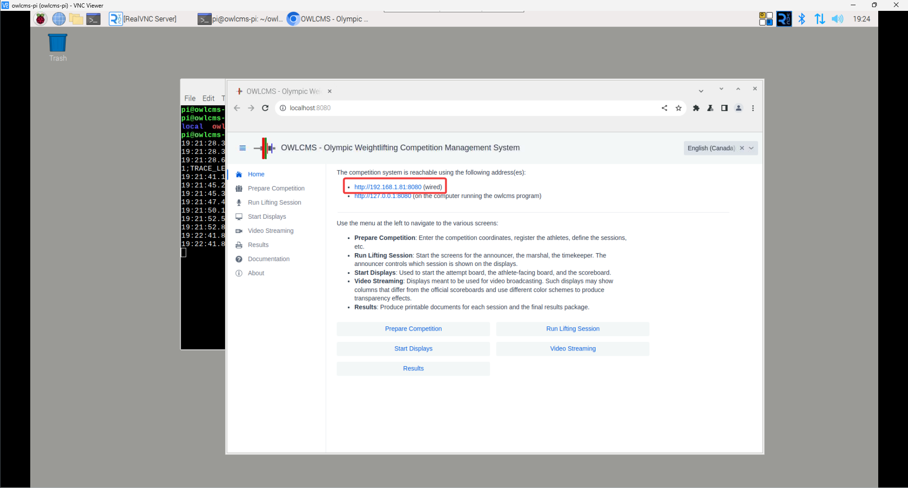

# Installing owlcms on RaspberryOS

Open a browser (the blue globe in the top bar) and go to the releases directory https://github.com/owlcms/owlcms4/releases

Download the zip file and open it

In the zip application, select Extract.  Make sure you unselect the Ensure a containing directory checkbox. Use the folder icon to select where you will extract.

When selecting the location for extraction, create a folder in your home directory.

Go to the directory where you extracted the files and run `java -jar owlcms.jar`

The address of the Raspberry Pi will be shown on the home page.

