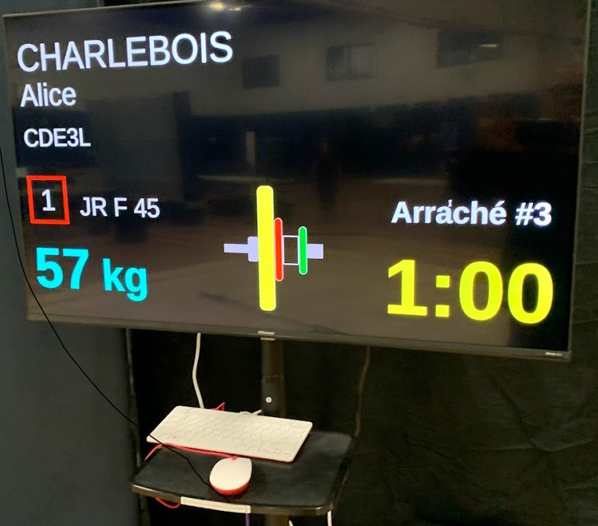
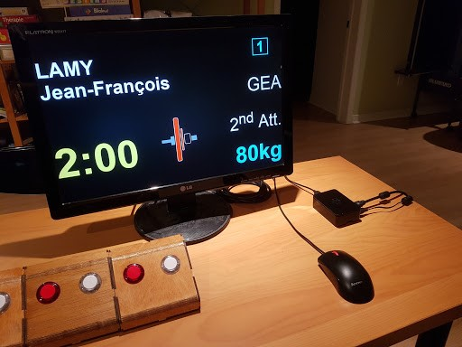

# Raspberry Pi as Cost-Effective Display Driver

The most cost effective way to run display screens is probably to use Raspbery Pi (RPi) devices.  We recommend using [Rpi 400](https://www.canakit.com/raspberry-pi-400-desktop-computer-kit.html) as screen drivers because the device has integrated keyboard and mouse and is the same price as the other kits Rpi 4 kits (roughly 100 US$).

## Hardware Features

Raspberry Pi have the following features:

1.	Both Ethernet and WiFi
2.	4 USB ports
	-	a USB mouse is used for operation -- normally, clicking on icons and menus is all that is needed.  An on-screen keyboard is available if something needs to be typed (e.g. an address in the browser, or a wifi password)
	-	3 ports are open to connect USB refereeing devices.
3.	HDMI port (2 on recent models): you can drive any modern TV or monitor with a HDMI port.  Monitors with DVI-D ports can also be used with the proper cable (HDMI at one end, DVI-D at the other).  Older VGA monitors require an HDMI-to-VGA converter.
4.	Bluetooth: you can use Bluetooth devices built around the [Adafruit EZ-key](https://www.adafruit.com/product/1535) as refereeing devices. 

## Recommended Software

If you use RPi devices to drive displays without keypads then all is good and you can use the current versions of the Raspbian software (named "Stretch" and "Buster").

- You only need to disable the screen blanking options
- The standard version of Chromium that ships with these version works fine.
- Installing the `onboard` virtual keyboard is useful, as it allows operating the raspberry with no physical keyboard attached. `sudo apt-get install onboard`
- You can use RealVNC to control them remotely.  You will need to install it on your Windows/Mac laptops.

## Old Delcom USB Keypads

If you own older (firmware version 52 and before) [Delcom USB Buttons](Delcom) keypads **and** are connecting them to a Raspberry Pi,  be aware that Delcom has unfortunately [introduced a bug in its device drivers](http://www.delcomproducts.com/webnote.asp?id=3).   See the [Delcom Configuration](Delcom) page for workarounds.  

Note that other USB buttons, Bluetooth, NES Classic Keypads, etc) work fine. For example, in the setup below , the keypads are Bluetooth, so there is no issue.

