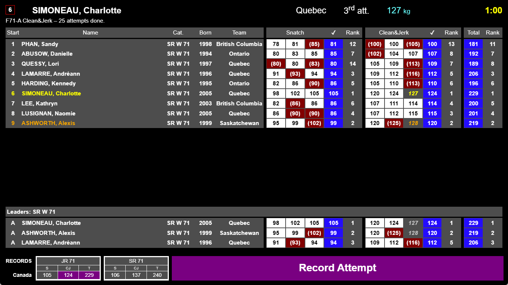
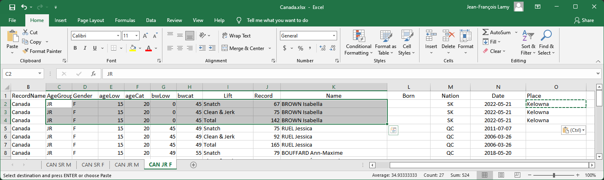

Record definition files can be loaded in owlcms so that when an athlete is about to lift, the records for his/her categories can be shown.  As many record files as needed can be loaded, so that state, national, continental, world, or event-specific records can all be shown.

In the following example

- the athlete can potentially break records in categories from two age groups (JR 45 and SR 45)
- the records from two federations have been loaded to illustrate. Normally one might expect related state, national and continental federations to be used in a given meet.
- the next lift would break the records highlighted in purple (assuming of course that the athlete meets citizenship and that other record requirements such as proper referee levels are met).
- the athlete had, in fact, just set the records on the previous lift-- the system updates the display when a record is provisionally set during a meet.

### Loading Records

The program reads all the tabs of all the files found in the `local/records` directory.  For legibility, we suggest using one Excel per federation/jurisdiction, and one tab per age group.  This does *not* actually matter, since the program reads all the files and all the tabs in each file.

> Note that `local/records` is case-sensitive (lowercase `r`)

Records are shown according the the sorting order of the files.  To control the sorting order, start the file names with a numerical prefix, e.g. 10_Canada.xlsx and 20_World.xlsx and 30_Commonwealth.xlsx would display the records in that order.

The following figure shows the content of the 10_Canada file, organized with one age group per tab.  In order to support non-standard age groups, and non-standard categories, the lower and upper bounds for ages and for body weights are given. 

Notes:

- IMPORTANT: 
  -  Normally the AgeGroup column should match the age groups in your competition.  When they do, this means that the athlete must be eligible in that age group to break the record.  For example, if a record is marked M35, the athlete must eligible as M35 -- a 35 year-old senior could for example be ineligible because he is not a member of his Masters federation, and he would not be shown as attempting the record.
  -  **BUT** If you have "Absolute" records that are accessible to all categories, or other records for which the eligibility requirements don't matter, just use another name for the age group.  For example, "Absolute", "Juvenile", etc.  Then the age group eligibility will not be checked, only the actual and bodyweight criteria listed on the record.

-  Ages are inclusive.  Masters 35 is athletes between 35 and 39
-  The lower bound of the bodyweight category is excluded.  45 to 49 means greater than 45 and lower or equal to 49.
-  The upperbound of the heavyweight categories is written with a `>`.  So the SR heavyweights are written as bwlow 109 bwcat >109
- You can translate the RecordName column, it is used only for display
-  -  

-  The `Lift` column relies on the first letter being S C or T to distinguish the lift types
-  Columns `K` and after are not currently displayed, but are very useful when updating the files, and for human readers.

### Updating Records

In some countries, regional championships are held in different time zones on the same days, and national records could therefore be broken in several meets.  This is why the Excel file is expected to be consolidated manually by the association or federation.

Records set during a lift are considered to be provisional.  The updated information is displayed as long as the program is not restarted. So if there is high confidence that the record will indeed become official, you may elect to update the Excel file.

 

