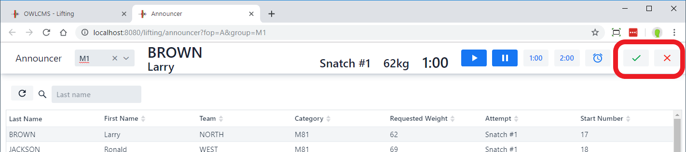
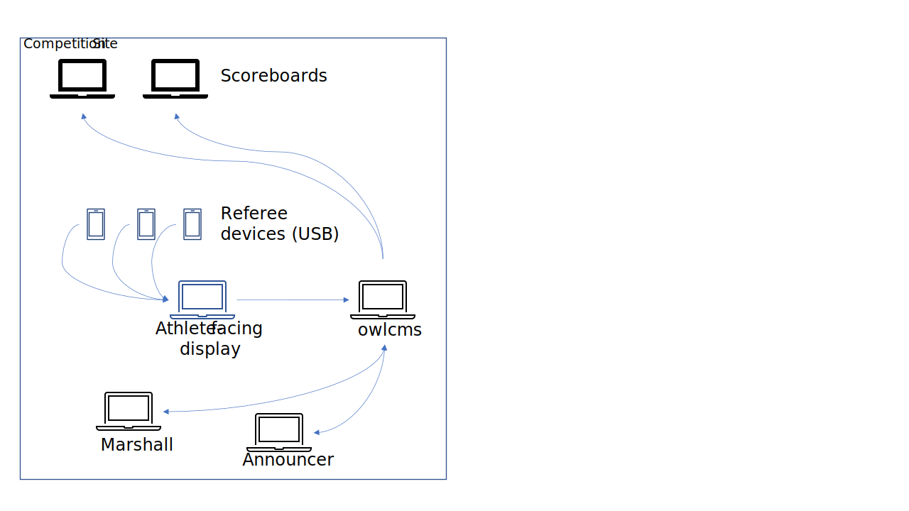
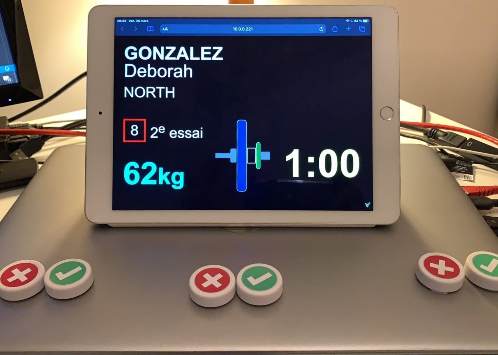

# Refereeing and Jury

OWLCMS supports using refereeing devices, and also supports 3 and 5-person [Jury](#Jury). Refereeing and Jury consoles are started from the `Run Lifting Group` page as shown below.  
The decisions are displayed to the public and athletes on the displays started on the [Start Displays](Displays) page.

Refereeing can be performed in 3 different ways

- With no technology.  Decisions are made using flags, colored cards, or hand signals.  
- With mobile devices (typically, a cellular phone or a tablet)
- With buttons connected to the athlete-facing decision display (or an attempt board)

## Manual Refereeing

The referees give their decisions using flags/cards/hand signals; the announcer announces the decision and uses the buttons at the top right of his screen to register the decision.  A single red or white indicator is shown to the public on the current attempt and scoreboard displays.

## Mobile Device Refereeing

 In this setup, each referee uses a phone, tablet or laptop.  The device runs a web browser, that connects to owlcms (either on premise or in the cloud).  For example, in a cloud-based setup, you get the following diagram:

The referee console is started from the "run a lifting group" page, or by adding /ref to the URL for the competition site.  For example https://owlcms4.herokuapp/ref  leads to the referee application.  After starting the referee screen, it is necessary to select which referee is which (1, 2 or 3) using the numeric input at the top (use the + and - signs)

The selection is confirmed by greying out the other key.  The refereeing display is reset when an athlete gets fresh clock.

## USB or Bluetooth Keypads

In this approach, keypads are connected to the laptop or mini PC running the timer/decision display (or the attempt board, both work the same).   For example -- it doesn't matter that owlcms is running locally or in the cloud.

There are two advantages to this approach:

1. Many referees prefer having their finger rest on a button (which is not possible on a phone)
2. The sound and down arrow are emitted directly by the browser, without any round-trip to the primary computer.  This reduces delays and increases reliability if the networking is fragile (which is sometimes the case in gyms)

### **Example of USB keypads**

USB Keypads can be bought from industrial device providers, such as [Delcom USB keypads](http://www.delcomproducts.com/productdetails.asp?PartNumber=706502-5M).

You can also build you own, for example using these instructions [Simple USB Buttons Using an Adafruit Trinket M0 - Hackster.io](https://www.hackster.io/laurentslab/simple-usb-buttons-using-an-adafruit-trinket-m0-5ad900#toc-programming-3)

### Example of Bluetooth buttons

You can use Bluetooth buttons to control an iPad, or a Raspberry Pi.  You can find Bluetooth buttons from Home Automation providers, such as Flic.  [Flic2](https://flic.io/) buttons can act as stand-alone devices using their [Universal mode](https://flic.io/flic-universal) (you only need the buttons, not the hub)
You can also build your own, for example using [these instructions](https://learn.adafruit.com/introducing-the-adafruit-bluefruit-spi-breakout/hidkeyboard) as a starting point.

## Keypad Configuration

The keys or buttons on the keypads are programmed to send key sequences.  The decision display is waiting for these keypresses.  You must click in the black area of the screen to make sure that the keypresses are seen by the browser.

OWLCMS interprets Even digits as red, and Odd digits as white.  The same devices can be used for referees and for the jury. 

| Referee# | Jury# | Good | Bad  |
| -------- | ----- | ---- | ---- |
| 1        | 1     | 1    | 2    |
| 2        | 2     | 3    | 4    |
| 3        | 3     | 5    | 6    |
|          | 4     | 7    | 8    |
|          | 5     | 9    | 0    |

- Note that the shortcut keys are as defined according the following standard: https://www.w3.org/TR/uievents-code/#key-alphanumeric-writing-system.   For most countries, hitting the key "Digit1" sends a 1.  But there are exceptions. For example, in France, hitting Digit1 will actually send a "&" and depending on the software you may actually need to use "&" instead of "1".  Fortunately, most national keyboards send the digits directly.
- Specific notes for [Delcom USB keypads](http://www.delcomproducts.com/productdetails.asp?PartNumber=706502-5M) can be found [here](Delcom)

## Jury

In order to use a jury, in the current version, you need 3 or 5 refereeing devices connected to the computer running the Jury console.  You may optionally have a separate keypad for the Head of the Jury (see below) in order to initiate deliberation and transmit decisions.

The juror devices are programmed just like for the referees, except that jury 4 uses keys 7 and 8, and jury 5 uses the keys 9 and 0.  As for the referees, even-numbered keys mean "red".

The jury console operates according to IWF rules: the referee decisions are shown as soon as they are made, in the bottom part of the screen.  

In the top part of the screen, the decisions circle for a jury member shows that he or she has made a decision, but the individual decisions are only shown in red or white after they have all been given.

The jury console now allows direct reversal/confirmation of lifts 
  - The Jury Deliberation button opens a dialog whereby the lift can be confirmed or reversed,
  - The Jury Head can ask the announcer to call the technical controller. 
  -  Jury actions are shown to the other technical officials consoles to keep them informed.
## Jury Head Keypad

  - In order to support a physical jury chief keypad, the following shortcuts are bound. Note that the shortcut keys are as defined in the following standard: https://www.w3.org/TR/uievents-code/#key-alphanumeric-writing-system.  To our knowledge, these keys are in the same location on almost all national keyboards.
    - "d" opens the deliberation dialog and starts a jury break (`KeyD` event code)
    - "g" to indicate a good lift  (`KeyG` event code)
    - "b" to indicate a bad lift  (`KeyB` event code)
    - "c" to call the technical controller (ex: for a loading error where the athlete will need to make a decision) (`KeyC` event code)
    - "Escape" to close the dialog and ends the jury break (`Escape` event code)