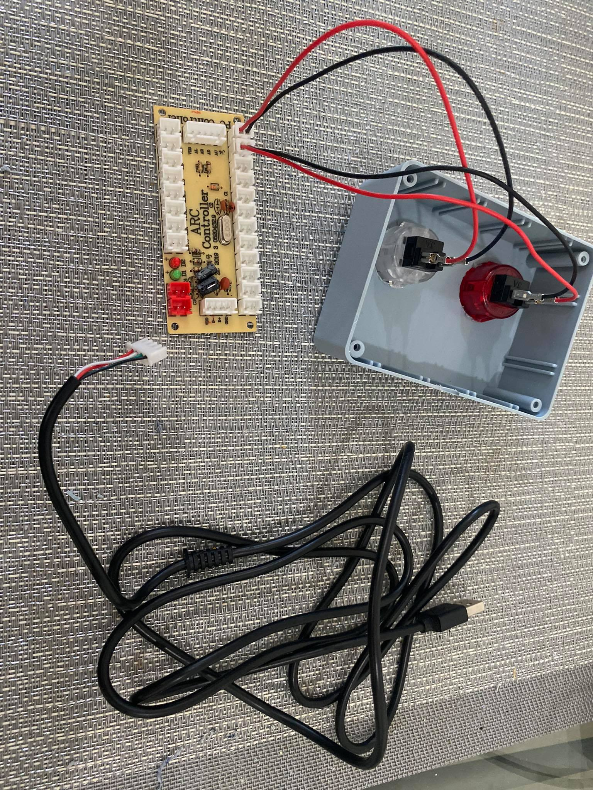
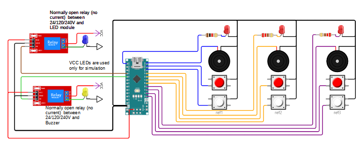

OWLCMS supports using refereeing devices, and also supports 3 and 5-person [Jury](#Jury). The decisions are displayed to the public and athletes on the displays started on the [Start Displays](Displays) page.

There are several ways to referee using owlcms.  Each is discussed in details in a section of the document.

1. [Manual refereeing](#manual-refereeing), where the referees use flags, cards, or hand signals.  The announcer enters the decisions.
2. [Mobile devices](#mobile-device-refereeing): Using phones, tablets or laptops to referee.  Any device that has a browser can be used to enter decisions and receive notifications.
3. [Button keypads](#button-keypads): These devices provide real buttons, which many referees prefer over using a phone.  They can be bought, or built from affordable supplies. However they do not provide the feedback when a referee needs to be reminded to enter a decision.
4. [Arduino-based devices](#arduino-based-devices).  Diagrams are available to build such devices (see [below](#arduino-based-devices)). All the software required is already available and the devices can be built without any programming. Such devices can be made as simple (buttons only) or as compliant (LED and buzzer feedback) as you wish.

## Manual Refereeing

The referees give their decisions using flags/cards/hand signals. The announcer announces the decision and uses the buttons at the top right of his screen to enter the decision.  A single red or white indicator is shown to the public on the current attempt and scoreboard displays.

## Mobile Device Refereeing

 In this setup, each referee uses a phone, tablet or laptop.  

This uses the phone or tablet web browser, which connects to owlcms. It does not matter whether owlcms is running on a laptop or in the cloud.  This setup is therefore useful when running virtual competitions.

The refereeing screen is started from the "Run a lifting group" page, in the Referees and Jury section at the bottom.  The sequence would look like the following when done on a phone.

  

The refereeing screen can also be started directly from the phone/tablet by using a browser and adding `/ref` at the end URL for the competition site.   After starting the referee screen, select which referee is which (1, 2 or 3) using the numeric input at the top (use the + and - signs)

Feedback for entering a decision is given by greying out the other key.  The refereeing display is reset when an athlete gets fresh clock.

When the other two referees have entered a decision, a yellow bar with a blinking reminder is shown, as well as an audible beep.  This is only a reminder, and the referee can wait as long as needed if they are not satisfied that the athlete has completed the lift.  The reminder goes away when the decision is entered.

When the jury wants to call the official, a red bar with blinking text is shown.  The call goes away when the competition is resumed.

## Button Keypads

Many referees prefer having their finger rest on a button (which is not possible on a phone).  In this section, we describe how to create a physical refereeing device. 

In this approach, keypads are connected to the laptop or mini PC running a display that shows the countdown timer.  Normally, this is the Athlete-facing display, but you can also use the Attempt Board, or even the Scoreboards.  The sound and down arrow are emitted directly by the browser, without any round-trip to the primary computer.  This reduces delays and increases reliability if the networking is fragile (which is sometimes the case in gyms)

There are three ways to create such a keypad

1. USB keypads: they emulate a USB keyboard.
2. Joystick keypads: they emulate a joystick, and a small piece of software converts the joystick button press to a keyboard press.
3. Bluetooth keypads: they emulate a Bluetooth keyboard and work with most devices such as iPads and Windows laptops.

#### **Example of USB keypads**

USB Keypads can be bought from industrial device providers, such as [Delcom USB keypads](http://www.delcomproducts.com/productdetails.asp?PartNumber=706502-5M). Specific notes for Delcom keypads can be found [here](Delcom) (older keypads don't work with Linux computers such as Raspberry Pis)

You can also build you own: 

- You can use an Arduino to emulate a USB keyboard:  [Keyboard - Arduino Reference](https://www.arduino.cc/reference/en/language/functions/usb/keyboard/)
- Or you can use devices that emulate a USB keyboard: [Simple USB Buttons Using an Adafruit Trinket M0 - Hackster.io](https://www.hackster.io/laurentslab/simple-usb-buttons-using-an-adafruit-trinket-m0-5ad900#toc-programming-3)

#### Example of Joystick buttons

In this configuration, a joystick-to-USB converter is used.  This is a do-it-yourself project, but most of the kits require no soldering. Search for `Joystick Zero Delay USB Encoder`, and you will get several [examples](https://www.amazon.ca/EG-Starts-Encoder-Controller-Joystick/dp/B06XVXCJBD)

The refereeing computer sees the device as a Joystick.  To convert the button presses to k[eyboard presses expected by owlcms](#keypad-configuration), you need a small program like [joy2key](https://joytokey.net/en/) or [antimicro](https://sourceforge.net/projects/antimicro.mirror/) on Windows, or `qjoypad` on Linux/Raspberry (use `apt-get install qjoypad`).

 

#### Example of Bluetooth buttons

You can use Bluetooth buttons to control an iPad or a Windows laptop.  You can find Bluetooth buttons from Home Automation providers, such as Flic.  Illustrated below, [Flic2](https://flic.io/) buttons can act as stand-alone devices using their [Universal mode](https://flic.io/flic-universal) (you only need the buttons, not the hub)

You can also build your own Bluetooth buttons, 

- You can program an Arduino-like device, the ESP32, to [act as a Bluetooth keyboard](https://gist.github.com/manuelbl/66f059effc8a7be148adb1f104666467).  
- You can also find devices that do the Bluetooth emulation. See  [these instructions](https://learn.adafruit.com/introducing-the-adafruit-bluefruit-spi-breakout/hidkeyboard) as a starting point.

#### Keypad Configuration

The keys or buttons on the keypads are programmed to send key sequences.  The decision display is waiting for these keypresses.  You must click in the black area of the screen to make sure that the keypresses are seen by the browser.

OWLCMS interprets Even digits as red, and Odd digits as white.  The same devices can be used for referees and for the jury. 

| Referee# | Good | Bad  |
| -------- | ---- | ---- |
| 1        | 1    | 2    |
| 2        | 3    | 4    |
| 3        | 5    | 6    |
|          | 7    | 8    |
|          | 9    | 0    |

Note that the shortcut keys are as defined according to [a standard](https://www.w3.org/TR/uievents-code/#key-alphanumeric-writing-system)

- For most countries, hitting the key "Digit1" sends a 1.  But there are exceptions. For example, in France, hitting Digit1 will actually send a "&" and depending on the software you may actually need to use "&" instead of "1".  Fortunately, most national keyboards send the digits directly.

## Arduino-Based Devices

Arduino boards are an affordable way to build your own devices.  See [this page](https://github.com/owlcms/owlcms-firmata/tree/main/README.md) for working timekeeper, referee, and jury setups.  Both the firmware that runs on the Arduino *and* the software that interfaces with owlcms are provided.  There is actually nothing to program.  

For example, a fully IWF-compliant design for the referee box is shown below. You can simply omit any part you don't need. For example, in the refereeing diagram below, if you don't want an external down signal light and buzzer, you can ignore the two relays on the left-hand side.  And if you need to arrange the connections, there is no need to change the firmware or the interface program, a simple change to a configuration file will do.

owlcms uses the MQTT protocol used in Internet-Of-Things automation and monitoring applications to talks to the devices.  See the [MQTT](MQTT) page for more details and for schematics that you can use for your own devices.  Commercially available pre-built devices using the same protocol are also being developed.
