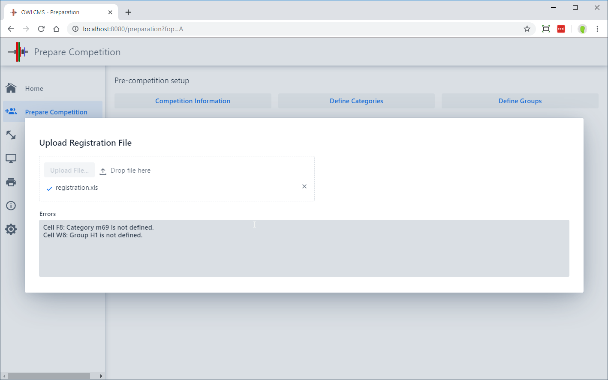

The next step in preparing a competition is registering the athletes.  This involves

- Entering the list of all participating athletes
- Drawing lots
- Assigning athletes to groups
- Producing a start list
- Producing Athlete cards

These steps are performed from the `Prepare Competition` page

## Clearing athletes from a previous competition

Unless you are running from a new installation, your database will contain information from the previous competition.  In order to clear the database, use to the **`Edit Athlete Entries`** button on the `Prepare Competition` page.   At the top of the page, use the `Delete Athletes` button and Confirm.

## Uploading a list of athletes

Because entering athletes is somewhat tedious, it is often easier to upload a list prepared with Excel which allows copy-and-paste in an easier way.  In order to do so, three steps are involved

1. Obtaining an up-to-date form to capture information.  From the `Prepare Competition` page, click on the `Download Empty Registration Template` button.  Open the downloaded file and **SAVE IT** somewhere in your own documents.

   

2. Fill-in the Excel with the information about your athletes.  Assign each athlete to a group and a weight category.  Note that if you are using multiple age divisions you must use the correct code for the category (for example `yM67` for youth M67 as opposed to `sM67` for senior M67).

3. Upload the completed form.  Note that this does not delete previous entries.  The system has no way of knowing that previous athletes match new athletes, so new entries are always created.  It is therefore up to you to [clear the athletes](#clearing-athletes-from-a-previous-competition) if needed.

   If there are errors detected on the upload, they will be shown (for example, wrong category codes, or undefined groups).  The athlete will still be created, but without the faulty information.  You can either upload again after correcting and clearing, or fix by hand (see below)
   

## Adding or Editing Athletes

In order to add or edit athletes, use again the `Edit Athlete Entries` button on the `Prepare Competition` page.  Above the list of athletes, using the `+` button allows you to add an athlete, whereas selecting an existing athlete by clicking ONCE allows you to edit.

You may then fill the form.  Various validations will be made (matching athlete gender with category gender, matching declared weights with entry total, etc.).  You will not be allowed to save illogical data.

The `Eligible for individual ranking` checkbox is used to determine whether the athlete is eligible for medals or is competing "out-of-competition".  Some meets may allow an athlete from another jurisdiction to compete in order to meet a qualification requirement, but not include the athlete in the medals.

## Drawing lot numbers

After all athletes have been entered, you should draw the lot numbers.  You can also assign lot numbers manually for late registrants by editing the athlete's entry card.

## Producing the Start List

The start list shows all the athletes that will compete, in which group, and the order in which the athletes will be weighed-in.  The button for producing the starting list is at the top of the page.

## Athlete Cards

Athlete Cards are the cards that will be used by the Marshall to record changes.  In many federations, they are printed out in advance, because the athletes will be asked to write down their starting weights and counter-sign their body weight.  If athlete cards are printed in advance of the weigh-in, it will also be necessary to write down the start numbers on the cards.  This is usually done by the competition secretary, comparing the [Starting Weight List](#starting-weight-list) as a reference and cross-check.

In the current version of OWLCMS, Athlete Cards are printed from the Weigh-In screen, accessible from the `Run Lifting Group` page.  