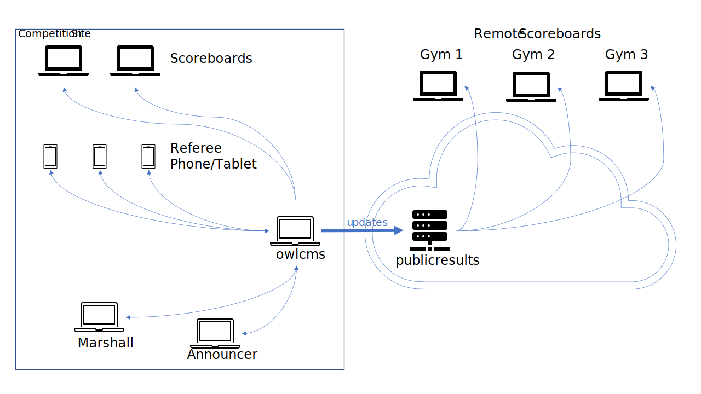
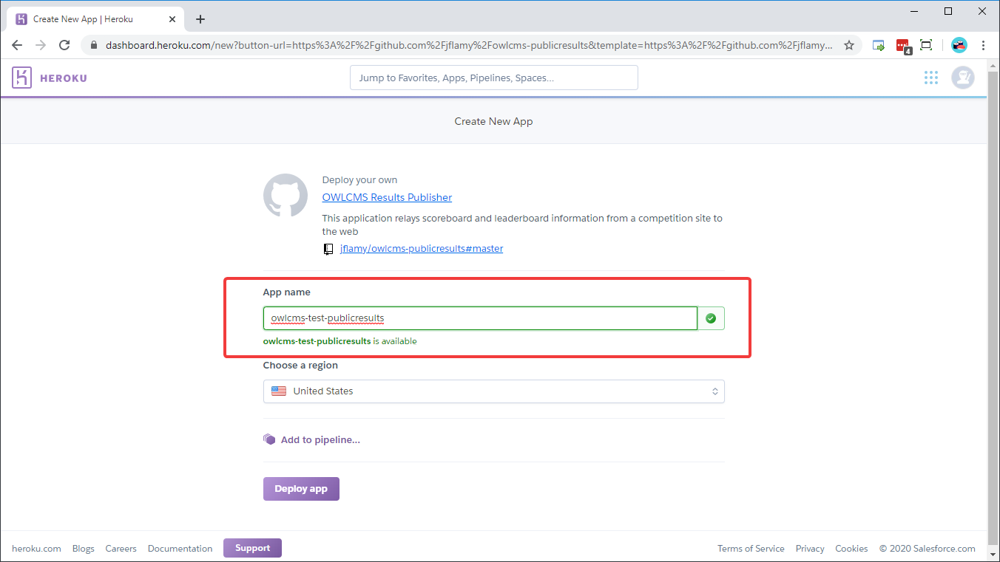
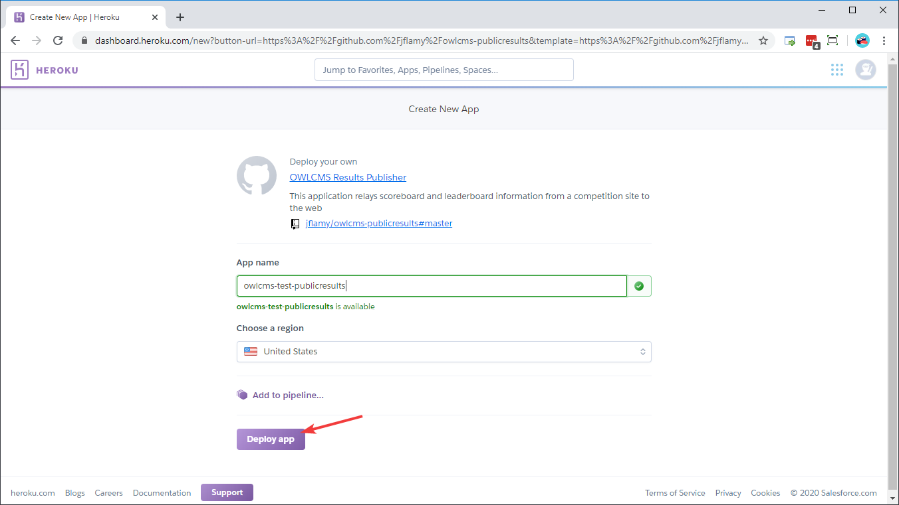
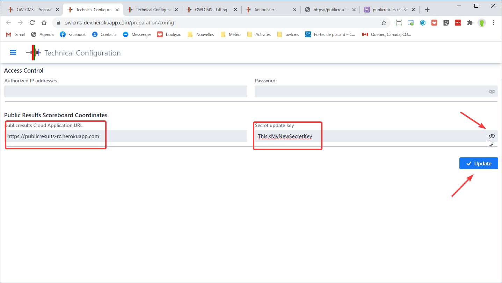
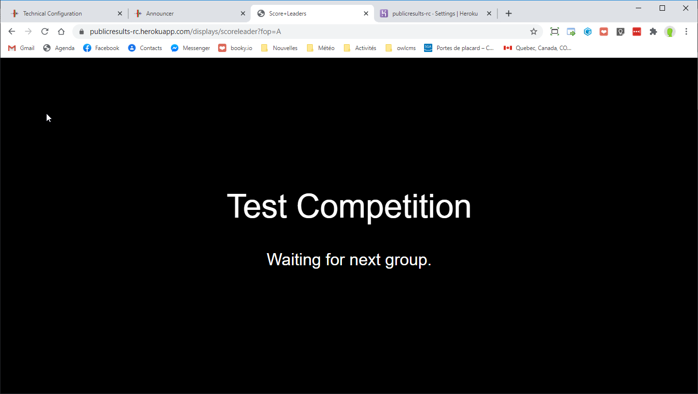
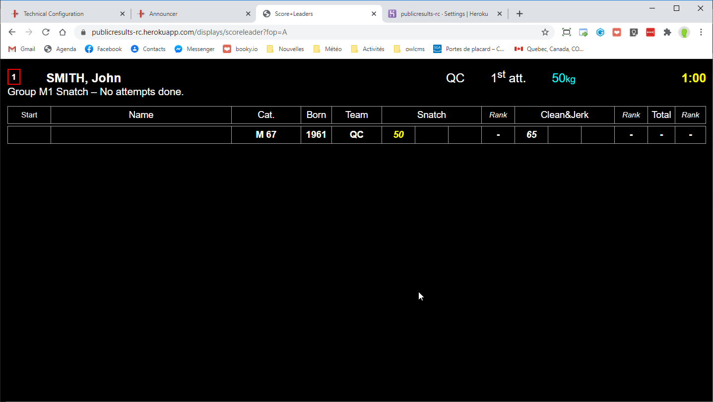

# Public Scoreboard

The `publicresults` application is used to make applications results available to the public at large, or to participants in virtual competition. For this reason, it is usually run in the cloud.

The following example shows owlcms running standalone in a gym, sending information to publicresults running in the cloud.

- updates are sent from the competition site to  the publicresults application running on the cloud whenever there is a significant event (clock start/stop, weight changes, lift decisions, etc.)  
- The public can connect to publicresults and  see the scoreboards via their phone or laptop no matter where they are
- There is no load put on the competition site other than sending an update to the publicresults application.  The publicresults application takes all the load for the public queries.

The other common configuration is when both owlcms and publicresults are in the cloud,  That scenario is discussed [here](VirtualOverview).

## Install the public results scoreboard on Heroku

1. Get a free Heroku account -- 

    - Go to [https://heroku.com](https://heroku.com) and create a free account
    - Remember the login and password information.

2. Click on the purple button below to start the installation on Heroku Cloud.

    

3. Enter your Heroku account (or create one if you haven't)

4. Enter a meaningful application name.  In the following example, we use `owlcms-test-publicresults` We will later use `owlcms-test-publicresults.herokuapp.com`  to see the results.  You should use a name that makes sense to your club or federation.

    *(Reminder: You can click on the images to make them bigger)*

    

5. Deploy the application. This will fetch the application, install it, and make it available to the public.
    

6. You can check that the application is running by starting a new browser tab. In our example, we connect to `https://owlcms-test-publicresults.herokuapp.com`.  Since we have not yet connected owlcms to feed publicresults, you will see this screen.
    
    

## Configure a Shared Secret

7. We now need to configure a secret code to keep communications secure between the competition site and the publicresults repeater.  Go to the `Settings` page for the application.
    

8. Create configuration variable `OWLCMS_UPDATEKEY` and set it to the secret key that will be shared with owlcms.  **Use something easy to type, but quite long**, and not easily guessed.  The  password to your Heroku account and the update key is what prevents vandals from messing up your scoreboards.  Do not share them, and make sure they cannot be guessed easily.
    

9. Copy the value for the update key (Ctrl-C)

## Reset `publicresults`

10. Restart the publicresults application
    

2. Start a new browser tab and go to the address for the application (or you can use the `Open app` button at the top right) and check that the application is again waiting.
     

## Configure Updates from `owlcms`

1. Open the owlcms application on Heroku and go to the `Prepare Competition` - `Technical Configuration ` page.

     - paste the secret key on the right-hand side -- use the "eye" icon to see what you pasted.
     - copy and paste the correct URL for the publicresults application we opened in step 5.
     - Click on update.

     

 ## Test the setup

1. Create the athletes for a group

     - load a registration file or create an athlete
     - go to the weigh-in screen and add body weight and starting weights.

2. Go to the announcer page and select a group.
     

3. As soon as a group is selected, publicresults is updated.  Switch to the publicresults tab.   Because we have not started lifting, you should see the following.   If your site has more than one platform, you will see a page that allows you to select which platform you want to watch.

     

5. The announcer selects a group, and clicks on "Countdown to Introduction", and starts the countdown.
     

6. The publicresults screen immediately switches to the countdown.

7. From then on, the publicresults screen will track the competition. It just repeats the events taking place on the local scoreboard.

## Check for updates

Once you have created the application once, you can download a program that will check for updates and remote control Heroku to grab them.   See [Instructions](https://github.com/jflamy-dev/owlcms-heroku-updater) and [Releases · owlcms/owlcms4-heroku-updater (github.com)](https://github.com/owlcms/owlcms4-heroku-updater/releases)

