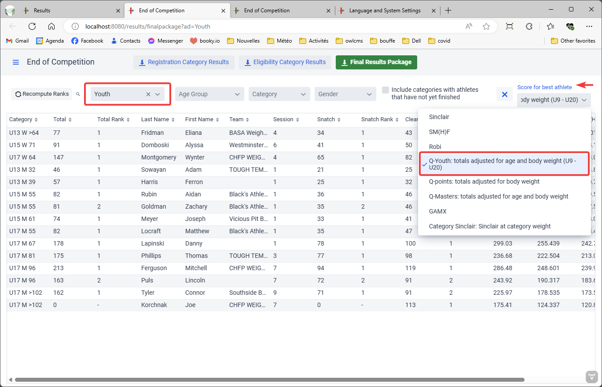

From the `Results` page, it is possible to get the various competition result documents.

## Session Results

The Session Results button opens a page where all athletes are listed.  By selecting the group, the list is narrowed to the group.  Clicking on an athlete brings up the athlete card, in case a correction is required.

There are two kinds of session results:

- The "Registration Category" list shows each athlete *once*, under their registration category This it the traditional protocol result sheet.  In a joint Junior and Senior championship, if an athlete is registered as a Junior, but is eligible to lift as a Senior, the athlete will show up as a Junior in this document.
- The "Eligibility Category" list show the athletes multiple times if they are eligible to multiple categories.  Using the same example, the athlete would show up twice, once as a Junior (with the ranking as a Junior) and once as a Senior (with the ranking as a Senior).

In this example, we select the Registration Category, but the process is identical for Eligibility Categories.

Then select "Group Results", the template you want, and click "Download" . The different templates show slightly different information, and use different paper sizes.  You can also add your own.

The document is downloaded -- the exact location to retrieve the document depends on your browser.  In the case of Chrome, the download is shown at the bottom. Edge and Firefox show the downloads at the top right.

Clicking on the file opens Excel (or your spreadsheet editor if you use another one). After clicking on "Enable Editing" when the file opens, you get the protocol sheet:

## Medals

In order to have a smooth medal ceremony, printing out the medals sheet is recommended.  The medals sheet will only list the categories that are completed.  This is very useful when there are multiple A/B/C groups and sessions are mixed.

The resulting Excel shows all medals in the Bronze, Silver, Gold order.  Whether there are medals for all lifts or just the total is controlled on the competition rules page.

> Note:  If [Score-based Medals](ScoreBasedCompetitions) are awarded for some age groups, this is not reflected in the Medals sheet.  You will have to use the `Scores` final package template to get a printable document.

## Team Results

On the `Results` Page, the `Team Results` button shows how many points have been scored by each team, using the IWF formula.  When non-standard point ranges are used, or if different championships use different scoring schemes, it is more convenient to produce a Final Package spreadsheet and look things up (see below.)

## Competition Results

The Competition Results page provides the overall results of a competition.  It can also be used during a competition to produce interim results.

There are three types of competition results

- Registration Category Results: Each athlete appears *once*.  This is normally sent to the Federation after the competition.  All athletes appear under they lifted officially (a 15-year old lifts as a Youth if there is such a category but is potentially eligible to Junior medals, therefore that athlete would appear as a Youth)
- Registration Category Results: This is typically posted as the Competition Results proper.  Athletes appear in all the categories where they were eligible, with their rank in each category.  If an athlete won several medals, this document will show it.
- Final Package.  This contains the Eligibility Category Results, the Best Lifter Awards, the Team Medals and Points, and the Records set during the competition.

### Multiple Championships

Sometimes two or more championships are held together during the same meet.  For example, there can be a Youth Championship the same weekend as a Junior Championship, etc.  Some federations even hold all their championships together.

In the following picture, two things are shown

- We want to produce the results only for the Youth Championships
- We want the Q-Youth scoring system to be used for the Best Lifters sheet.  Selecting this will also update the grid on the page to show Q-Youth.

### Final Package

The "Final Package" package contains several tabs.

- Eligibility Category results

  The "best athlete" scoring scheme, as selected.  Note that for the Masters final packages, the best lifter pages are fixed in advance, and your federation may also have made the choice in advance in the template you are provided.

- Team Scores (points and medals), see the [section below](#team-points-and-medals)

- All the new records set.

Four templates are commonly used

- The `Total` template is used for competitions that awards medals and points for Total only.
- The `SnCjTotal` template is used for competitions that award three separate medals, as well as points for all the lifts.
- The `Masters` template is used for Masters events -- it shows the SM(H)F and Q-Masters scores used to determine the Grand Master awards.
- The `Scores` template is used when [Score-based Medals](ScoreBasedCompetitions) are awarded to the groups. For example, all U9 boys may compete together, and their Q-Youth score could be used for the medals.  The AgeGroups file would have specified "AGEFACTORS" as the scoring system for that age group.

### Team Points and Medals

The team scores tabs shows the team cumulative points and medals. The details for each athlete are shown at the bottom.

If you wish to sort the points table, you need to copy the team names and points to another area of the page, and use the Paste Special option to do a **Paste as values**.  Once that is done, you can format as table and sort by descending points.

A medals table is also present and it can be sorted using the same technique (select, copy, paste special "as values", sort)

### Records

A summary of all records broken is present in the standard templates.

## Time Statistics

The time statistics Excel shows how much time was spent per lift in each group, on average.  It gives the number of athletes that can lift in an hours - if the number is 8 athletes per hour, then a 12 person group will take 90 minutes, on average.  Youth championships often go faster (9 or 10), whereas senior championships are slower (7,5 athletes per hour for example).