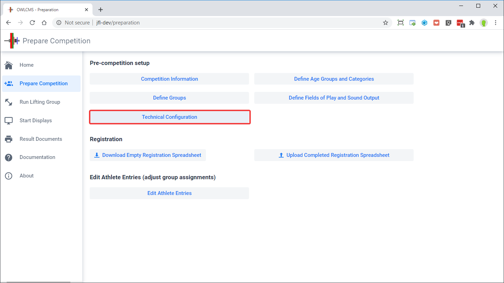
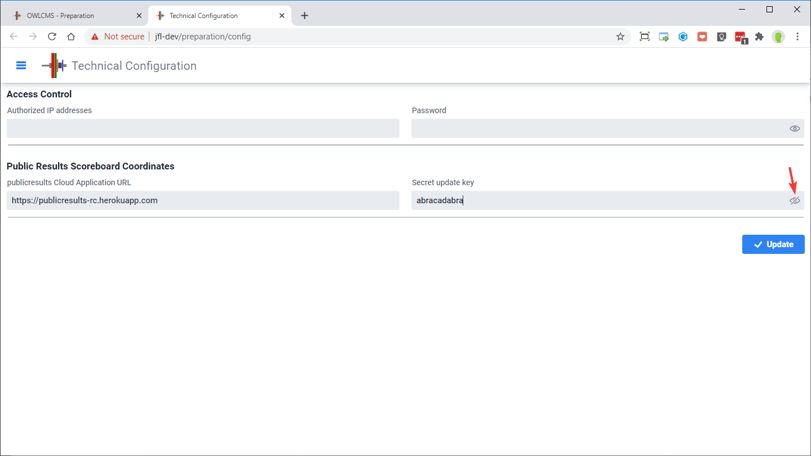
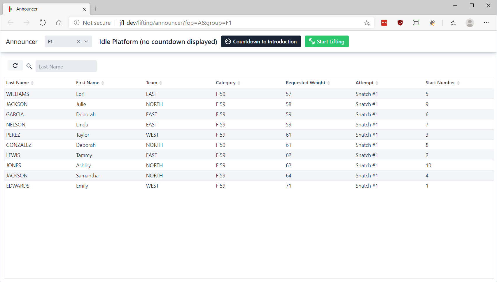
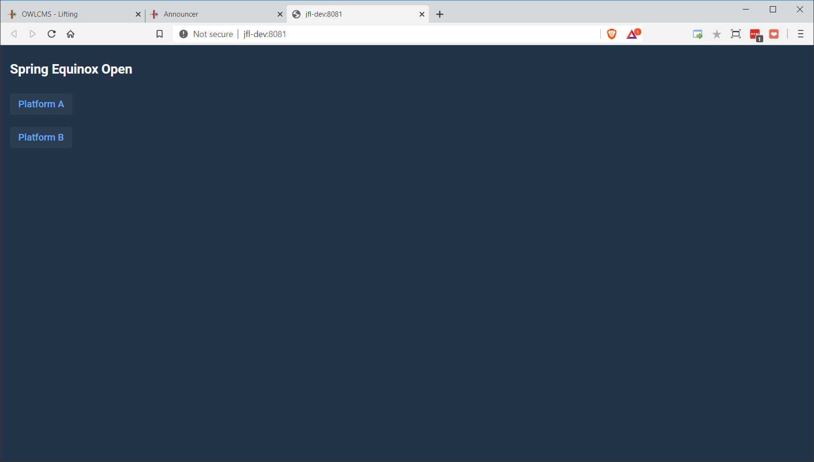
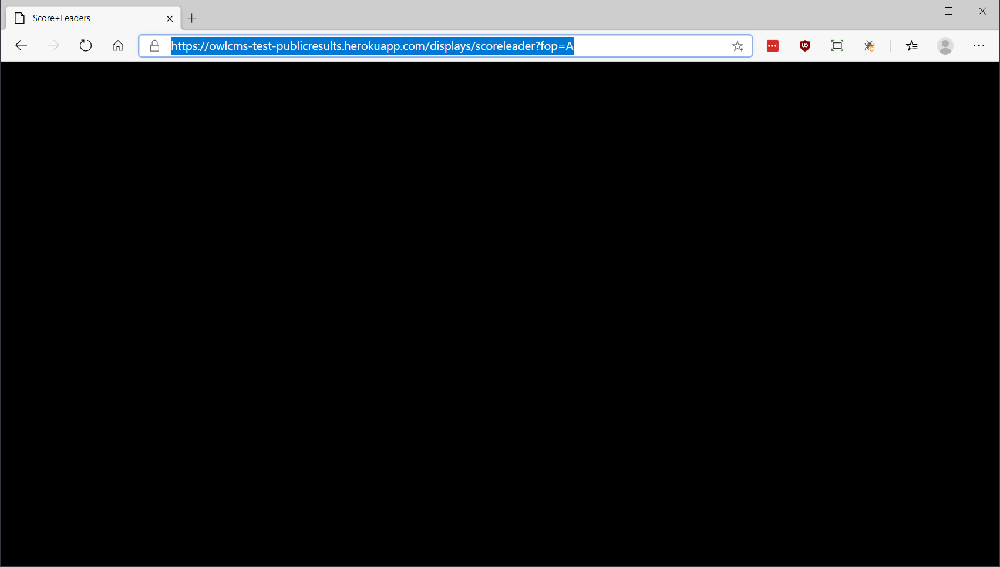
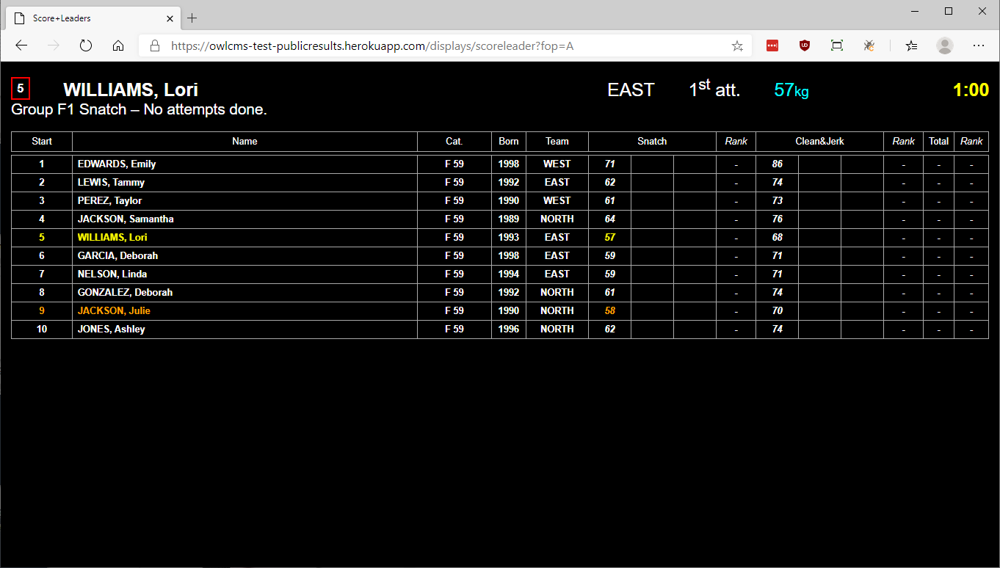

`publicresults` is an application used to make the scoreboards available to the public at large.  It receives updates from `owlcms` and makes them available to all.  See [this page](Virtual) for more explanations.

## Connect owlcms to publicresults

`owlcms` needs to know where its remote `publicresults` mirror is located.  See [this page](PublicResults) for installation instructions for `publicresults`.

In order to configure the URL for publicresults and the associated secretkey, go to the `Prepare Competition` page and use the `Language and System Settings` button.

You can then enter the information, and update the configuration.  The "eye" icon allows you to see what you type.  You need to use the URL and secret key used during [publicresults installation](PublicResults).

Changes are immediate.  Note however that if you used the `OWLCMS_REMOTE` and `OWLCMS_UPDATEKEY` environment variables, or the `-Dremote` and `-DupdateKey`parameters, these will take precedence and your chages will be ignored.

## Running with Remote Scoreboards

1. Start the publicresults application.  Just accessing the URL should enough -- the application will be restarted automatically if it was shut down due to inactivity (on the free Heroku subscription, the remote application will go to sleep if unused for an hour).  During a competition, there will be frequent updates, so there is no chance of this happening. 
2. Start the competition site application as usual, and get the the announcer to select a group.  Click on "Start Lifting"
   
3. The public results application will now show that there are active platforms.
  
4. Clicking on the `Platform A` link leads to a generic waiting page, until the announcer starts the countdown to the introduction or starts the competition group. 
  
5. As soon as a break or lifting event happens, the competition site updates the remote application.  From then on the scoreboard updates whenever a pertinent change happens.  Note that in the first release the scoreboard clock only shows the time allocated for the lift, and does not count down, and that decision lights are not shown.
  

