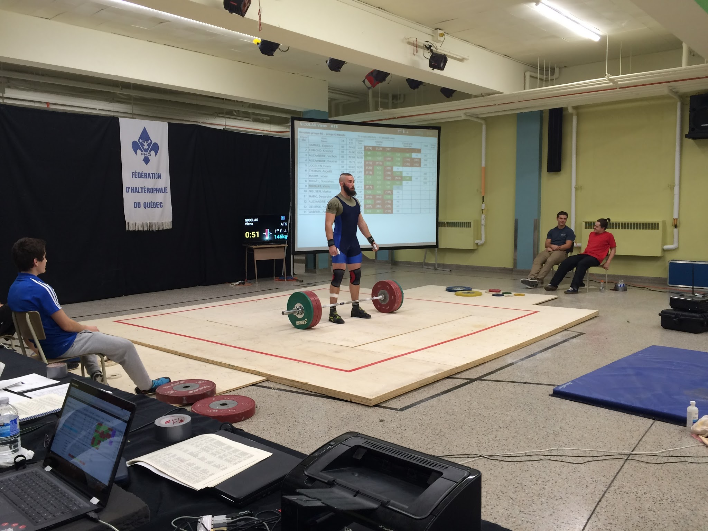

# Running a Competition

## Entering Data and Running a Competition

A detailed [Competition Secretary Guide](pdf/Competition Setup.pdf) is available, which explains the steps to

+	Registering the athletes
+	Printing out athlete cards
+	Producing the start list
+	Performing Weigh-in and Assigning Start Numbers
+	Running a session
+	Producing Results
and so on.

## Cheat Sheet for Announcers
A quick summary for announcers is available [here](pdf/AnnouncerQuickStart.pdf)
