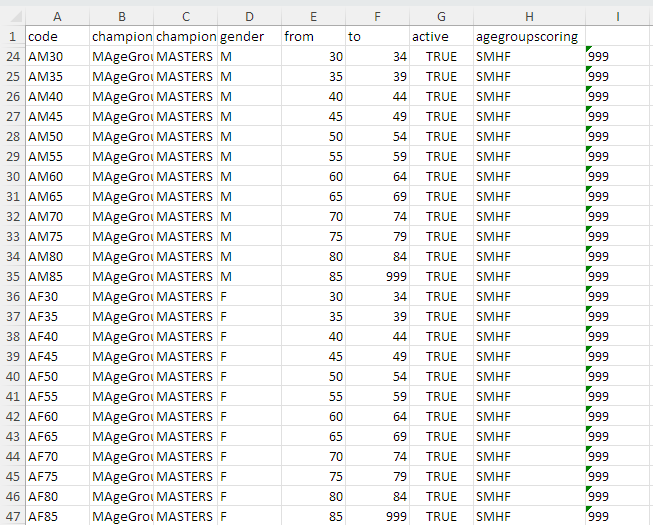
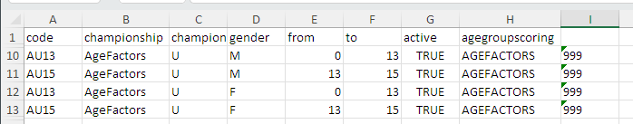

It is often desirable to rank all athletes in an age group on a score.  Examples include:

- Masters of all bodyweights in a given age group are ranked according to their SM(H)F score, instead or in addition to the normal medals per weight class. This makes it more interesting because in many Masters competitions there are not enough athletes in each bodyweight class and everyone gets a medal.
- Kids of given age groups compete all together based on a formula such as the Huebner Adjusted Totals.  This applies a factor based on a statistical analysis of young athletes that showed that age and body weight affect strength *together* for young athletes.  Sinclair coefficients are for older high-performance athletes, and SM(H)F factors are the same for all body weights, which is not correct for youth.

#### Exporting the Current Definitions

Currently, creating such a competition requires editing an AgeGroups definition file using Excel.  The easiest way to get started is to export the current ones, as follows.

#### Example: Masters combined body weight classes

To create score-based age groups, there needs to be a column H named `agegroupscoring`
If you exported the definitions in the previous step, this column will be present. 

- Column H includes the desired scoring system.  For Masters, this is `SMHF` .  If the cell is empty, the score is the `TOTAL` according to IWF rules.
- Column A gives this special category a new code.  In this example, the `A` prefix indicates "all bodyweights".
- Column B indicates that you can produce the Final Package for all the `MAgeGroups` together.  This would allow you to easily grant a `Best Lifter` award for all the groups in a championship.
- Column I indicates that there is a single bodyweight category from 0 to 999 kg.  All athletes fall in that single category.
- You can keep the normal Masters age groups as well if you wish.   If you pick the AF categories as the registration category the SMHF scores will be shown on the scoreboard.
- You can have Masters athletes mixed with non-masters in the same session. If that is the case, it is recommended that you use the `Display Athletes by Age Group` competition option.  By default, this will show the Total for non-masters athletes as their score unless you have selected something else for your non-masters age groups.

#### Example: Youth combined body weight classes

To create score-based age groups, there needs to be a column H named `agegroupscoring`
If you exported the definitions as explained above, this column will be present. 

- Column H includes the desired scoring system.  For kid/youth/junior ages, this would be `AGEFACTORS` to use Huebner statistical factors to adjust the total based on both age and body weight.  Other choices can be `BW_SINCLAIR` (body weight sinclair), `CAT_SINCLAIR` (Sinclair computed at the category weight), `ROBI` or `GAMX` (though these last two don't make much sense for young kids.)  If the cell is empty, the score is the `TOTAL` according to IWF rules.
- Column A gives this special category a new code.  In this example, the `A` prefix indicates "all bodyweights".
- Column B indicates that you can produce the Final Package for all the `AgeFactors` together.  This would allow you to easily grant a `Best Lifter` award for all the groups in a championship.
- Column I indicates that there is a single bodyweight category from 0 to 999 kg.  All athletes fall in that single category.
- You can keep the normal age groups as well if you wish.   If you pick the AF categories as the registration category the selected scores will be shown on the scoreboard.
- You can have Score-based athletes mixed with normal totals in the same session. If that is the case, it is recommended that you use the `Display Athletes by Age Group` competition option.  This will show the Total for traditional categories as the score.

#### Example: True Open

You can also create a true open category using the same approach (a single bodyweight class 0-0-999kg) and a single age group (15-999 age).  You could make that 0-999 but be aware that Sinclair formulas were based on Senior athletes, so you probably want kids to be separate.

