# Features

## Announcer, Marshall and Timekeeper Screens

The system can handle multiple platforms (it is used routinely to handle dual simultaneous sessions) with independent displays and consoles. 

For each competition platform, there is one announcer console, as many marshall screens as required, and a timekeeper console. Information entered on any screen is immediately reflected on the others. Notifications are shown on other consoles when, for instance, a weight request is entered by the marshall that changes the lifting sequence and stops the clock. 

For smaller meets, the announcer can easily act as marshall and timekeeper, entering weight changes and operating the clock. 

Lifting order is automatically computed, and the rules concerning the alloted time (whether a lifter gets two minutes or one, and whether time should be resumed) are taken into account. 

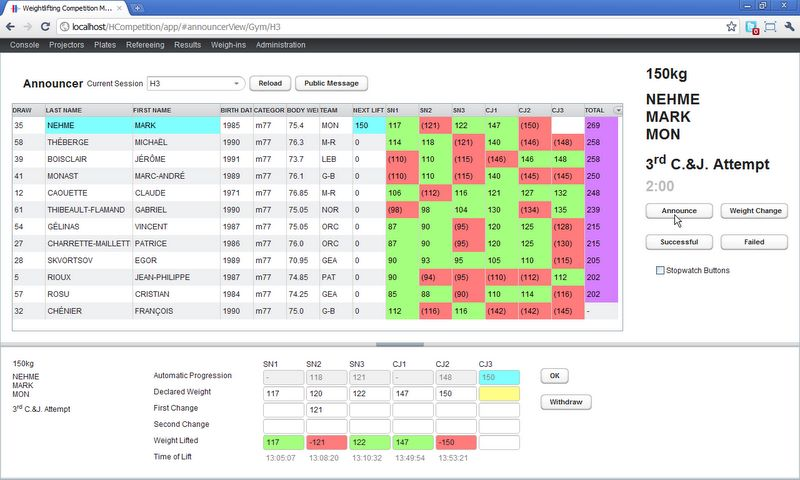

## Timekeeping and Notifications

When the system is used to perform timekeeping, a simple user interface is used to manage the clock. For a small competition, the announcer can act as timekeeper from the announcer console (there is a checkbox to enable the clock buttons). For a larger competition, a separate laptop or tablet is used for the timekeeper. 

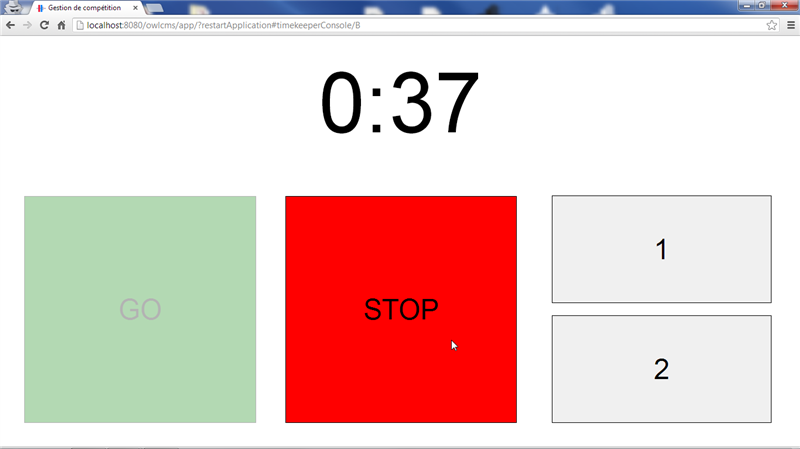

The various consoles are synchronized: a weight entered by a marshall affecting the current lifter will stop the clock. The timekeeper and announcer are notified on their screen, greatly improving communications. 

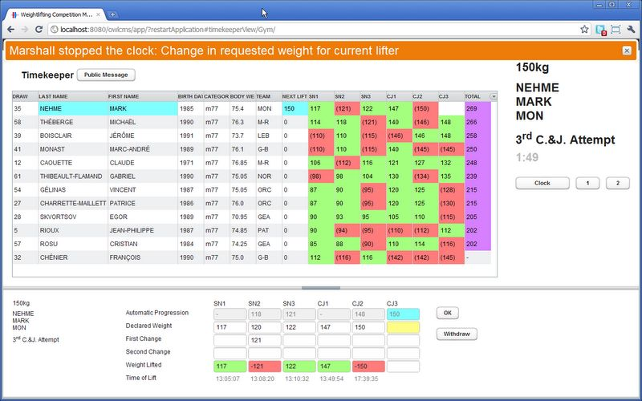

Since the system also computes the alloted time, and memorizes who lifted last, errors are radically reduced. Countdown time is shown on the attempt board and all result boards (see below) 

## Attempt Board

The attempt board shows the time remaining, and information about the current lifter and requested weight. 

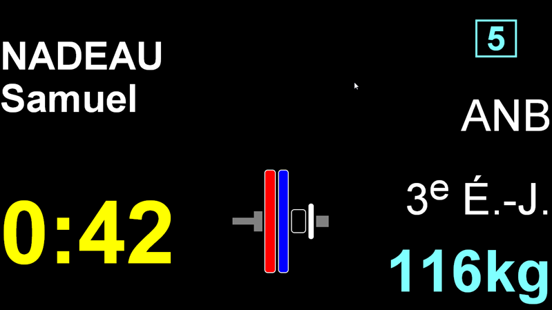

The public gets instant notification of decisions on the attempt board. 

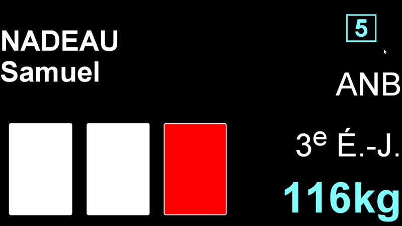

## Result Board

The information from the attempt board is also shown on top of the results to accomodate smaller meets where using separate displays is impractical. The result board is also used for the warmup area; there can be as many boards as required.
The system supports both regular IWF and Masters competitions. 

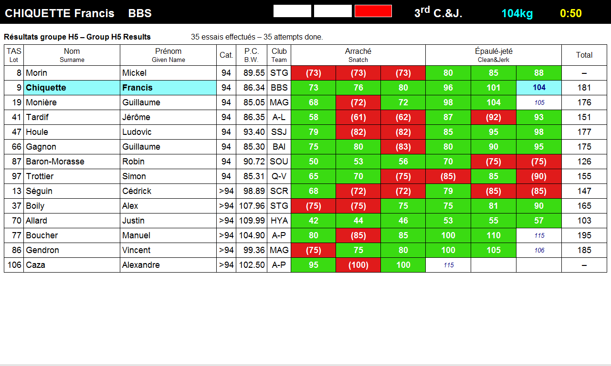

## Current Lifter Bio

Information about the current lifter can be shown.  A default template is provided for showing a picture and short biographical notes.  Instructions are found in See the "athleteBio" directory in the "Competition Managemement" folder created during the installation.  

## Manual Refereeing

When refereeing equipment is not available, the system can be used with an external decision light systems, or with the traditional flags. In that case, the announcer records the decision in the system as he announces it to the public.

## Refereeing Devices

The refereeing system can use any USB or Bluetooth device that behaves like a keyboard. The refereeing devices are connected to a computer or laptop that typically sits in front of the competition platform, and which displays either the {athlete-facing coutdown](#Lifter_Display), or the [current attempt board](#Attempt_Board). You can either buy programmable input switches or build your own.  See the [Equipment Setup](Setup.md#Equipment_Setup) page for details.

## Refereeing with Phones

Referees prefer "real buttons" because it allows them to rest their fingers on the buttons.  But if those are not available, phones can be used to referee. In order to access the refereeing features from a tablet, a different address is used, which gives access to a mobile device menu (the address is of the form `http://192.168.100/owlcms/m/#mobileHome`) 

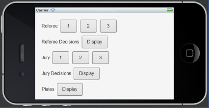

Each referee uses a mobile device or a laptop to enter his or her decision. It is possible to use USB devices or Bluetooth devices (such as Wii remotes) to give referees devices with actual buttons. Any device that can be configured to send the digits 1 to 6 (acting as a keyboard) can be used. 

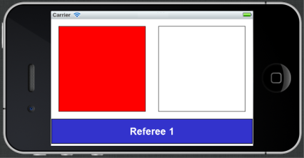

## Jury

The system supports a 3-person Jury.  Decisions from the referees are shown in real-time on the Jury display.  The same devices are used as for refereeing.
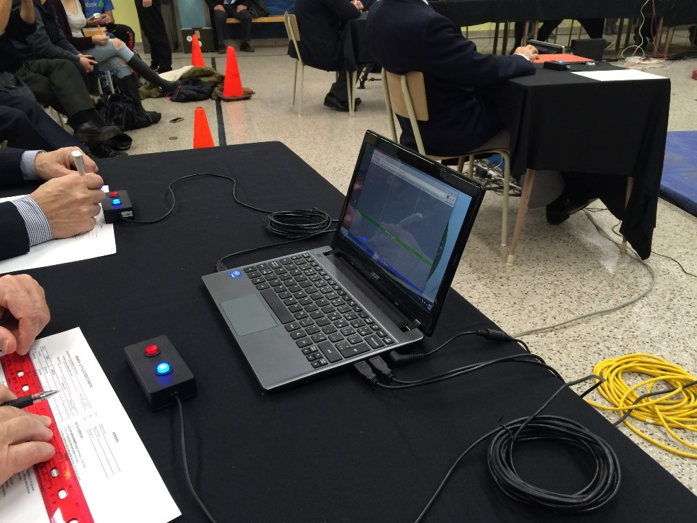

## Lifter Display

The countdown is shown full-screen on a lifter-facing display, and is also shown on all result boards. 

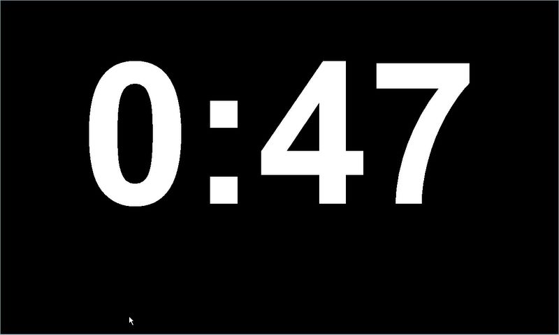

The lifter "down" signal and the decisions are displayed. The decisions also are shown on the attempt board and on top of the result board so the audience can see them. 

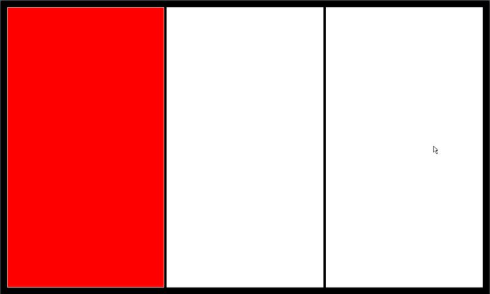

## Plates display

The various consoles have access to a pop-up screen that defines which plates are available on the platform. It is also possible to override the normal weight of the bar (for example if a 15pounds/7kg bar is used for a kid competition), and to state whether collars are used or not. 

The resulting combination of plates is shown on the attempt board, can be shown on the announcer/timekeeper consoles, and can also be shown on a portable device 

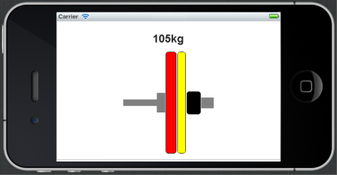

## Result Documents

The system produces the start list, lifter cards, weigh-in list, competition results for each group, and cumulative competition results with team rankings (competition book). All these documents are produced in Excel format. 

The system supports both regular IWF and Masters competitions.

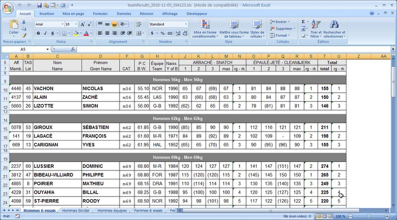

## Weigh-in Screen

Athlete registration information is normally uploaded from a spreadsheet. Several administrative screens allow editing of the registration information. The following screenshot illustrates how information about body weights and declared lifts is captured. 

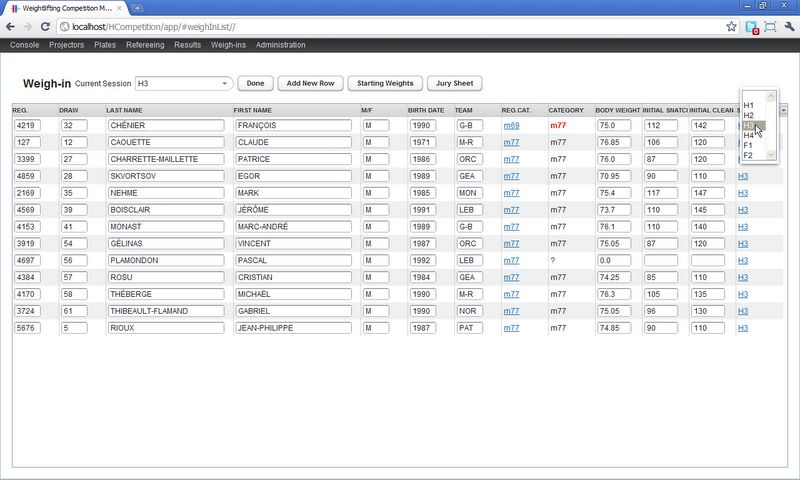

## Competition Secretary

The system also produces the start list, lifter cards and weigh-in list. 

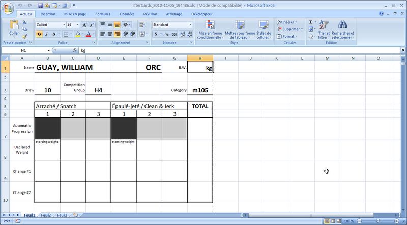

## Features Summary

  * Competition Set-Up 
    * define platforms (supports multiple simulaneous competition platforms) 
    * define sessions, assign them to platforms 
    * import athletes from spreadsheet, assign them to sessions 
    * record registration category 
    * produce start list as Excel spreadsheet 
    * indicate whether competition is under Masters rules or regular rules. 
    * select applicable categories (e.g. for youth events) 
  * Weigh-in 
    * record body weight, initial lifts. Highlight out-of-category weights 
    * produce weigh-in list (starting weights) (as Excel spreadsheet) 
    * produce jury/examination sheet (as Excel spreadsheet) 
  * Sessions 
    * Announcer console 
      * Compute lifting order, automatically display next lifter 
      * Record that lifter has been announced 
      * Record successful/unsucsessful lifts (if using a seperate referee lights system) 
      * Compute 2 minutes according to rules (correctly manages changes to another lifter) 
      * Announcer may also perform all functions of Marshall and Timekeeper consoles for small meets. 
      * displays notification if marshall stops time by virtue of accepting weight change for current lifter. 
    * Marshall console 
      * Record all weight changes 
      * Interact correctly with timekeeping (stop time if weight change is for current lifter) 
    * Timekeeper console 
      * start/stop time 
      * reset time to one or two minutes 
      * displays notification if marshall stops time by virtue of accepting weight change for current lifter. 
    * Results console 
      * produce session results 
      * produce cumulative results 
      * produce competition book (with Sinclair or SMM results) 
    * Technical controller information 
      * display of plates to be loaded (available equipment is configurable). 
      * supports non-standard bars (e.g. 5kg, 10kg) for youth competitions 
  * Screen displays 
    * Main Competition Board 
      * display of lifters in official order (by category and draw number) 
      * also shows attempt board information and timer information. 
      * displays attempts done so far 
      * When using refereeing features, shows the refereeing lights when a decision is given. 
    * Attempt board 
      * display of current lifter information (name, affiliation, requested weight, attempt, time left) 
      * display of referee decisions 
      * in addition to screen version, a dedicated LED display can be driven through a serial connection. 
    * Lifting order board 
      * shows lifters in the order they are currently expected to be called. 
    * Current lifter Bio/Picture
      * shows an HTML file for the current lifter, typically shows a picture and short biographical notes (template provided) 
  * Refereeing and countdown 
    * Referee console 
      * Red/white buttons 
      * Reminder when referee has to give decision 
      * Can be run on iPod or similar small-form device. 
    * Lifter-facing countdown display 
      * Shows countdown in easily readable font 
      * Shows "down" indicator when two referees have given same decision. 
      * Shows decision lights in the right order (referee to the left of lifter shown at left) 
      * Several displays can simultaneously display time and decisions (e.g. if two lifting platforms are used for the same group to reduce loading time)
      * USB decision buttons or bluetooth devices can be connected to the browser to provide decisions.
    * Jury display 
      * Same as public-facing display, but shows decisions and decision changes immediately, not after 3 second delay. 
  * Competition Documents as Excel Spreadsheets 
    * Start List (registrations) and Team List (members for each team)
    * Weigh-in List (starting weights) 
    * Result List (protocol format) 
    * Competition Book with Sinclair and Team Rankings 
  * Templating System 
    * the jXLS package is used to produce documents. You may therefore customize the documents and books to suit your needs 
    * Since the documents are Excel spreadsheets, you may use custom scoring formulas for "tradition" meets 