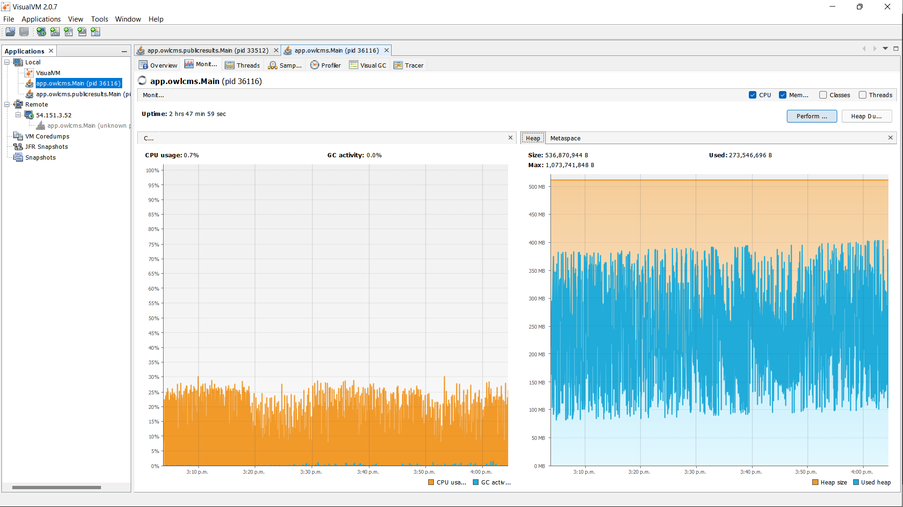

Before a large meet, you may wish to test your configuration and equipment.  The program has a few features that enable realistic, life-size testing:

- You can export your database to save a copy of your data, and re-import it after the tests
- There is a simulation robot feature that will perform a fake weigh-in, declare fake starting weights, and then run though all the platforms and all the groups giving referee decisions at random.
- The simulator is realistic in the sense that it uses the actual competition engine to send commands to all the user interfaces, and is driven by the same inputs it would normally receive from the announcer/timekeeper and the referees.

#### Prepare your database

1. Prepare your registration data: 

   1. Define the age groups
   2. Create your platform or platforms
   3. Create your groups
   4. Provide the registration information for the athletes (birth year, gender, body weight or registration category)
   5. Look at the Preparation / registration entries page to check that all is correct

2. Add the permissions required to run the simulation

   1. Go to the Preparation / Language and System Settings page

   2. Locate the "Backdoor Access" setting and enter a string like the following (replace `192.168.0.105` with the actual address of the main owlcms computer when running on a laptop, or your public IP address if running on Heroku).

      `192.168.0.105,127.0.0.1,[0:0:0:0:0:0:0:1]`

      This setting is used to make sure that only these machines can start the simulation.  `127.0.0.1,[0:0:0:0:0:0:0:1]` are two different ways of writing down "localhost" (required because Firefox sends one or the other, as it feels like).

      If you are running on Heroku, you can type "what is my ip" in Google to get your public IP address.

3. Export your registration data from the Preparation page (for reference)

4. Export the full database from the System Settings page (the setting that allow access will be saved inside the export)

#### Install a monitoring tool (optional)

If you like watching scrolling graphics and have a computer or programming background, instructions for using a monitoring tool are at the bottom of this page.

#### Setup your equipment and start all the browsers

1. Go to the weigh-in screen and provide a realistic body weight and starting weights for one athlete
2. Go to the announcer screen and start lifting for that group
3. Install all your displays and open all the browsers you want.  Make sure they are all displaying what you expect, especially if you are simulating more than one platform.

#### Start the simulation

- If running locally, go to the main laptop and open the Home page.  Type "http://127.0.0.1/simulation" 
- Ïf running remotely, open a window on the Heroku application and to the main page. Add `/simulation` at the end.  This will give you something similar to https://mycompetition.herokuapp.com/simulation 

The system will perform a fake weigh-in if needed and create fake declarations for the snatch and clean & jerk.

Once that is done, after a short pause, all your screens should come to life.  Check that they all do (sometimes a screen will miss the signal to "get going", this is unfortunately outside my control).  If simulating several platforms, there is a small intentional lag between the start times.

#### Watch

All the displays should update according to the same cycle:  call athlete, start clock, wait 2 seconds, referees give 3 decisions at random, down signal, 3 second delay after decisions, display decisions for 3,5 seconds.  Running a full lift cycle takes 10 seconds roughly (so count one minute of simulation per athlete).  If running two platforms in parallel, the time is cut in half since the delays are based on the wall clock -- the program does nothing and just waits.

#### Restore your database

After your simulation is over, go to the Language and System Settings page and reload the saved file you created at the beginning.

#### Technical Monitoring and Tuning Hints

If you have a programming or technical computer background, read on, else you can safely skip.

You may want to install [VisualVM](https://visualvm.github.io/) to monitor what is going on *inside* the program.  Please refer to the [Documentation](https://visualvm.github.io/documentation.html)  and in particular the [Working with Local Applications](https://htmlpreview.github.io/?https://raw.githubusercontent.com/visualvm/visualvm.java.net.backup/master/www/applications_local.html) and [Monitoring Applications](https://htmlpreview.github.io/?https://raw.githubusercontent.com/visualvm/visualvm.java.net.backup/master/www/monitor_tab.html) pages.

The screen shot below was taken when running <u>18 displays</u> simulating a competition with <u>180 athletes</u> with three overlapping age groups.  Each lift is simulated on a 10 second cycle (call athlete, start timer, 2-second wait, give decisions, emit down signal, wait 3 seconds, display decisions, reset). So this simulation ran for 3 hours.

The laptop used was a 2017-vintage core i5. The program was given a starting working memory of 512MB and allowed to use up to 1GB (but never exceeded the starting memory)

- The diagram shows on the right shows that this amount of memory was allocated but never fully used. 
- If you click on "Metaspace" next to "Heap" you will see that there is another 80MB of memory needed for Java and the program itself (so in this instance, Windows will report a process size of roughly 600MB)
- This was at the cost of doing memory cleanups ("garbage collection").  In this configuration laptop was using 20% of its CPU.   Giving the program more memory reduces CPU usage.
- Memory allocation is done in the installation directory, in the owlcms.l4j file.   Remove the last two lines if you have a laptop with 8GB or more.
- On a more powerful computer (core i7) with 8GB, the default values for memory are a more generous 2GB.,  In such a configuration, CPU usage is negligible -- 2-4%.  Running the same competition, the memory is consumed until about 1,2GB, and then cleaned up to 100MB, and the cycle repeats forever and ever.

