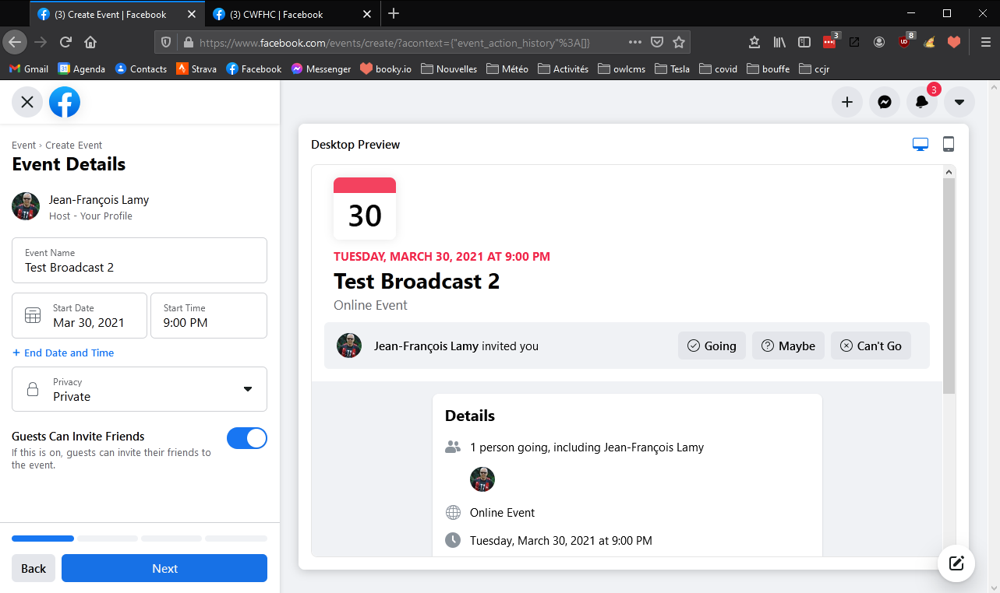
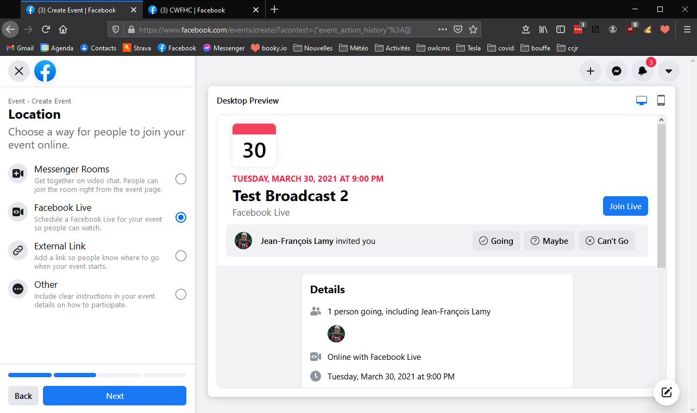
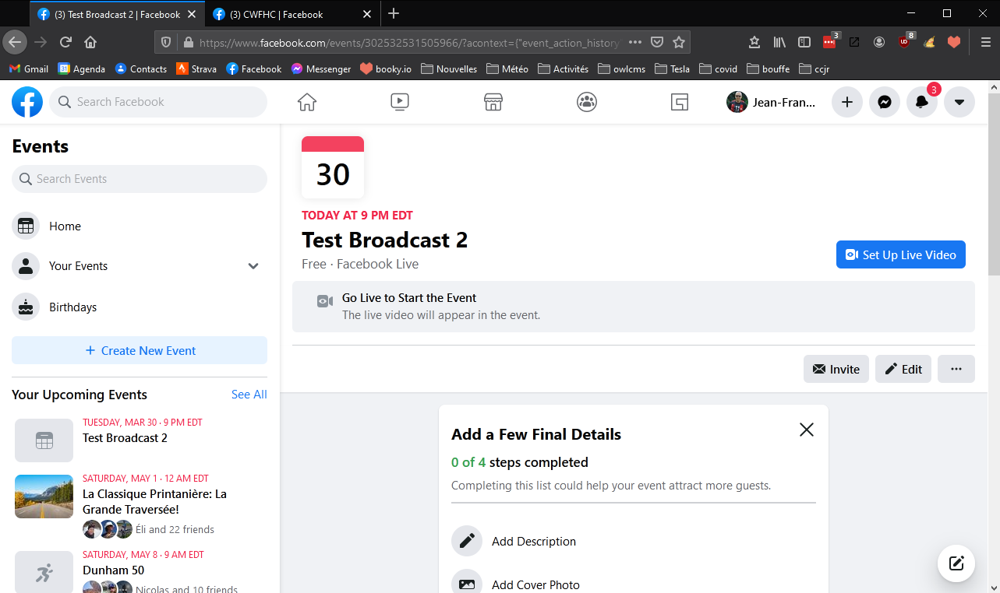
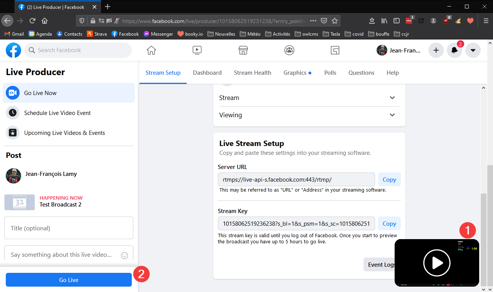
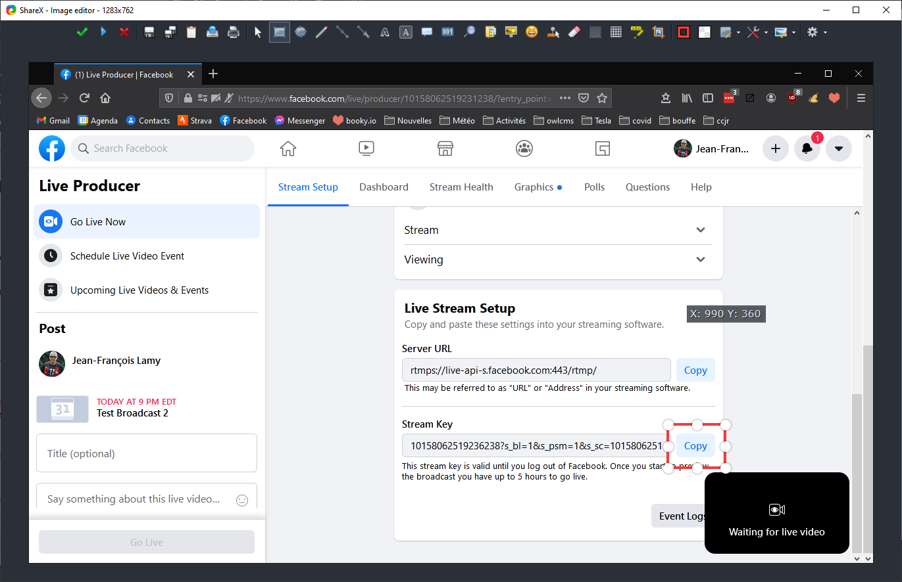
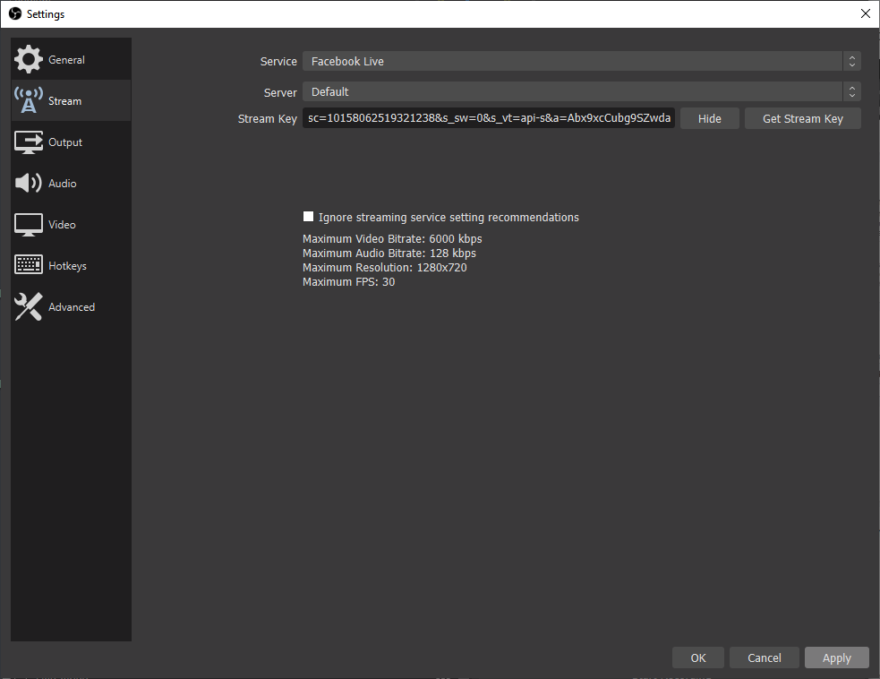
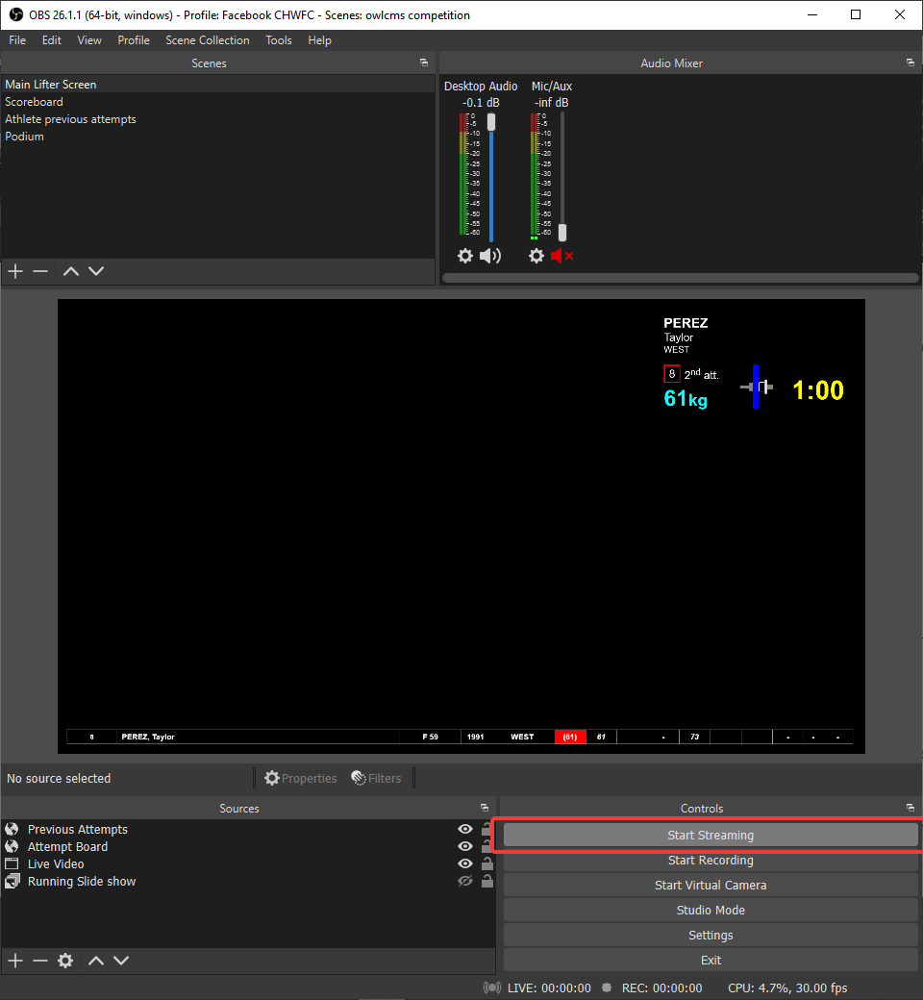

# Setup Streaming

We will use Facebook as an example.  Other streaming services work much the same way.

For Facebook, we suggest that you create one event per group, to make it easier for people to retrieve each session.  

### 1 Create an Event

1. Go to your Facebook page using a browser.  Find the section called Events (this changes whether you are using a public or personal page).  There will be a Create Event option.  

   - Provide the Event Name, planned date, and Privacy settings

2. Go through the wizard.  Make sure you select Facebook Live and enter the description for your Event, etc. 

### 2 Get Ready to Broadcast

1. A few minutes before your event, you will get a reminder.  Find your event and click on it.  You will get a page with "Set Up Live Video"
   

4. Select the "Go Live Now"  entry at the left, and the "Use Stream Key" option.

   

5. Scroll down the page until you see the Stream Key section.  Click on the Copy button to grab the key.

   

6. Go back to OBS,  Open the File - Settings menu.  Select Streaming.  Erase the streaming key and paste the one you just got from Facebook.

   

6. Close the settings page.  In OBS, at the bottom right, you will find a "Start Streaming" Button
   

7. If you go back to Facebook, you should see your video start to stream in the preview window (You can make it larger by moving your mouse over the small window).  You can then chose to go live.
   

