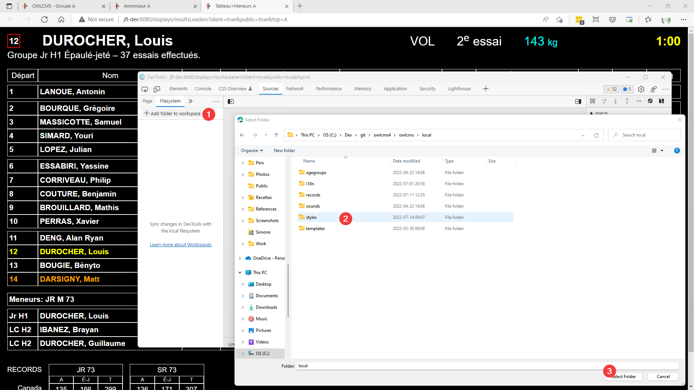
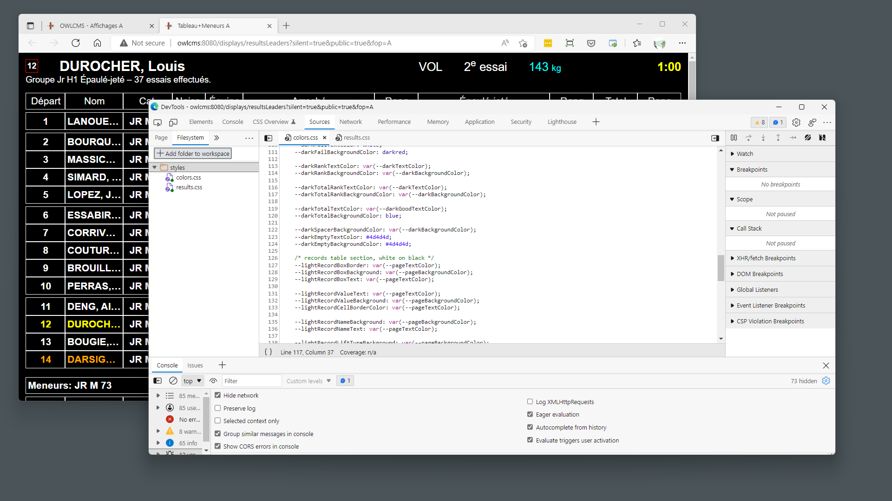
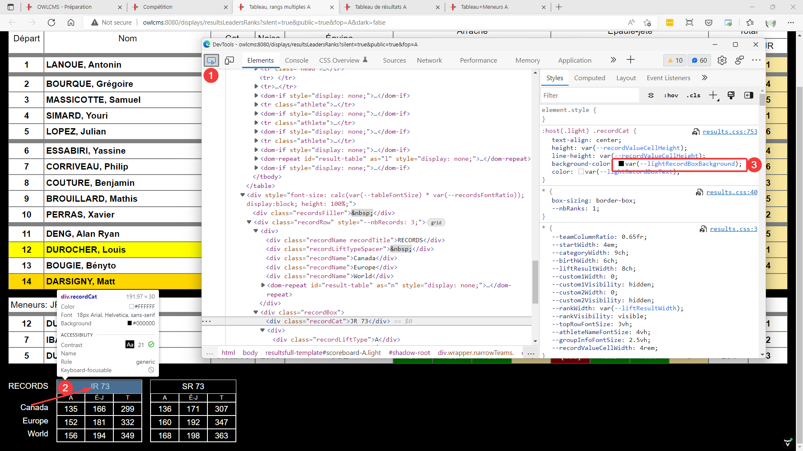
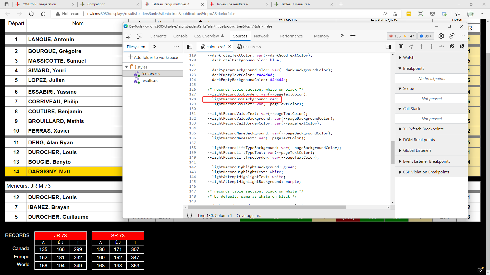
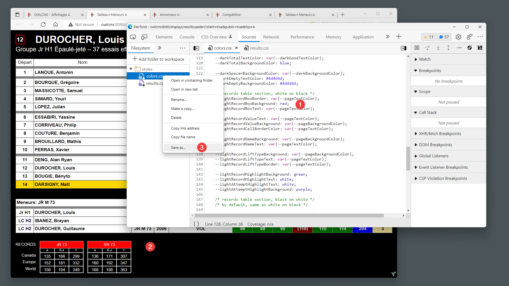

The colors and formatting of the scoreboard and attempt board are controlled by Web-standard style sheets ("CSS style sheets").  Colors are defined in a file called `local/styles/colors.css` . The formatting of the scoreboards is inside `local/styles/resultsCustomization.css` for most of the settings you are likely to change, and in `local/styles/results.css` for the rest.

> This topic is <u>advanced</u>.  But there are many learning resources for CSS style sheets, and several persons with no Web development background have succeeded in customizing their scoreboards.

Note that `results.css` is much more likely to change significantly than `colors.css` (where the most likely thing will be new colors being added).  You are therefore encouraged to change your colors in colors.css.  Should you find a color or scoreboard area that was omitted, please report it so it can be made configurable like the rest.

### Working with Browser Caches

One of the challenges in editing style sheets is the fact that browsers keep a copy to avoid fetching it over and over.

By default, owlcms arranges for the css and image files to be fetched again, once, after each server restart.  It does this by adding a time-based suffix to the file name that fools the browser into thinking it needs a new copy.  That suffix is understood and processed correctly by the owlcms server.  This technique is known as "autoversioning"

However, when we are editing the files using the browser developer mode, we want the files to be named exactly as they are on the disk. This is done by using a configuration variable.  To turn off autoversioning and use the developer mode features:

- If running on Windows, use Notepad to add `-DcssEdit=true` on a line at the top  the `owlcms.l4j.ini` file in the installation directory (you may see the file named as `owlcms.l4j` depending on your Windows settings.)
- On Linux or MacOS, use `java -DcssEdit=true -jar owlcms.jar` to launch the program.

After fixing your css files, you should undo your changes and put the value back to false, and restart the server.  This will ensure you get the recent copy for you normal tests.  When the variable is missing or false, the css files are refreshed after each server restart.

### Using the Browser Developer Mode

The recommended way to edit the CSS files is to use the developer mode in your browser.  This allows you to immediately see the impact of your changes.  The examples below use Edge but the process is the same with Chrome.

1. First, open the scoreboard you want to edit.  The color scheme is shared across scoreboards, so we usually use the "scoreboard + leaders".  
2. Use Ctrl-F5 to reload the page clearing the previous caches. 
3. Then start the Developer mode for your browser.  You can do this in several ways.  The most common is to use F12 or Control-Shift-I on Windows.
4. **Important**: Make sure that on the "Network" tab the option to `Disable Cache` is **selected**.  We do NOT want the cache to be active.
5. Tell the developer mode to synchronize with your files, 
   1. Go to the Source section
   2. Select Filesystem
   3. Locate the folder where your style files are found (inside your installation directory).  If editing the video files, make sure to select the `styles/video` folder and not the parent styles folder.
   4. Select and answer the prompts to confirm that you allow the developer mode to access and update the files.

You should now see the style files, including results.css and colors.css;

### Locating the color definitions to change

Go back to the "Elements" tab in the developer window.  Select the Icon to the left, and move your cursor to the area you want to customize.  In this example, we move to the header of the record box and select.

The "Styles" section on the left shows all the applicable elements from the style sheet. What we are looking for is the "background-color" and "color" settings.

### Picking the colors

The following trick will be used:

1. We will edit the color directly in the Styles pane, but *we will not save it* because this would modify results.css. We will use "Escape" to revert to the original value.
2. We will copy the color we want to the colors.css file.

So we go ahead and click on the black colored square next to background-color.  We then pick a color we like.  This is immediately reflected in the title of the record box. Then

1. We **Copy** the color with # in the color picker
2. We remember the `--` name of the color we will want to change.
3. We get out of the color picker by typing "Escape"
4. We are back to the value before editing.

### Updating the colors

We then go back to the Source section at the top of the developer window, and we select the colors.css tab. 

We locate the color name, in this example --lightRecordBoxBackground, and change the color to what we want.  In this example, we typed "red" instead of pasting a color number.  The change is immediately reflected in the windows.

### Saving the colors

Typing "Ctrl-S" in the colors.css file should save it. You can also do a "Save As"

### Other tips

- If the files in the Filesystem section no longer show the circle icon, this means that they have become unsynchronized. Normally, doing a Ctrl-F5 to force the browser to reload will resynchronize things.
- the file `resultsCustomization.css` contains the settings to hide/show columns.  To hide a column you set the width to 0, and you set the visibility to `hidden`.  To show a column you pick a width (ideally using a `var` formula, and you set the visibility to `visible`.
- You can actually `results.css` to change things like the font-weight (to go bold, for example), or to edit border styles.  But remember that you may have to redo these changes if the program updates results.css (which happens occasionally)

### Hiding Notifications

Notifications of record attempts and new records are shown on the scoreboard and attempt board.

If you prefer showing record notifications by using [OBS scene switching](OBSSceneSwitching), you can hide them using a CSS variable. Set `--zIndexRecordNotifications` in `colors.css` to a positive value (ex: 10) to enable the notifications, and a negative value (ex: -10) to always hide them.

