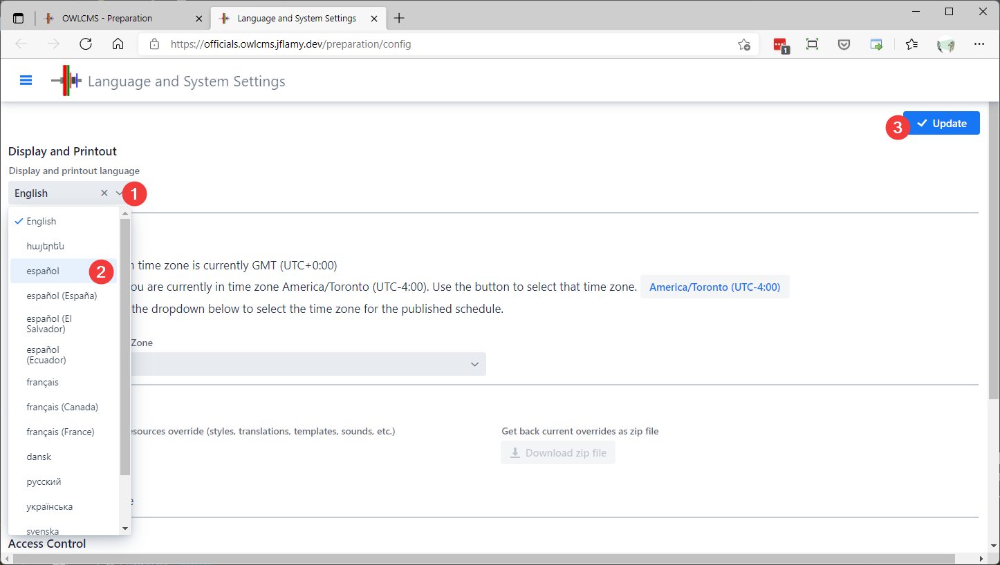
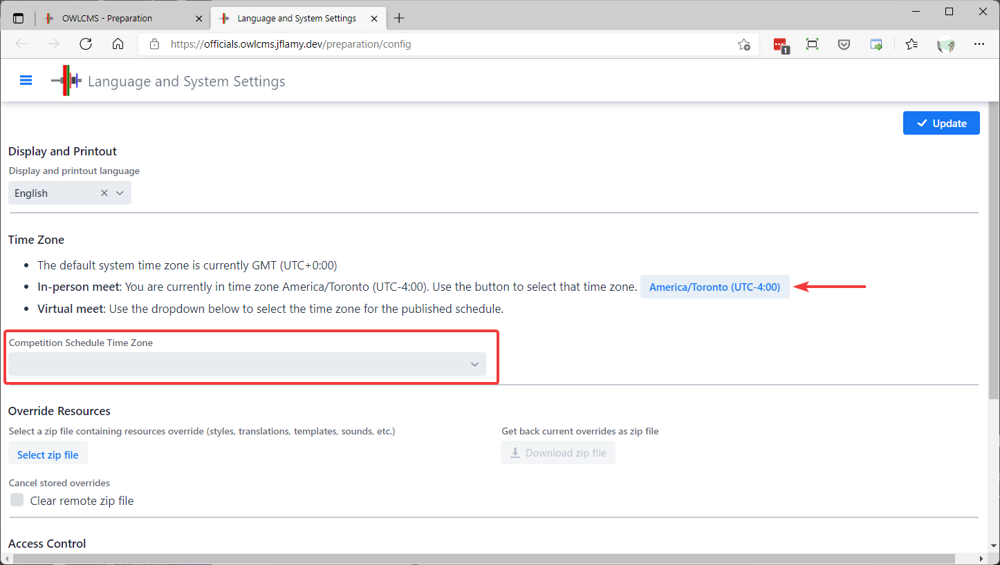

## Display Language

In countries where more than one language is spoken, and in a virtual meet, the various computers used in a competition are likely to be configured with different languages.  

By default, owlcms will try to use the language indicated by each browser, if a translation is available for that language.  This could be useful in a virtual meet, where officials could come from different countries.

More likely however is the need force a single language to be used on all displays (owlcms will then ignore the individual language preferences sent by each browser).  After saving the language new pages will appear in the selected language, pages already open will need to be reloaded.

The display language is set from the `Prepare Competition` - `Language and System Settings` page.

The display language can be also be set via a configuration file or environment setting (see [here](Heroku#configure-your-time-zone-and-locale) and [here](LocalSetup#id=defining-the-language)).

## Time Zone Configuration

By default, Heroku uses the universal UTC time (colloquially known as Greenwich).  You should set the time zone to match the published schedule, so that break timers can be set accordingly.
Go to the `Prepare Competition`- `Language and System Settings` page. 

  - If you are in the same time zone as the competition, you can use the button indicated by the arrow to quicky set the time zone.
  - If not, you need to use the drop down list to select a city in the same time zone as the schedule.

## Other Settings

### Overriding Styles and Templates

The installation directory on a laptop contains a folder called `local`.  Underneath that folder are all the files and resources used by the program.  You may edit these files if you need to change translation wording, scoreboard colors, the Excel templates, etc.   

If you want to run the program in the cloud, you will need to perform the changes on a local laptop, and zip the local directory.  See the page on [Uploading Customizations](UploadingLocalSettings) for details.

### Access Control

Refer to the [Heroku](Heroku) or the [Fly](Fly) pages for details on how these features work.

