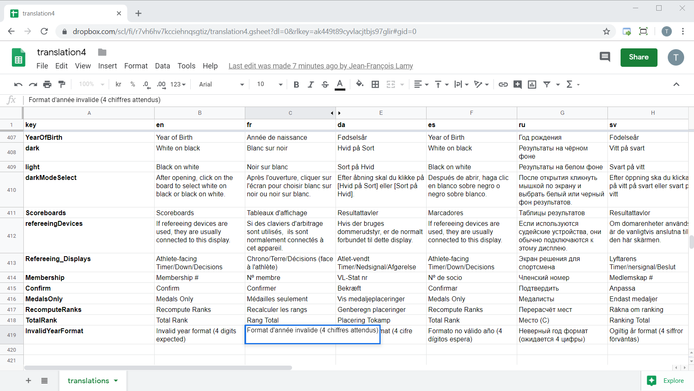
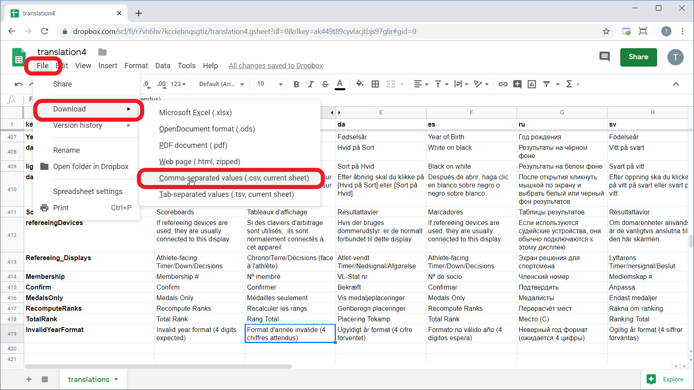
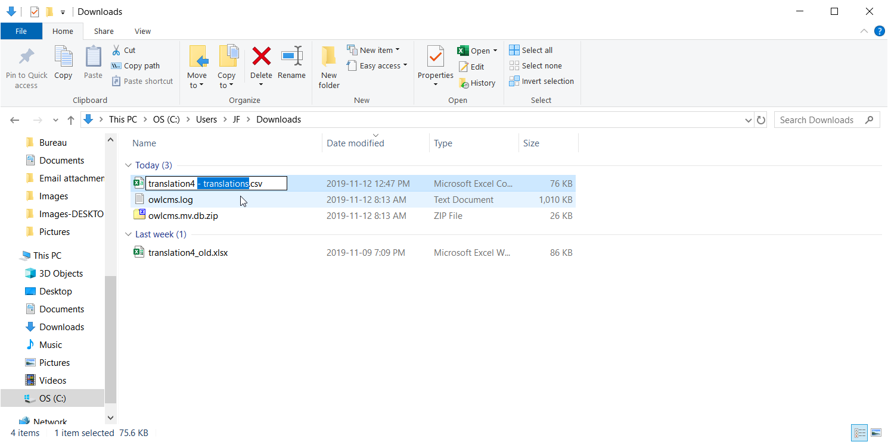
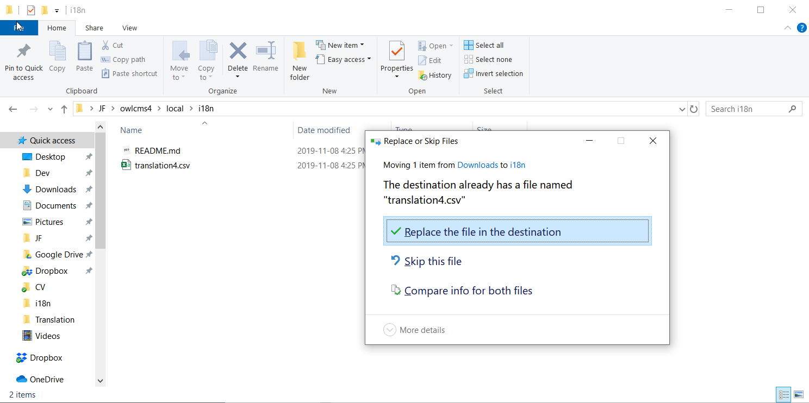
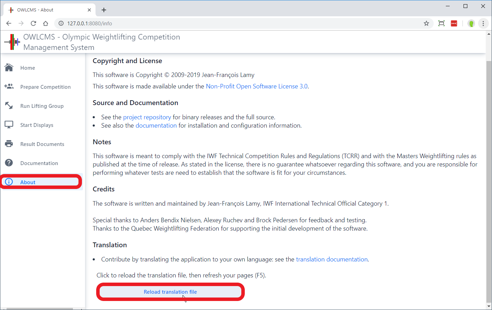

# Translation Instructions


## Translating the screens and displays

1. For translation, you need to install OWLCMS locally.  Refer to the [Local Setup instructions](https://jflamy.github.io/owlcms4/#/LocalSetup). 

2. Use the following link to locate the [Dropbox folder](https://www.dropbox.com/sh/3dzsbv02fgdrpp3/AAD-yKNcgiMzFOqQzv3qFTiFa?dl=0) that contains the master copy of the translations
    - Click on the file named `translation4.gsheet`
    - You will be prompted to login in order to edit. The simplest way to edit is to use a Google account (even if it's only for this purpose).  Log out of dropbox and login using the google account.  If you do not gain access, send an e-mail to jf@jflamy.dev for it to be granted.
3. Each column of `translation4.gsheet`represents a language.  
    - Add your own language by adding a column at the end; use the ISO 639-1 two-letter code for your language -- see the list in https://en.wikipedia.org/wiki/List_of_ISO_639-1_codes  (for example, da is Danish, fr is French, ru is Russian, etc.) 
    - You may  have variations per country. For example `fr_CA` is the code for French in Canada, where different words are used and some of the displays are bilingual.
4. Translate the strings in your language. Google sheets saves automatically.
    


## Translation Rules

There are 5 things to be careful with (I am using examples from the Spanish translation)

**1) HTML formatting.** 

Some cells contain HTML codes like `<b></b>` for formatting, and use HTML conventions for special characters. For example, `&amp;` is used instead of `&`. Such codes must be preserved in your translation, for example:

```html
El grupo actual para la plataforma se selecciona en la <b><i>Anunciador</i></b> pantalla<br>
```

**2) Sentences with substitution slots {0} {1} ...** 

When the program needs to build a sentence where values need to be inserted, the sentence is written with `{0}` for the first value, `{1}` for the second value, and so on (counting starting at 0 is frequent in computer programming -- this is a convention used by the tools I am using, not my personal choice)

```html
El valor debe estar entre {0} y {1} inclusivo.
```

**3) Grammatical variations for plural**

If you see things like the following, you must NOT translate the word "choice". For example, the following selects what to display depending on whether the try number is 1, 2, or 3. that 1er 2o 3er will be shown in properly formatted format (`<sup>` is for superscript).

 ```html
{0}<sup>{0,choice,1#er|2#o|3#er}</sup> att.
 ```

**4) Number formatting**

If you see things like the following, do NOT translate the word "number", and do not replace the "." with a ",". The programming library I use understands #.# as a numerical format and will put the correct decimal marker for Spanish instead of the period (there will actually be a comma in the output)

```
{0,number,#.#} kg
```

**5) Unicode character codes**

If you see a string that starts with `\u`, it is a way to write down characters that cannot be typed, or that would be swallowed during the processing of the file. So if you see `\u0020` that is just a way to type a space such that it is preserved when the file is read.


## Testing your screen and display translations

5.  When ready to test, you need to download the translation file to your PC.  Use the `File` `Download` `Comma-separated values` option from the menu.

6. Use the `Show in folder` option on the downloaded file (or locate your Downloads folder) and <u>rename the file to `translation4.csv`</u>

   

7.  Copy or move the file to your local installation

   - Under Windows, [open your installation directory](https://jflamy.github.io/owlcms4/#/LocalSetup?id=accessing-the-program-files-and-configuration) and locate the `local\i18n`  folder (which stands for "internationalization" -- the word has 18 letters between i and n)
   - Under Mac OS and Linux, open where you unzipped the file, and find the `local/i18n` directory
   - Overwrite the file that is currently in the local/i18n location



8. Start the program as usual for your local setup

  - > The files that you have in your `local` directory will have precedence over the files shipped with OWLCMS, so the translation file in `local -> i18n -> translation4.csv` will be used instead of the official one. 

  - Any string you have not translated will come out as `!xx: SomeCode`. This means that there is no value in the row `SomeCode` for the language `xx`.

9. If you update the file while the program is running, you can reload the file to see your changes by going to the bottom of the `About` screen and clicking on the reload button.  After reloading the translations you need to tell your browser to reload the pages from OWLCMS to see the new text (F5 or Ctrl-R or Right-Click depending on your browser)



- By default, OWLCMS obeys your browser settings.  So if your browser is set to have xx as the preferred language, and there are translations available for language `xx`, you will see the `xx` text you provided.
  - If you don't get the right language (for example, my browser is in English, but I need to see French when translating to French), see the [instructions for forcing the language](https://jflamy.github.io/owlcms4/#/LocalSetup?id=defining-the-language)

## Translation updates

After updating your translations, you may wish to send an e-mail to the author at [jf@jflamy.dev](mailto:jf@jflamy.dev) to make sure your changes are pulled in.
