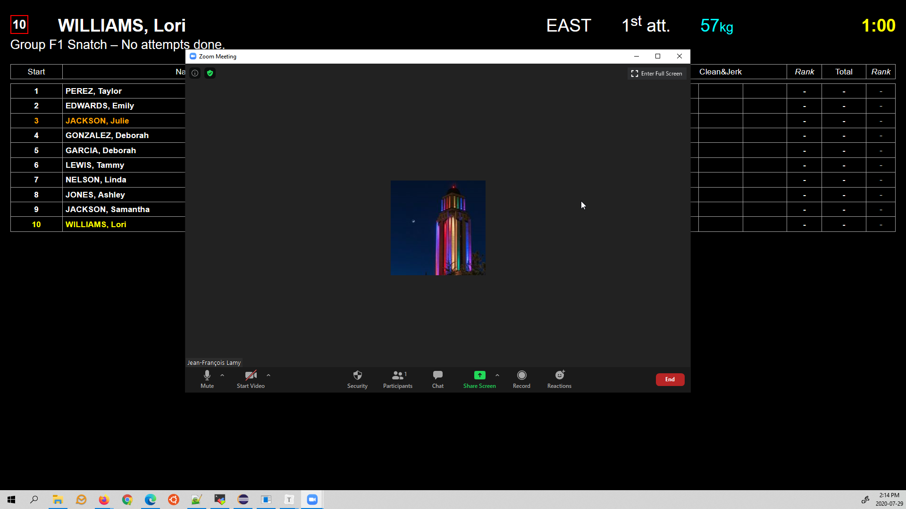
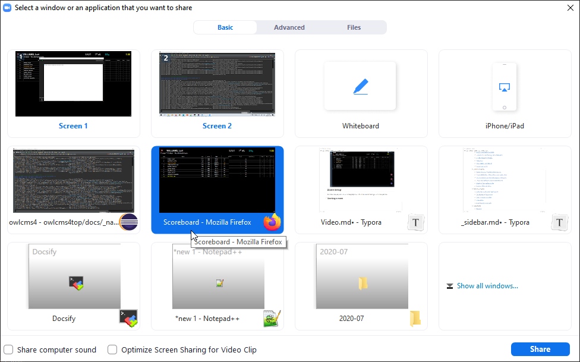
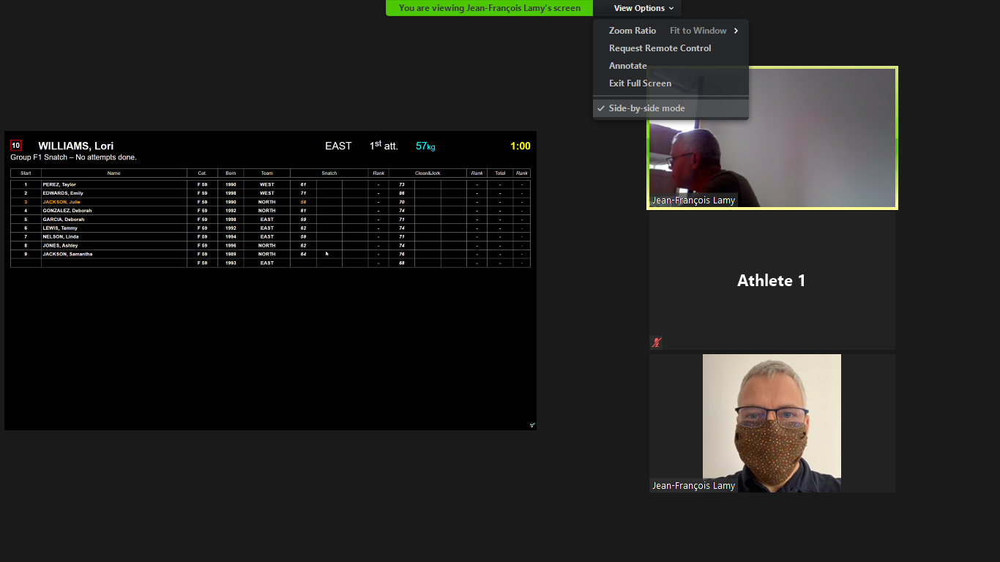

This document presents two alternatives for hosting a competition over a video conference.   We also explain how you can, for viewer's convenience, provide the scoreboard as part of the videoconference.

We provide explanations below for two videoconferencing services among the many that are available.

- 8x8.vc : This service is free (without time limits), offers good world-wide connectivity, and good video quality.  All that is required is signing up for a free account -- they only charge extra for business-oriented services that we don't use.
- zoom.us : This service requires a paid account for competitions lasting more than 40 minutes.  The user interface for conference participants to view the scoreboard is less intuitive, and Zoom has also reduced the video quality during the COVID-19 pandemic.

## 8x8.vc 

8x8 is an international company that maintains a well-known video-conferencing software called "Jitsi".  The site https://8x8.vc offers free accounts that only require a registration. 

### Initial Registration

1. Go to the 8x8.vc page and sign up for a free account.    You will be brought to the home page for the moderator.
   

2. You will be offered to download extensions or plugins to schedule videoconferences, you can just ignore them (click x to close)
   
3. The first time around, use the cogwheel at the bottom right to select the web URL for your competition.  In the following example, we use `fhq`  as our team name and `competition` as our meeting room, so our participants would connect to `https://8x8.vc/fhq/competition`
   You may want to add a password to your room as well.

   

### Starting a meet

1. Start the meeting. 
   
2. You should start a browser to `owlcms` and get the announcer to start a competition group, for testing. Start the scoreboard screen on the same laptop where you are starting the videoconference.
3.  Go back to 8x8.  You can then use the `share` button at the bottom right to select the browser window.
   
4. The setup is now finished, athletes and officials can join
   

### Accessing a meet

- On a laptop, use a browser to go to the URL (`https://8x8.vc/team/room` is the format)  In our example, we had `fhq` as our team and `competition` as our room, so https://8x8.vc/fhq/competition would be the URL.
- On an Android phone (Samsung, LG, Huawei, Pixel, etc.) you can simply use your browser with the same URL as on a laptop.  You can look at the competition using your browser, or alternately download the 8x8 software from the Play Store.  To connect, use the `team/room` format -- the name of the conference in our example would be `fhq/competition`
- On an iPhone or iPad, you should install the 8x8 application from the App Store.  To connect, use the `team/room` format -- the name of the conference in our example would be `fhq/competition`

### Selecting the view

1. Once athletes have joined, every one can select what they look at.  If an athlete or referee has video turned of, only their initials are visible.  The scoreboard appears just like a participant.  The 8x8 logo is the name of the company and cannot be removed in the free version.
   
2. Athletes can make their display full screen, and can use a "strip" mode instead of the tiles.
   

## Zoom Setup

Zoom is a very popular service, but slightly more difficult to use for hosting a virtual competition.

### Setting up a meet

1. Start owlcms
2. Start the announcer screen, select a group, and start lifting 
3. Start Zoom (the following steps are easier if you have two screens) and select `Share Screen`

4. Select the scoreboard window as the window to be shared.
   

5. Go back to the announcer screen and unselect the group
6. Let the athletes in from the waiting room

### Viewing the scoreboard and the athletes

In Zoom, the scoreboard is not shown like the other participants.  You can however use the `side-by-side` view both the scoreboard and the video sessions.  Use the menu at the top of the screen ("View Options") to select side-by-side mode.  You can move the boundary between the right and left areas to your preference.

