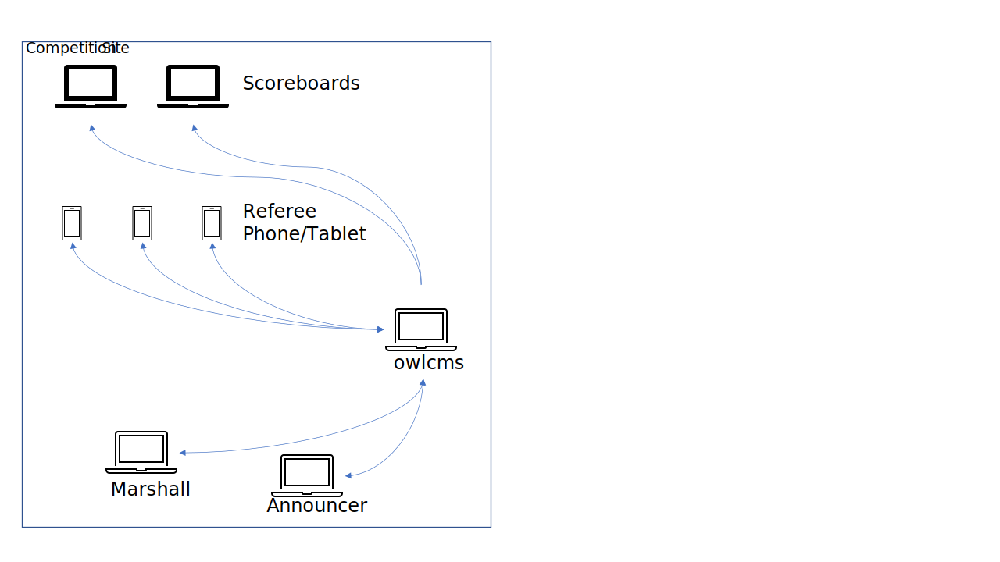

This document explains the concepts behind running a virtual competition with owlcms. A *virtual competition* is a competition where the athletes and officials are in multiple locations and communicate via a videoconferencing application such as Zoom or Jitsi.  We recommend Zoom or Jitsi because the video moderator can select what is seen by all attendees (putting the spotlight on the current athlete, in this case)

## Standard On-site Competition

A very common setup is to run owlcms on a computer at the competition site.  The various computers all connect to a primary laptop.  Often, it is the announcer's own laptop, or the competion secretary's, this makes no difference.

## Remote Scoreboards Using the publicresults Cloud-Based Application

In order to hold a virtual competition, even if there are only a few remote lifters, we must allow them to see the scoreboard, timer, down and decisions.  

There is a sister application to owlcms called *publicresults*.  Publicresults is installed in the cloud, and all the remote athletes can access it (or anyone in the public, actually).  Publicresults gets updates from owlcms.  No one other than the officials gets access to owlcms, to reduce the security risks.

## Remote Officials Using Cloud-Based owlcms 

In a true virtual competition, the officials are in multiple locations.  In order to allow access by all officials, `owlcms` is run in the cloud (access is protected using a password).   Remote referees should use a laptop because video rates on most iPads is not very good and a larger screen than a phone is needed.

## Setting up a Virtual Competition

The following steps are suggested

1. Install owlcms in the cloud.  See [Cloud Installation of owlcms](Cloud)
2. Install publicresults in the cloud.  Configure the secret key used for updating.  See [Cloud Installation of publicresults](Remote).  Note the site URL you selected, and copy the secret key.
3. Configure the cloud-based owlcms to send its updates to publicresults (configure the site URL and secret key noted in the previous step. See [Connect owlcms to publicresults](ConfigPublicResults)