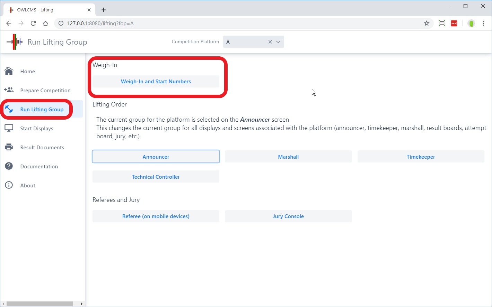
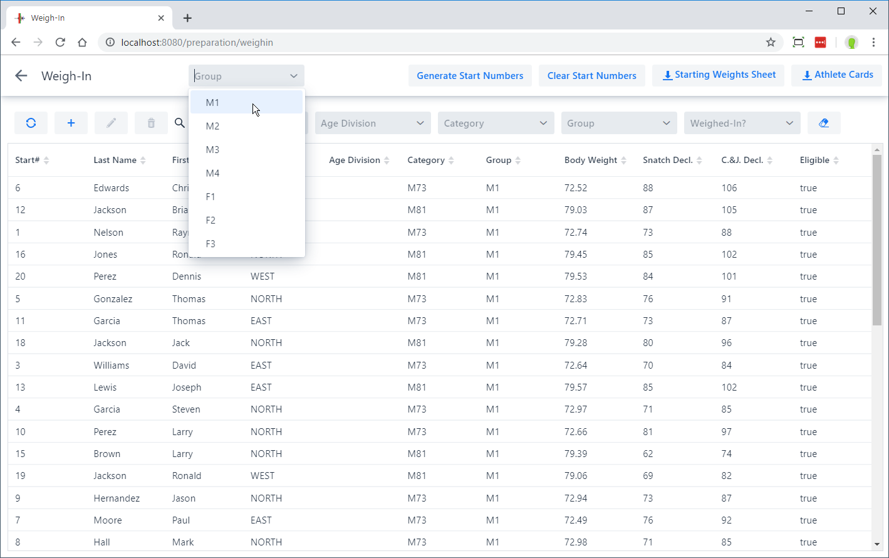
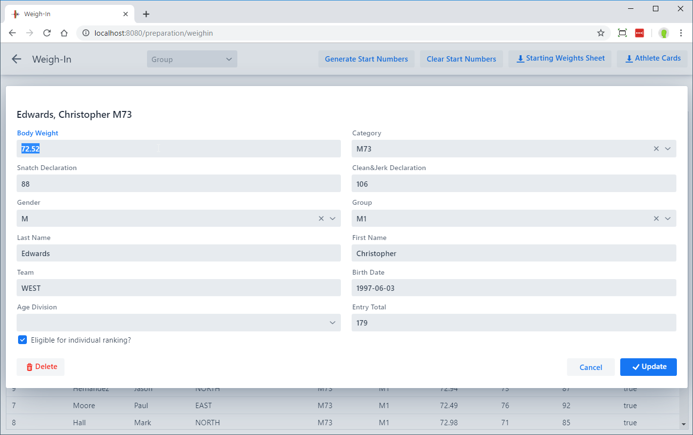
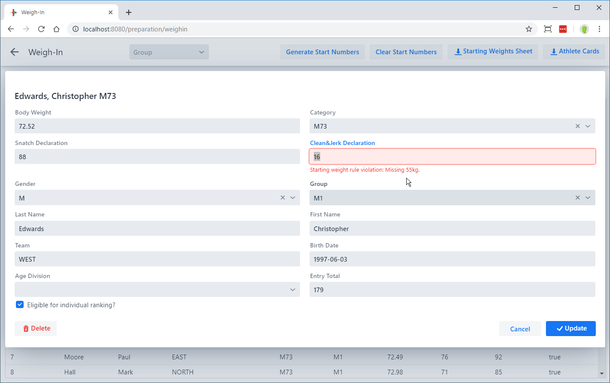
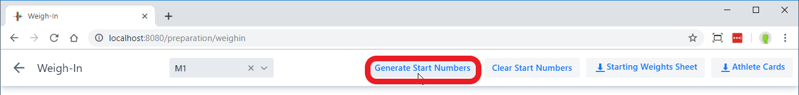
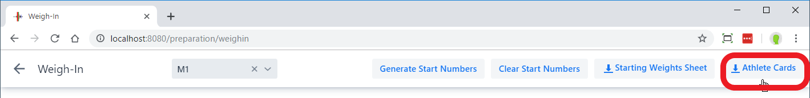
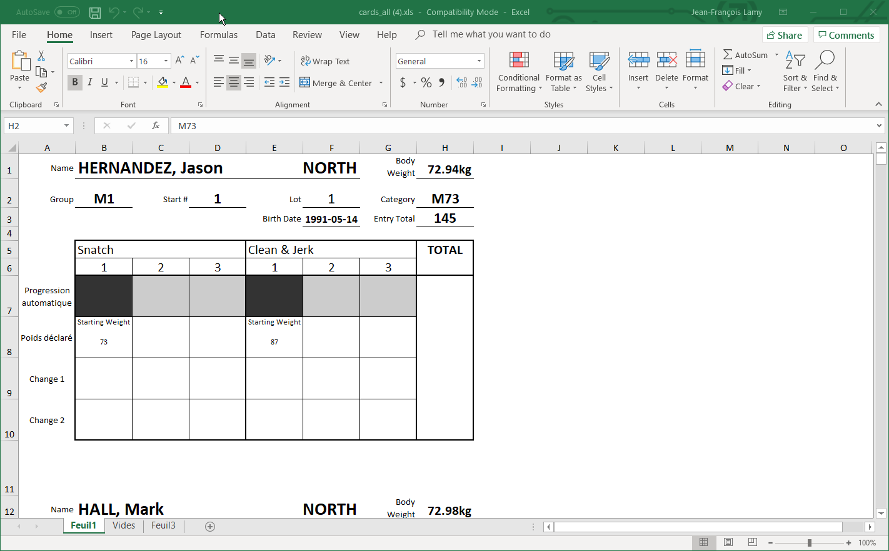
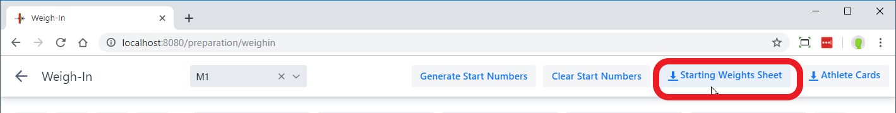
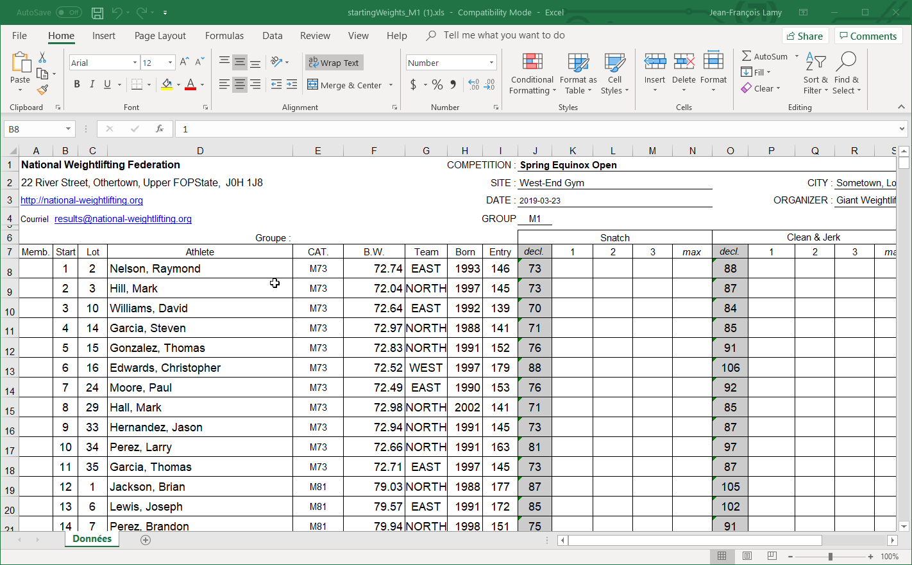

Weigh-ins take place for each group, so the buttons for the weigh-in officials is on the Lifting Group page.

## Selecting a Group and Athlete

The first step is to select the group being weighed-in.  The athlete is selected by clicking ONCE in the list.

## Entering information

The athlete's body weight, and starting weights should now be entered.  The program computes the categories in which the athlete is eligible.  If an entry total is provided, it is compared to the qualifying totals for the categories.

Various validations are made by OWLCMS and errors are signaled. For example, the category must fit with the gender and the body weight.  A drop down of possible categories will be offered (this is mostly useful when age groups overlap and an athlete could compete in different groups, such as Masters or Senior)

If enabled on the Competition Information page, the 20kg rule will be enforced. In this example, a typo meant that 16 was entered instead of 106.  But the error could actually be in one of the other two fields.

## Start Numbers

Start numbers are used to ensure that lighter weight categories lift before heavier weight categories even if the same weight is requested.  Start numbers are normally assigned at the end of weigh-in in competitions where athletes are allowed to move up if they don't make the weight.

## Athlete Cards

Athlete Cards are the cards that will be used by the Marshal to record changes.  They are normally printed *before* the weigh-in, so that athletes can put their initials on their weight and requests.

Athlete cards are produced as an Excel document which can be printed.  Several templates are available. Pick the style and paper size you want.

The CardTemplate style prints two athletes on the same page, which can be cut in half.

The IWF style is meant to be folded.  Each lift appears on one side, so the card is flipped between lifts.

### Starting Weight Sheet

The starting weight sheet shows the start number and the requested weights.  It is used to cross-check that the information printed is the same as on the athlete cards, and to write down the start numbers on the athlete cards.

You should select the group prior to printing the starting weights sheet.

Coaches can use this to count attempts.  In some federations, this is filled by a junior official to be used as a backup protocol sheet.

### Jury / Referee Examination Sheet

The Jury sheet is used for referee examinations (or as a way to periodically evaluate referees).  It is an alternate version of the protocol sheet with additional information about the referees and a summary of the officiating errors to be noted.

